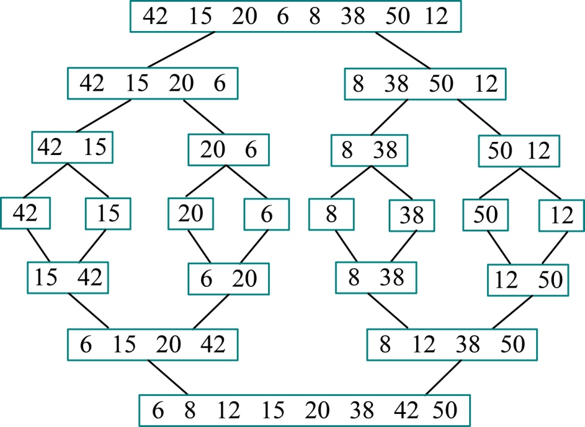

### 3.3.3　完美图解

给定一个列数（42，15，20，6，8，38，50，12），我们执行合并排序的过程，如图3-10所示。

<b class="my_markdown">图3-10　合并排序过程</b>

从上图可以看出，首先将待排序元素分成大小大致相同的两个子序列，然后再把子序列分成大小大致相同的两个子序列，如此下去，直到分解成一个元素停止，这时含有一个元素的子序列都是有序的。然后执行合并操作，将两个有序的子序列合并为一个有序序列，如此下去，直到所有的元素都合并为一个有序序列。

合久必分，分久必合！合并排序就是这个策略。

