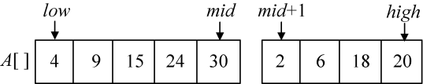
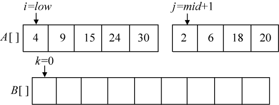
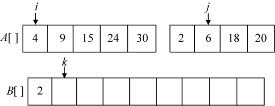
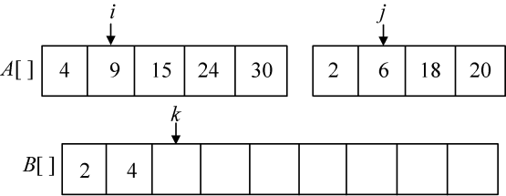
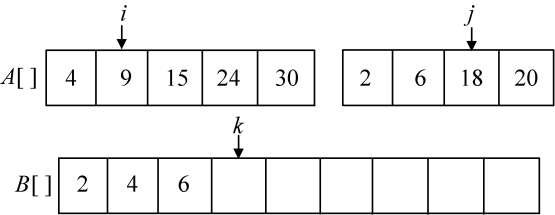
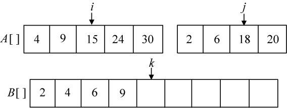
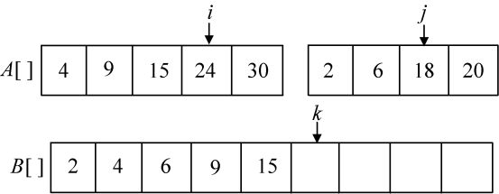
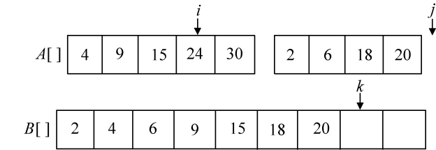
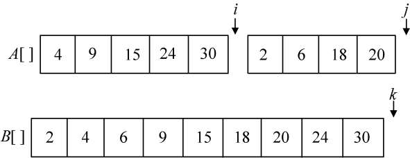
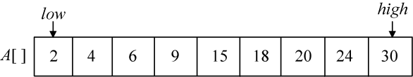

### 3.3.4　伪代码详解

（1）合并操作

为了进行合并，引入一个辅助合并函数Merge（A，low，mid，high），该函数将排好序的两个子序列A[low:mid]和A[mid+1:high]进行合并。其中，low和high代表待合并的两个子序列在数组中的下界和上界，mid代表下界和上界的中间位置，如图3-11所示。


<center class="my_markdown"><b class="my_markdown">图3-11　合并操作原始数组</b></center>

合并方法：设置3个工作指针i、j、k（整型数）和一个辅助数组B[]。其中，i和j分别指向两个待排序子序列中当前待比较的元素，k指向辅助数组B[]中待放置元素的位置。比较A[i]和A[j]，将较小的赋值给B[k]，同时相应指针向后移动。如此反复，直到所有元素处理完毕。最后把辅助数组B中排好序的元素复制到A数组中，如图3-12所示。

```c
int *B = new int[high-low+1];//申请一个辅助数组B[]  
int i = low, j = mid+1, k = 0;
```


<center class="my_markdown"><b class="my_markdown">图3-12　合并操作初始化</b></center>

现在，我们比较A[i]和A[j]，将较小的元素放入B数组中，相应的指针向后移动，直到i>mid或者j>high时结束。

```c
while(i <= mid && j <= high)//按从小到大顺序存放到辅助数组B[]中
{
    if(A[i] <= A[j]) 
          B[k++] = A[i++];  
    else
          B[k++] = A[j++];  
}
```

第1次比较A[i]=4和A[j]=2，将较小元素2放入B数组中，j++，k++，如图3-13所示。


<center class="my_markdown"><b class="my_markdown">图3-13　合并过程</b></center>

第2次比较A[i]=4和A[j]=6，将较小元素4放入B数组中，i++，k++，如图3-14所示。


<center class="my_markdown"><b class="my_markdown">图3-14　合并过程</b></center>

第3次比较A[i]=9和A[j]=6，将较小元素6放入B数组中，j++，k++，如图3-15所示。


<center class="my_markdown"><b class="my_markdown">图3-15　合并过程</b></center>

第4次比较A[i]=9和A[j]=18，将较小元素9放入B数组中，i++，k++，如图3-16所示。


<center class="my_markdown"><b class="my_markdown">图3-16　合并过程</b></center>

第5次比较A[i]=15和A[j]=18，将较小元素15放入B数组中，i++，k++，如图3-17所示。


<center class="my_markdown"><b class="my_markdown">图3-17　合并过程</b></center>

第6次比较A[i]=24和A[j]=18，将较小元素18放入B数组中，j++，k++，如图3-18所示。


<center class="my_markdown"><b class="my_markdown">图3-18　合并过程</b></center>

第7次比较A[i]=24和A[j]=20，将较小元素20放入B数组中，j++，k++，如图3-19所示。


<center class="my_markdown"><b class="my_markdown">图3-19　合并过程</b></center>

此时，j>high了，while循环结束，但A数组还剩有元素（imid）怎么办呢？直接放置到B数组就可以了，如图3-20所示。

```c
while(i <= mid) B[k++] = A[i++];//对子序列A[low:middle]剩余的依次处理
```


<center class="my_markdown"><b class="my_markdown">图3-20　合并过程</b></center>

现在已经完成了合并排序的过程，还需要把辅助数组B中的元素复制到原来的A数组中，如图3-21所示。

```c
for(i = low, k = 0; i <= high; i ++)//将合并后的有序序列复制到原来的A[]序列
   A[i] = B[k++];
```


<center class="my_markdown"><b class="my_markdown">图3-21　合并结果复制到A[]</b></center>

完整的合并程序如下：

```c
void Merge(int A[], int low, int mid, int high) 
{  
  int *B = new int[high-low+1];//申请一个辅助数组  
  int i = low, j = mid+1, k = 0;   
  while(i <= mid && j <= high) 
  {//按从小到大存放到辅助数组B[]中  
    if(A[i] <= A[j]) 
         B[k++] = A[i++];  
    else 
         B[k++] = A[j++];  
  }  
while(i <= mid) B[k++] = A[i++];       //对子序列A[low:middle]剩余的依次处理
while(j <= high) B[k++] = A[j++];      //对子序列A[middle+1:high]剩余的依次处理
for(i = low, k = 0; i <= high; i ++)   //将合并后的序列复制到原来的A[]序列
   A[i] = B[k++];
}
```

（2）递归形式的合并排序算法

将序列分为两个子序列，然后对子序列进行递归排序，再把两个已排好序的子序列合并成一个有序的序列。

```c
void MergeSort(int A[], int low, int high) 
{  
  if(low < high) 
  {  
     int mid = (low+high)/2; 
     MergeSort(A, low, mid);           //对A[low:mid]中的元素合并排序  
     MergeSort(A, mid+1, high);        //对A[mid+1:high]中的元素合并排序  
     Merge(A, low, mid, high);         //合并操作
  }
}
```

