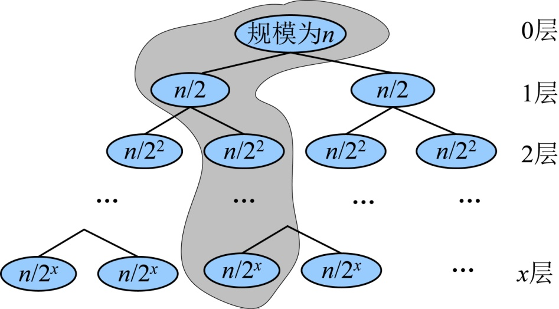

### 3.3.6　算法解析与拓展

#### 1．算法复杂度分析

（1）时间复杂度

+ 分解：这一步仅仅是计算出子序列的中间位置，需要常数时间O(1)。
+ 解决子问题：递归求解两个规模为n/2的子问题，所需时间为2T(n/2)。
+ 合并：Merge算法可以在O(n)的时间内完成。

所以总运行时间为：

当n>1时，可以递推求解：

递推最终的规模为1，令，则，那么

合并排序算法的时间复杂度为O(nlogn)。

（2）空间复杂度：程序中变量占用了一些辅助空间，这些辅助空间都是常数阶的，每调用一个Merge()，会分配一个适当大小的缓冲区，且退出时释放。最多分配大小为n，所以空间复杂度为O(n)。递归调用所使用的栈空间是O(logn)，想一想为什么？

合并排序递归树如图3-22所示。

<b class="my_markdown">图3-22　合并排序递归树</b>

递归调用时占用的栈空间是递归树的深度，，则，递归树的深度为logn。

#### 2．优化拓展

上面算法我们使用递归来实现，当然也可以使用非递归的方法，大家可以动手试试。

那么，还有没有更好的算法来解决这个问题呢？

