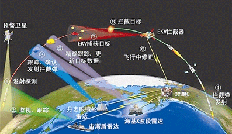

### 3.4　兵贵神速——快速排序

未来的战争是科技的战争。假如A国受到B国的导弹威胁，那么A国就要启用导弹防御系统，根据卫星、雷达信息快速计算出敌方弹道导弹发射点和落点的信息，将导弹的跟踪和评估数据转告地基雷达，发射拦截导弹摧毁敌方导弹或使导弹失去攻击能力。如果A国的导弹防御系统处理速度缓慢，等算出结果时，导弹已经落地了，还谈何拦截？

现代科技的发展，速度至关重要。

我们以最基本的排序为例，生活中到处都用到排序，例如各种比赛、奖学金评选、推荐系统等，排序算法有很多种，能不能找到更快速高效的排序算法呢？

<b class="my_markdown">图3-23　某国导弹防御系统示意图</b>

