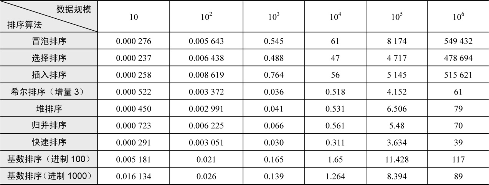

### 3.4.1　问题分析

曾经有人做过实验，对各种排序算法效率做了对比（单位：毫秒），如表3-1所示。

<b class="my_markdown">表3-1　排序算法效率</b>

从上面的表中我们可以看出，如果对105个数据进行排序，冒泡排序需要8 174毫秒，而快速排序只需要3.634毫秒！

快速排序（Quicksort）是比较快速的排序方法。快速排序由C. A. R. Hoare在1962年提出。它的基本思想是通过一组排序将要排序的数据分割成独立的两部分，其中一部分的所有数据都比另外一部分的所有数据都要小，然后再按此方法对这两部分数据分别进行快速排序，整个排序过程可以递归进行，以此使所有数据变成有序序列。

我们前面刚讲过合并排序（又叫归并排序），它每次从中间位置把问题一分为二，一直划分到不能再分时，执行合并操作。合并排序的划分很简单，但合并操作就复杂了，需要额外的辅助空间（辅助数组），在辅助数组中完成合并排序后复制到原来的位置，它是一种异地排序的方法。合并排序分解容易，合并难，属于“先易后难”。而快速排序是原地排序，不需要辅助数组，但分解困难，合并容易，是“先苦后甜”型。

