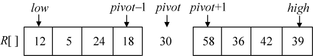
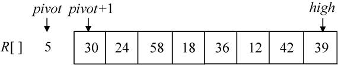
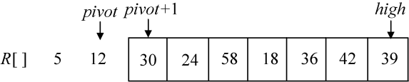

### 3.4.2　算法设计

快速排序的基本思想是基于分治策略的，其算法思想如下。

（1）分解：先从数列中取出一个元素作为基准元素。以基准元素为标准，将问题分解为两个子序列，使小于或等于基准元素的子序列在左侧，使大于基准元素的子序列在右侧。

（2）治理：对两个子序列进行快速排序。

（3）合并：将排好序的两个子序列合并在一起，得到原问题的解。

设当前待排序的序列为R[low:high]，其中lowhigh，如果序列的规模足够小，则直接进行排序，否则分3步处理。

（1）分解：在R[low: high]中选定一个元素R[pivot]，以此为标准将要排序的序列划分为两个序列R[low:pivot−1]和R[pivot+1:high]，并使用序列R[low:pivot−1]中所有元素的值小于等于R[pivot]，序列R[pivot+1:high]中所有元素均大于R[pivot]，此时基准元素已经位于正确的位置，它无需参加后面的排序，如图3-24所示。

<b class="my_markdown">图3-24　快速排序分解</b>

（2）治理：对于两个子序列R[low:pivot−1]和R[pivot+1:high]，分别通过递归调用快速排序算法来进行排序。

（3）合并：由于对R[low:pivot−1]和R[pivot+1:high]的排序是原地进行的，所以在R[low:pivot−1]和R[pivot+1:high]都已经排好序后，合并步骤无需做什么，序列R[low:high]就已经排好序了。

如何分解是一个难题，因为如果基准元素选取不当，有可能分解成规模为0和n−1的两个子序列，这样快速排序就退化为冒泡排序了。

例如序列（30，24，5，58，18，36，12，42，39），第一次选取5做基准元素，分解后，如图3-25所示。

<b class="my_markdown">图3-25　选5做基准元素排序结果</b>

第二次选取12做基准元素，分解后如图3-26所示。

<b class="my_markdown">图3-26　继续选12做基准元素排序结果</b>

是不是有点像冒泡了？这样做的效率是最差的，最理想的状态是把序列分解为两个规模相当的子序列，那么怎么选择基准元素呢？一般来说，基准元素选取有以下几种方法：

+ 取第一个元素。
+ 取最后一个元素。
+ 取中间位置元素。
+ 取第一个、最后一个、中间位置元素三者之中位数。
+ 取第一个和最后一个之间位置的随机数k（lowkhigh），选R[k]做基准元素。

