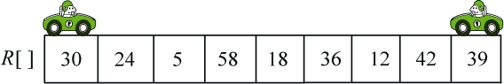
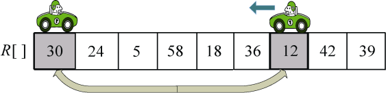
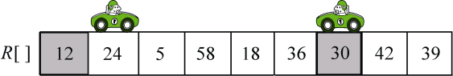
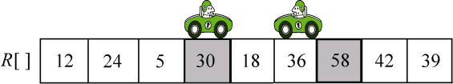
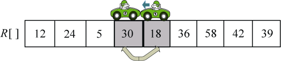
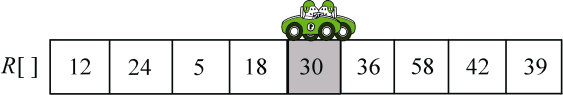
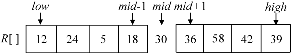

### 3.4.3　完美图解

并没有明确的方法说哪一种基准元素选取方案最好，在此以选取第一个元素做基准为例，说明快速排序的执行过程。

假设当前待排序的序列为R[low:high]，其中lowhigh。

步骤1：首先取数组的第一个元素作为基准元素pivot=R[low]。i=low，j=high。

步骤2：从右向左扫描，找小于等于pivot的数，如果找到，R[i]和R[j]交换，i++。

步骤3：从左向右扫描，找大于pivot的数，如果找到，R[i]和R[j]交换，j−−。

步骤4：重复步骤2～步骤3，直到i和j指针重合，返回该位置mid=i，该位置的数正好是pivot元素。

至此完成一趟排序。此时以mid为界，将原数据分为两个子序列，左侧子序列元素都比pivot小，右侧子序列元素都比pivot大，然后再分别对这两个子序列进行快速排序。

以序列（30，24，5，58，18，36，12，42，39）为例，演示排序过程。

（1）初始化。i=low，j=high，pivot=R[low]=30，如图3-27所示。

<b class="my_markdown">图3-27　快速排序初始化</b>

（2）向左走。从数组的右边位置向左找，一直找小于等于pivot的数，找到R[j]=12，如图3-28所示。

<b class="my_markdown">图3-28　快速排序过程（交换元素）</b>

R[i]和R[j]交换，i++，如图3-29所示。

<b class="my_markdown">图3-29　快速排序过程（交换元素后）</b>

（3）向右走。从数组的左边位置向右找，一直找比pivot大的数，找到R[i]=58，如图3-30所示。

<b class="my_markdown">图3-30　快速排序过程（交换元素）</b>

R[i]和R[j]交换，j−−，如图3-31所示。

<b class="my_markdown">图3-31　快速排序过程（交换元素后）</b>

（4）向左走。从数组的右边位置向左找，一直找小于等于pivot的数，找到R[j]=18，如图3-32所示。

<b class="my_markdown">图3-32　快速排序过程（交换元素）</b>

R[i]和R[j]交换，i++，如图3-33所示。

<b class="my_markdown">图3-33　快速排序过程（交换元素后）</b>

（5）向右走。从数组的左边位置向右找，一直找比pivot大的数，这时i=j，第一轮排序结束，返回i的位置，mid=i，如图3-34所示。

<b class="my_markdown">图3-34　第一趟快速排序（划分）结果</b>

至此完成一轮排序。此时以mid为界，将原数据分为两个子序列，左侧子序列都比pivot小，右侧子序列都比pivot大。

然后再分别对这两个子序列（12，24，5，18）和（36，58，42，39）进行快速排序。

大家可以动手写一写哦！

