### 3.4.6　算法解析与拓展

#### 1．算法复杂度分析

（1）最好时间复杂度

+ 分解：划分函数Partition需要扫描每个元素，每次扫描的元素个数不超过n，因此时间复杂度为O(n)。
+ 解决子问题：在最理想的情况下，每次划分将问题分解为两个规模为n/2的子问题，递归求解两个规模为n/2的子问题，所需时间为2T(n/2)，如图3-35所示。

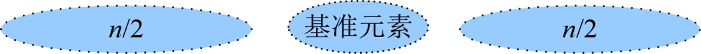
<center class="my_markdown"><b class="my_markdown">图3-35　快速排序最好的划分</b></center>

+ 合并：因为是原地排序，合并操作不需要时间复杂度，如图3-36所示。

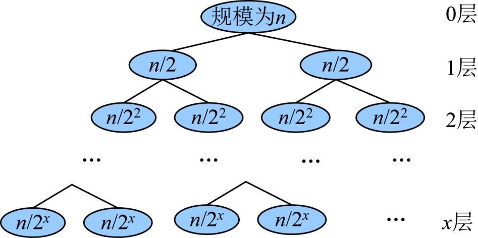
<center class="my_markdown"><b class="my_markdown">图3-36　快速排序最好情况递归树</b></center>

所以总运行时间为：

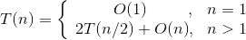
当n>1时，可以递推求解：

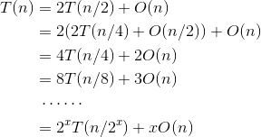
递推最终的规模为1，令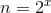，则，那么

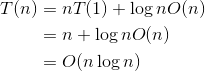
快速排序算法最好的时间复杂度为O(nlogn)。

+ 空间复杂度：程序中变量占用了一些辅助空间，这些辅助空间都是常数阶的，递归调用所使用的栈空间是O(logn)，想一想为什么？

（2）最坏时间复杂度

+ 分解：划分函数Partition需要扫描每个元素，每次扫描的元素个数不超过n，因此时间复杂度为O(n)。
+ 解决子问题：在最坏的情况下，每次划分将问题分解后，基准元素的左侧（或者右侧）没有元素，基准元素的另一侧为1个规模为n−1的子问题，递归求解这个规模为n−1的子问题，所需时间为T(n−1)。如图3-37所示。

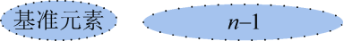
<center class="my_markdown"><b class="my_markdown">图3-37　快速排序最坏的划分</b></center>

+ 合并：因为是原地排序，合并操作不需要时间复杂度。如图3-38所示。

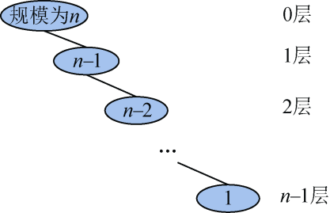
<center class="my_markdown"><b class="my_markdown">图3-38　快速排序最坏情况递归树</b></center>

所以总运行时间为：

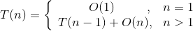
当n>1时，可以递推求解如下：

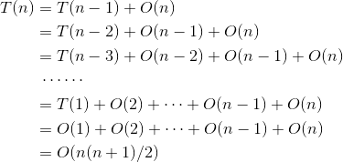
快速排序算法最坏的时间复杂度为O(n<sup class="my_markdown">2</sup>)。

+ 空间复杂度：程序中变量占用了一些辅助空间，这些辅助空间都是常数阶的，递归调用所使用的栈空间是O(n)，想一想为什么？

（3）平均时间复杂度

假设我们划分后基准元素的位置在第 k（k=1，2，…，n）个，如图3-39所示。

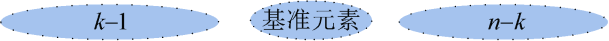
<center class="my_markdown"><b class="my_markdown">图3-39　快速排序平均情况的划分</b></center>

则：

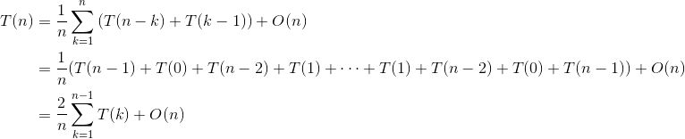
由归纳法可以得出，T(n)的数量级也为O(nlogn)。快速排序算法平均情况下，时间复杂度为O(nlogn)，递归调用所使用的栈空间也是O(logn)。

#### 2．优化拓展

从上述算法可以看出，每次交换都是在和基准元素进行交换，实际上没必要这样做，我们的目的就是想把原序列分成以基准元素为界的两个子序列，左侧子序列小于等于基准元素，右侧子序列大于基准元素。那么有很多方法可以实现，我们可以从右向左扫描，找小于等于pivot的数R[j]，然后从左向右扫描，找大于pivot的数R[i]，让R[i]和R[j]交换，一直交替进行，直到i和j碰头为止，这时将基准元素与R[i]交换即可。这样就完成了一次划分过程，但交换元素的个数少了很多。

假设当前待排序的序列为R[low: high]，其中lowhigh。

步骤1：首先取数组的第一个元素作为基准元素pivot=R[low]。i=low，j=high。

步骤2：从右向左扫描，找小于等于pivot的数R[i]。

步骤3：从左向右扫描，找大于pivot的数R[j]。

步骤4：R[i]和R[j]交换，i++，j−−。

步骤5：重复步骤2～步骤4，直到i和j相等，如果R[i]大于pivot，则R[i−1]和基准元素R[low]交换，返回该位置mid=i−1；否则，R[i]和基准元素R[low]交换，返回该位置mid=i，该位置的数正好是基准元素。

至此完成一趟排序。此时以mid为界，将原数据分为两个子序列，左侧子序列元素都比pivot小，右侧子序列元素都比pivot大。

然后再分别对这两个子序列进行快速排序。

以序列（30，24，5，58，18，36，12，42，39）为例。

（1）初始化。i= low，j= high，pivot= R[low]=30，如图3-40所示。

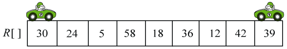
<center class="my_markdown"><b class="my_markdown">图3-40　快速排序初始化</b></center>

（2）向左走。从数组的右边位置向左找，一直找小于等于pivot的数，找到R[j]=12，如图3-41所示。

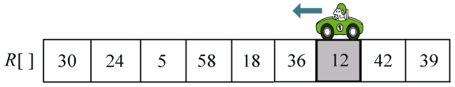
<center class="my_markdown"><b class="my_markdown">图3-41　快速排序过程（向左走）</b></center>

（3）向右走。从数组的左边位置向右找，一直找比pivot大的数，找到R[i]=58，如图3-42所示。

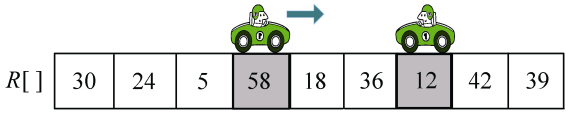
<center class="my_markdown"><b class="my_markdown">图3-42　快速排序过程（向右走）</b></center>

（4）R[i]和R[j]交换，i++，j−−，如图3-43所示。

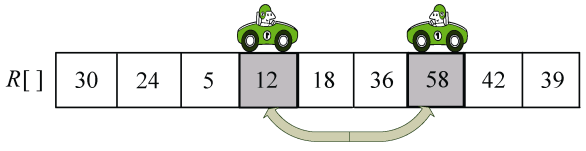
<center class="my_markdown"><b class="my_markdown">图3-43　快速排序过程（交换元素）</b></center>

（5）向左走。从数组的右边位置向左找，一直找小于等于pivot的数，找到R[j]=18，如图3-44所示。

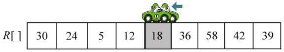
<center class="my_markdown"><b class="my_markdown">图3-44　快速排序过程（向左走）</b></center>

（6）向右走。从数组的左边位置向右找，一直找比pivot大的数，这时i=j，停止，如图3-45所示。

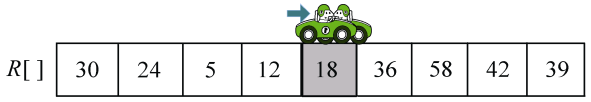
<center class="my_markdown"><b class="my_markdown">图3-45　快速排序过程（向右走）</b></center>

（7）R[i]和R[low]交换，返回i的位置，mid=i，第一轮排序结束，如图3-46所示。

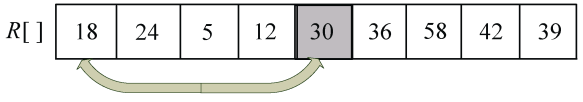
<center class="my_markdown"><b class="my_markdown">图3-46　快速排序过程（R[i]和R[low]交换）</b></center>

至此完成一轮排序。此时以mid为界，将原数据分为两个子序列，左侧子序列都比pivot小，右侧子序列都比pivot大，如图3-47所示。

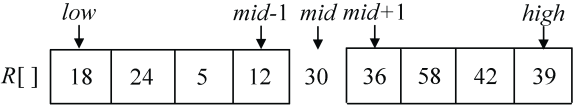
<center class="my_markdown"><b class="my_markdown">图3-47　快速排序第一次划分结果</b></center>

然后再分别对这两个子序列（18，24，5，12）和（36，58，42，39）进行快速排序。

相比之下，上述的方法比每次和基准元素交换的方法更加快速高效！

优化后算法：

```c
int Partition2(int r[],int low,int high)//划分函数
{
     int i=low,j=high,pivot=r[low];//基准元素
     while(i<j)
     {
           while(i<j&&r[j]>pivot) j--;//向左扫描
           while(i<j&&r[i]<=pivot) i++;//向右扫描
           if(i<j)
           {
                 swap(r[i++],r[j--]);//r[i]和r[j]交换，交换后i++, j--
           }
     }
     if(r[i]>pivot)
     {
           swap(r[i-1],r[low]);//r[i-1]和r[low]交换
           return i-1;//返回最终划分完成后基准元素所在的位置
    }
swap(r[i],r[low]);//r[i]和r[low]交换
    return i;//返回最终划分完成后基准元素所在的位置
}
```

大家可以思考是否还有更好的算法来解决这个问题呢？

