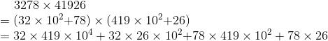
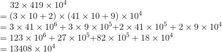
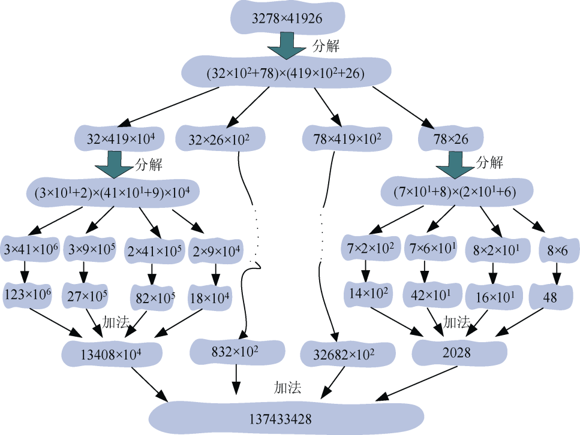

### 3.5.1　问题分析

有时，我们想要在计算机上处理一些大数据相乘时，由于计算机硬件的限制，不能直接进行相乘得到想要的结果。在解决两个大的整数相乘时，我们可以将一个大的整数乘法分而治之，将大问题变成小问题，变成简单的小数乘法再进行合并，从而解决上述问题。这样既解决了计算机硬件处理的问题，又能够提高乘法的计算效率。

例如：

继续分治：

我们可以看到当分解到只有一位数时，乘法就很简单了，如图3-49所示。

<b class="my_markdown">图3-49　大整数乘法分治图</b>

