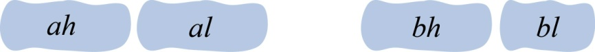
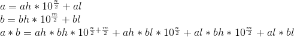

### 3.5.2　算法设计

算法思想：解决本问题可以使用分治策略。

（1）分解

首先将2个大整数a（n位）、b（m位）分解为两部分，如图3-50所示。

<b class="my_markdown">图3-50　大整数a、b分解为高位和低位</b>

ah表示大整数a的高位，al表示大整数a的低位。bh表示大整数b的高位，bl表示大整数b的低位。

ah、al为n/2位，bh、bl为m/2位。

2个大整数a（n位）、b（m位）相乘转换成了4个乘法运算ah*bh、ah*bl、al*bh、al*bl，而 **乘数的位数变为了原来的一半** 。

（2）求解子问题

继续分解每个乘法运算，直到分解有一个乘数为1位数时停止分解，进行乘法运算并记录结果。

（3）合并

将计算出的结果相加并回溯，求出最终结果。

