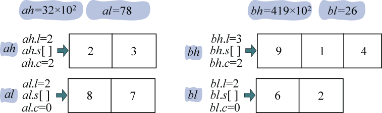
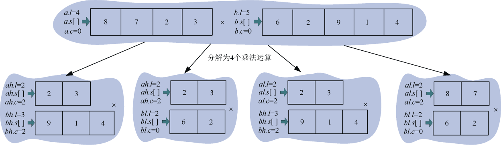
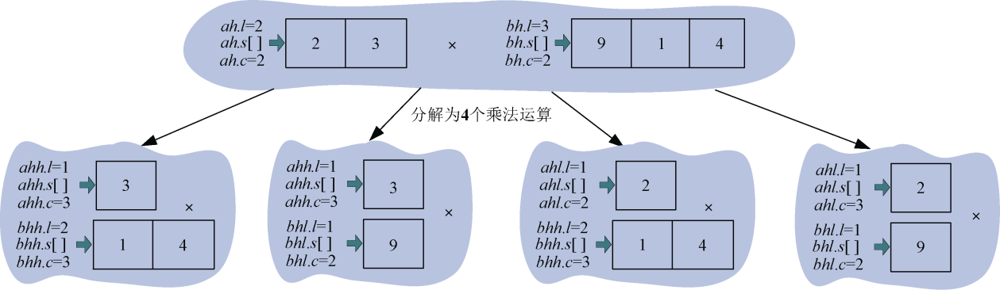
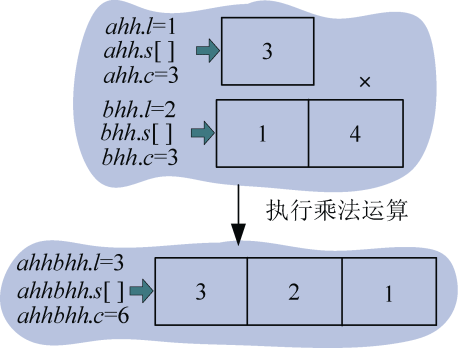
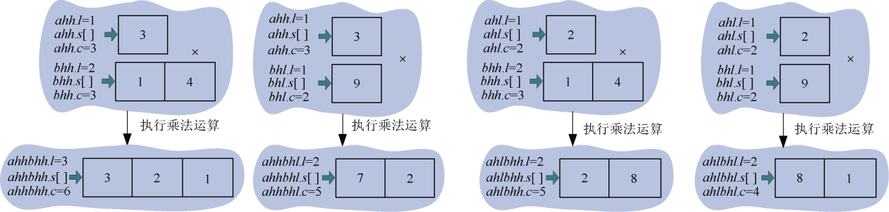
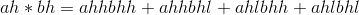
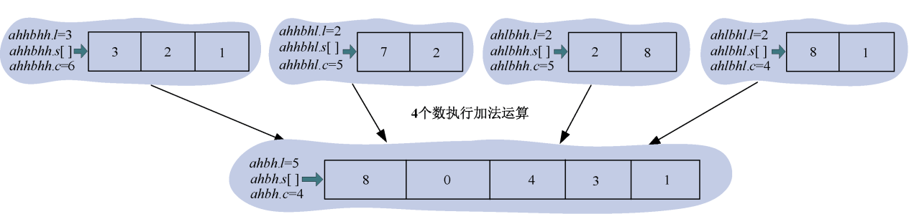

### 3.5.3　完美图解

分治进行大整数乘法的道理非常简单，但具体怎么处理呢？

首先将两个大数以字符串的形式输入，转换成数字后， **倒序存储** 在数组s[]中，l用来表示数的长度，c表示次幂。两个大数的初始次幂为0。

**想一想，为什么要倒序存储，正序存储会怎样？**

+ cp()函数：用于将一个n位的数分成两个n/2的数并存储，记录它的长度和次幂。
+ mul()函数：用于将两个数进行相乘，不断地进行分解，直到有一个乘数为1位数时停止分解，进行乘法运算并记录结果。
+ add()函数：将分解得到的数进行相加合并。

例如：a=3278，b=41926，求a*b的值。

（1）初始化

将a、b **倒序存储** 在数组a.s[]，b.s[]中，如图3-51所示。

<b class="my_markdown">图3-51　大整数a、b存储数组（倒序）</b>

（2）分解

cp()函数用于将一个n位的数分成两个n/2的数并存储，记录它的长度和次幂。ah表示高位，al表示低位，l用来表示数的长度，c表示次幂，如图3-52所示。

<b class="my_markdown">图3-52　大整数a、b分解为高位和低位</b>

转换为4次乘法运算：，，，。如图3-53所示。

<b class="my_markdown">图3-53　原乘法分解为4次乘法</b>

（3）求解子问题

，，，。下面以为例说明。如图3-54所示。

<b class="my_markdown">图3-54　ah*bh相乘分解</b>

（4）继续求解子问题

继续求解上面4个乘法运算，，，。可以看出这4个乘法运算都有一个乘数为1位数，可以直接进行乘法运算。

怎么进行乘法运算呢？以图3-53中为例，如图3-55所示。

<b class="my_markdown">图3-55　乘法运算</b>

3首先和1相乘得到3存储在下面数组的第0位，然后3和4相乘得到12，那怎么存储呢，先存储12%10=2，然后存储进位12/10=1，这样乘法运算的结果是321， **注意是倒序** ，实际含义是3×41=123，还有一件事很重要，就是次幂！两数相乘时，结果的次幂是两个乘数次幂之和，3×103×41×103=123×106。

4个乘法运算结果如图3-56所示。

<b class="my_markdown">图3-56　4个乘法运算</b>

（5）合并

**合并子问题结果，返回给** ，将上面4个乘法运算的结果加起来返回给。如图3-57所示。

<b class="my_markdown">图3-57　4个乘法运算结果相加</b>

由此得到ah*bh=13408×104。

用同样的方法求得ah*bl=832×102，al*bh=32682×102，al*bl=2028。将这4个子问题结果加起来，合并得到原问题a*b=137433428。

