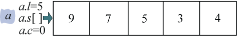
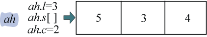
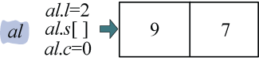
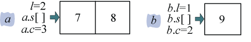
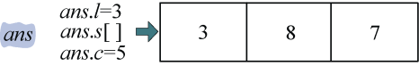
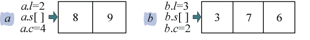
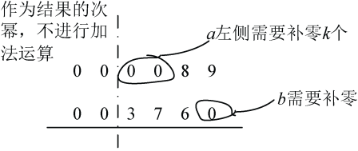
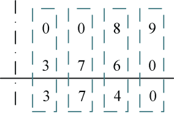
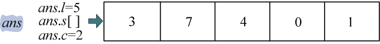

### 3.5.4　伪代码详解

（1）数据结构

将两个大数以字符串的形式输入，然后定义结构体Node，其中s[]数组用于存储大数， **注意是倒序存储！** （因为乘法加法运算中有可能产生进位，倒序存储时可以让进位存储在数组的末尾），l用于表示长度，c表示次幂。两个大数的初始次幂为0。

```c
char sa[1000]; //接收大数的字符串
char sb[1000]; //接收大数的字符串
typedef struct _Node
{
     int s[M];  //数组，倒序存储大数
     int l;     //代表数的长度
     int c;     //代表数的次幂，例如32*105，那么将23存储在s[]中，l=2，c=5
} Node,*pNode; 

```

（2）划分函数

其中，cp()函数用于将一个n位的数分成两个n/2的数并存储，记录它的次幂。

```c
void cp(pNode src, pNode des, int st, int l) 
{    //src表示待分解的数结点，des表示分解后得到的数结点
     //st表示从src结点数组中取数的开始位置，l表示取数的长度
     int i, j; 
     for(i=st, j=0; i<st+l; i++, j++) //从src结点数组中st位置开始，取l个数
     {
          des->s[j] = src->s[i];      //将这些数放入到des结点的数组中
     }
     des->l = l;                      //des长度等于取数的长度
     des->c = st + src->c;            //des次幂等于开始取数的位置加上src次幂
}

```

举例说明：如果有大数43579，我们首先把该数存储在结点a中，如图3-58所示。

```c
ma = a.l/2;                           //ma表示a长度的一半，此例中a.l=5，ma=2

```


<center class="my_markdown"><b class="my_markdown">图3-58　大整数a存储数组（倒序）</b></center>

分解得到a的高位ah，如图3-59所示。

```c
cp(&a, &ah, ma, a.l-ma);              //相当于cp(a, &ah, 2, 3)；
          //即从a中数组第2个字符位置开始取3个字符，赋值给ah; 
          //ah的长度等于3；ah的次幂等于开始位置2加上a的次幂，即2+a.c=2

```


<center class="my_markdown"><b class="my_markdown">图3-59　大整数a的高位（倒序真实含义是435×10<sup class="my_markdown">2</sup>）</b></center>

然后分解得到a的低位al，如图3-60所示。

```c
cp(&a, &al, 0, ma);                   //相当于cp(a, &al, 0, 2)；
          //即从a中数组第0个字符位置开始取2个字符，赋值给al; 
          //al的长度等于2；al的次幂等于开始位置0加上a的次幂，即0+a.c=0
```


<center class="my_markdown"><b class="my_markdown">图3-60　大整数a的低位（倒序真实含义是79）</b></center>

这样两次调用cp()函数，我们就把一个大的整数分解成了两个长度约为原来一半的整数。

（3）乘法运算

定义的mul()函数用于将两个数进行相乘，不断地进行分解， **直到有一个乘数为1位时停止** ，让这两个数相乘，并记录结果回溯。

```c
ma = pa->l/2; //ma表示a长度的一半
mb = pb->l/2; //mb表示b长度的一半
if(!ma || !mb) //如果!ma说明ma=0，即a的长度为1，该乘数为1位数
               //如果!mb说明mb=0，即b的长度为1，该乘数为1位数
{
     if(!ma)   //!ma说明a为1位数，a、b交换，保证a的长度大于等于b的长度
     {
          temp =pa; 
          pa = pb; 
          pb = temp; 
     }         //交换后b的长度为1
     ans->c = pa->c + pb->c;          //结果的次幂等于两乘数次幂之和
     w = pb->s[0];//因为交换后b的长度为1，用变量 w记录即可
     cc= 0;    //初始化进位cc为0
     for(i=0; i <pa->l; i++)          //把a中的数依次取出与w相乘，记录结果和进位
     {
         ans->s[i] = (w*pa->s[i] + cc)%10;//存储相乘结果的个位，十位做进位处理
         cc = (w*pa->s[i] + cc)/10;   //处理进位
     }

```

举例说明：两个数a=9×10<sup class="my_markdown">2</sup>，b=87×10<sup>3</sup>相乘。a的数字为1位，a、b交换，保证a的长度大于等于b的长度，交换后a=87×10<sup>3</sup>，b=9×10<sup class="my_markdown">2</sup>，倒序存储如图3-61所示。


<center class="my_markdown"><b class="my_markdown">图3-61　大整数a、b存储数组（倒序）</b></center>

初始化进位cc=0。

先计算9×7=63，（63+cc）%10=3，ans−>s[0]=3，进位cc=（63+cc）/10=6。

再计算9×8=72，（72+cc）%10=8，ans−>s[1]=8，进位cc=（72+cc）/10=7。

a中的数处理完毕，退出for循环。

```c
if(cc)                 //上例中退出时cc=7
    ans->s[i++] = cc;  //如果到最后还有进位，则存入数组末尾ans->s[2]=7
ans->l = i;            //记录结果的长度，上例中最后i=3
```

退出for循环时，cc不为0说明仍有进位，记录该进位，如图3-62所示。


<center class="my_markdown"><b class="my_markdown">图3-62　大整数a、b相乘结果（倒序）</b></center>

ans结果为387，结果其实际含义是9×10<sup class="my_markdown">2</sup>×87×10<sup>3</sup>=783×10<sup>5</sup>。

（4）合并函数

add()函数将分解得到的数进行相加合并。

```c
void add(pNode pa, pNode pb, pNode ans) 
{   //程序调用时把 a、b地址传递给pa、pb参数，表示待合并的两个数
    //ans记录它们相加的结果
    int i, cc, k,alen,blen,len; 
    int ta, tb;         //ta、tb分别记录a、b相加时对应位上的数
    pNode temp; 
    if(pa->c <pb->c)    //交换以保证a的次幂大
    {
          temp = pa; 
          pa = b; 
          pb =temp; 
    }
    ans->c = pb->c;  //结果的次幂为两个数中小的次幂
    cc = 0;          //初始化进位cc为0
    k=pa->c - pb->c  //k为a左侧需要补零的个数
```

举例说明：两个数a=673×10<sup class="my_markdown">2</sup>，b=98×10<sup>4</sup>相加。a的次幂为2，比b的次幂小，a、b交换，保证a的次幂大于等于b的次幂，交换后a=98×10<sup>4</sup>，b=673×10<sup class="my_markdown">2</sup>，倒序存储如图3-63所示。

```c
ans->c = pb->c;     //最低次幂作为结果的次幂，ans->c =pb->c=2
cc = 0;             //初始化进位cc为0
k= pa->c - pb->c;   //k为a左侧需要补零的个数，k=4-2=2
```


<center class="my_markdown"><b class="my_markdown">图3-63　大整数a、b存储数组（倒序）</b></center>

如图3-64所示。


<center class="my_markdown"><b class="my_markdown">图3-64　大整数a、b加法</b></center>

```c
    alen=pa->l + pa->c;       //a数加上次幂的总长度，上例中alen=6
    blen=pb->l + pb->c;       //b数加上次幂的总长度，上例中alen= 5
    if(alen>blen) 
          len=alen;           //取a、b总长度的最大值
    else
          len=blen; 
    len=len-pb->c;         //结果的长度为a，b之中的最大值减去最低次幂，上例中len= 4
                 //最低次幂是不进行加法运算的位数) 
    for(i=0; i<len; i++) 
    {
         if(i <k)             //k为a左侧需要补零的个数
               ta = 0;        //a左侧补零
         else
               ta =pa->s[i-k];//i=k时，补0结束，从a数组中第0位开始取数字
         if(i <b->l) 
               tb = pb->s[i]; //从b数组中第0位开始取数字
         else
               tb = 0;        //b数字先取完，b右侧补0
         if(i>=pa->l+k)       //a数字先取完，a右侧补0
               ta = 0; 
         ans->s[i] = (ta + tb + cc)%10;  //记录两位之和的个位数，十位做进位处理
         cc = (ta + tb + cc)/10; 
    }
```

如图3-65所示。


<center class="my_markdown"><b class="my_markdown">图3-65　大整数a、b加法结果</b></center>

i=0时，ta=0，tb=3，ans->s[0] =（ta+tb+cc）%10=3，cc=（ta+tb+cc）/10=0。

i=1时，ta=0，tb=7，ans->s[1] =（ta+tb+cc）%10=7，cc=（ta+tb+cc）/10=0。

i=2时，ta=8，tb=6，ans->s[2] =（ta+tb+cc）%10=4，cc=（ta+tb+cc）/10=1。

i=3时，ta=9，tb=0，ans->s[3] =（ta+tb+cc）%10=0，cc=（ta+tb+cc）/10=1。

```c
if(cc)    //如果上面退出时有进位，即cc不为0
     ans->s[i++] = cc;//有进位，则存入数组末尾ans->s[4]=1
ans->l = i;//上例中ans->l = 5;
```

如图3-66所示。


<center class="my_markdown"><b class="my_markdown">图3-66　大整数a、b加法结果存储数组</b></center>

