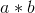
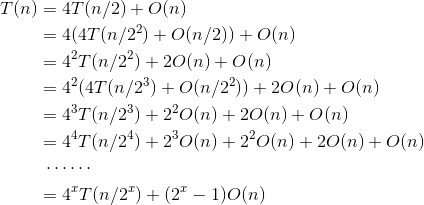
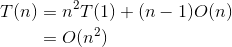
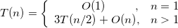
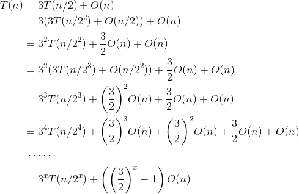

### 3.5.6　算法解析与拓展

#### 1．算法复杂度分析

（1）时间复杂度：我们假设大整数a、b都是n位数，根据分治策略，相乘将转换成了4个乘法运算ah*bh、ah*bl、al*bh、al*bl，而 **乘数的位数变为了原来的一半** 。直到最后递归分解到其中一个乘数为1位为止，每次递归就会使数据规模减小为原来的一半。假设两个n位大整数相乘的时间复杂度为T(n)，则：

当n>1时，可以递推求解如下：

递推最终的规模为1，令则，那么有：

大整数乘法的时间复杂度为O(n2)。

（2）空间复杂度：程序中变量占用了一些辅助空间，都是常数阶的，但合并时结点数组占用的辅助空间为O(n)，递归调用所使用的栈空间是O(logn)，想一想为什么？

大整数乘法的空间复杂度为O(n)。

#### 2．优化拓展

如果两个大整数都是n位数，那么有：

A*B=a*c*10n+（a*d+c*b）*10n / 2+b*d

还记得快速算出1+2+3+…+100的小高斯吗？这孩子长大以后更聪明，他把4次乘法运算变成了3次乘法：

a*d+c*b=（a−b）（d−c）+a*c+b*d

A*B= a*c*10 n +（（a−b）（d−c）+a*c+b*d）*10 n / 2 +b*d

这样公式中，就只有a*c、（a−b）（d−c）、b*d， **只需要进行3次乘法** 。

那么时间复杂度为：

当n>1时，可以递推求解如下：

递推最终的规模为1，令，则，那么有：

优化改进后的大整数乘法的时间复杂度从O(n2)降为O(n1.59)，这是一个巨大的改进！

但是 **需要注意** ：在上面的公式中，A和B必须2n位。很容易证明，如果不为2n，那么A或者B在分解过程中必会出现奇数，那么a*c和（（a−b）（d−c）+a*c+b*d）的次幂就有可能不同，无法变为3次乘法了，解决方法也很简单，只需要补齐位数即可，在数前（高位）补0。

