### 3.6　分治算法复杂度求解秘籍

分治法的道理非常简单，就是把一个大的复杂问题分为a（a>1）个形式相同的子问题，这些子问题的规模为n/b，如果分解或者合并的复杂度为f(n)，那么总的时间复杂度可以表示为：

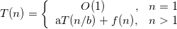
那么如何求解时间复杂度呢？

上面的求解方式都是递推求解，写出其递推式，最后求出结果。

例如，合并排序算法的时间复杂度递推求解如下：

递推最终的规模为1，令，则，那么有：

#### 1．递归树求解法

递归树求解方式其实和递推求解一样，只是递归树更清楚直观地显示出来，更能够形象地表达每层分解的结点和每层产生的成本。例如：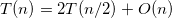，如图3-67所示。

时间复杂度=叶子数*T(1)+成本和=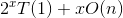。

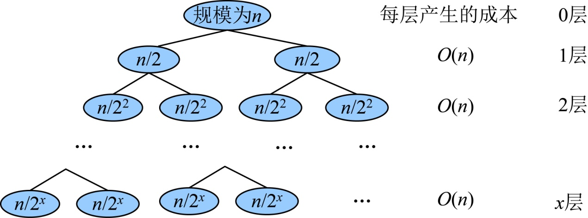

<b class="my_markdown">图3-67　分治递归树</b>

因为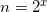，则，那么时间复杂度=。

#### 2．大师解法

我们用递归树来说明大师解法：

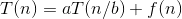
如果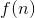的数量级是，那么原公式转化为，如图3-68所示。

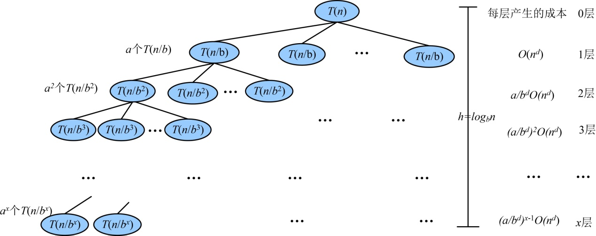

<b class="my_markdown">图3-68　大师解法递归树</b>

递归最终的规模为1，令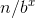=1，那么，即树高。

叶子数：。

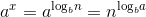
成本和：。

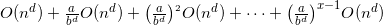
时间复杂度=叶子数*T(1)+成本和

第1层成本：。

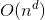
最后1层成本：

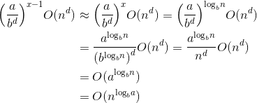
最后1层成本约等于叶子数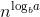，既然最后一层成本约等于叶子数，那么叶子数*T(1)就可以省略了，即 **时间复杂度=成本和。**

现在我们只需要观察每层产生的成本的发展趋势，是递减的还是递增的，还是每层都一样？每层成本的公比为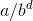。

（1）每层成本是递减的（a/bd<1）那么时间复杂度在渐进趋势上，成本和可以按 **第1层** 计算，其他忽略不计，即 **时间复杂度** 为：

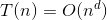
（2）每层成本是递增的（a/bd>1）那么时间复杂度在渐进趋势上，成本和可以按 **最后1层** 计算，其他忽略不计，即 **时间复杂度** 为：

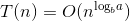
（3）每层成本是相同的（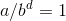），那么时间复杂度在渐进趋势上，每层成本都一样，我们把 **第一层的成本乘以树高** 即可。 **时间复杂度** 为：

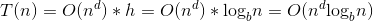
形如的时间复杂度 **求解秘籍** ：

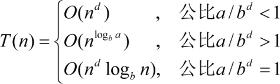
举例如下。

+ 猜数游戏

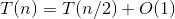
a=1，b=2，d=0，公比a/bd=1，则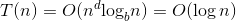。

+ 快速排序

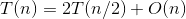
a=2，b=2，d=1，公比a/bd=1，则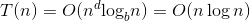。

+ 大整数乘法

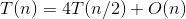
a=4，b=2，d=1，公比a/bd>1，则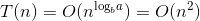。

+ 大整数乘法改进算法

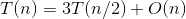
a=3，b=2，d=1，公比a/bd>1，则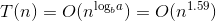。

那么，如果时间复杂度公式不是怎么办呢？

画出递归树，观察每层产生的成本：

成本的公比小于1，时间复杂度按 **第1层** 计算；

成本的公比大于1，时间复杂度按 **最后1层** 计算；

成本的公比等于1，时间复杂度按 **第1层*树高** 计算。

以求解为例。

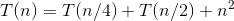
递推式解法如下：

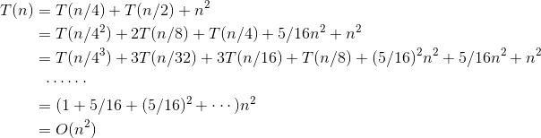
大师解法如下：

递归树如图3-69所示。

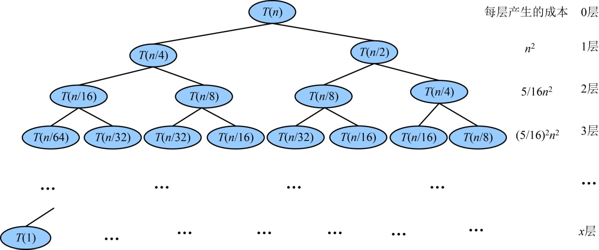

<b class="my_markdown">图3-69　大师解法递归树</b>

首先从递归树中观察每层产生的成本发展趋势，每层的成本有时不是那么有规律，需要仔细验证。例如第3层是(5/16)2n2，需要验证第4层是(5/16)3n2。经过验证，我们发现每层成本是一个等比数列，公比为5/16（小于1），呈递减趋势，那么只计算第1项即可，时间复杂度为T(n)=O(n2)。

