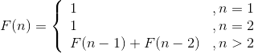
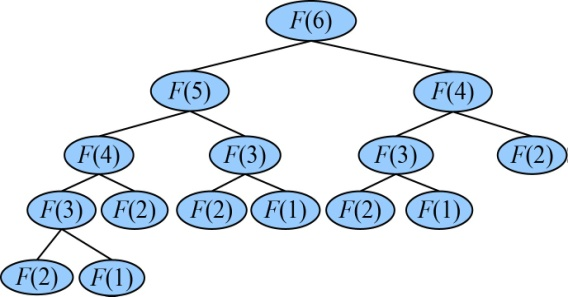

### 4.1　神奇的兔子序列

公元1202年，意大利数学家列昂纳多•斐波那契（Leonardo Fibonacci）在《算盘全书》（Liber Abaci）中描述了一个神奇的兔子序列，这就是著名的斐波那契序列。

假设第1个月有1对刚诞生的兔子，第2个月进入成熟期，第3个月开始生育兔子，而1对成熟的兔子每月会生1对兔子，兔子永不死去……那么，由1对初生兔子开始，12个月后会有多少对兔子呢？如果是N对初生的兔子开始，M月后又会有多少对兔子呢？

第1个月，兔子①没有繁殖能力，所以还是 **1** 对。

第2个月，兔子①进入成熟期，仍然是 **1** 对。

第3个月，兔子①生了1对小兔②，于是这个月共有2对（ **1+1=2** ）兔子。

第4个月，兔子①又生了1对小兔③。兔子②进入成熟期。共有3对（ **1+2=3** ）兔子。

第5个月，兔子①又生了1对小兔④，兔子②也生下了1对小兔⑤。兔子③进入成熟期。共有5对（ **2+3=5** ）兔子。

第6个月，兔子①②③各生下了1对小兔。兔子④⑤进入成熟期。新生3对兔子加上原有的5对兔子，这个月共有8对（ **3+5=8** ）兔子。

……

这个数列有十分明显的特点，从第3个月开始，当月的兔子数=上月兔子数+本月新生小兔子数，而本月新生的兔子正好是上上月的兔子数，即当月的兔子数=前两月兔子之和。

我们仅以F(6)为例，如图4-1所示。

<b class="my_markdown">图4-1　F(6)的递归树</b>

从图4-1可以看出，有大量的结点重复（子问题重叠），F(4)、F(3)、F(2)、F(1)均重复计算多次。

