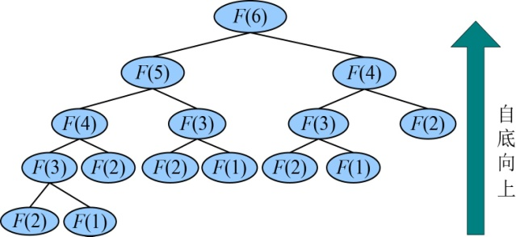

### 4.2.3　解题秘籍

遇到一个实际问题，如何采用动态规划来解决呢？

（1）分析最优解的结构特征。

（2）建立最优值的递归式。

（3）自底向上计算最优值，并记录。

（4）构造最优解。

以神奇的兔子序列问题为例。

（1）分析最优解的结构特征

我们通过分析发现，前两个月都是1对兔子，而从第3个月开始，当月的兔子数等于前两个月的兔子数，如果把每个月的兔子数看作一个最小的子问题，那么求解第n个月的兔子数，包含了第n−1个月的兔子数和第n−2个月的兔子数这两个子问题。

（2）根据最优解结构特征，建立递归式


（3）自底向上计算最优值

看到递归式，我们也很难立即求解F(n)，如果直接递归调用将会产生大量的子问题重复，那怎么办呢？动态规划提供了一个好办法，自底向上求解，记录结果，重复的问题只需求解一次即可，如图4-2所示。


<center class="my_markdown"><b class="my_markdown">图4-2　F(6)的递归树自底向上求解</b></center>

例如：

F(1)=1

F(2)=1

F(3)= F(2)+F(1)=2

F(4)= F(3)+F(2)=3

F(5)= F(4)+F(3)=5

F(6)= F(5)+F(4)=8

```c
int Fib2(int n) 
{  
  if(n<1)   
     return -1;
  int F[n+1];
  F[1]=1；
  F[2]=1;
  for(int i=3;i<=n;i++)
      F[i]=F[i-1]+F[i-2];
  return F[n];
}
```

（4）构造最优解

本题中自底向上求解到树根就是我们要的最优解。

在众多的算法中，很多读者觉得动态规划是比较难的算法，为什么呢？难在递归式！

很多复杂问题，很难找到相应的递归式。实际上，一旦得到递归式，那算法就已经实现了99%，剩下的程序实现就非常简单了。那么后面的例子就重点讲解遇到一个问题怎么找到它的递归式。

蛇打三寸，一招致命。

