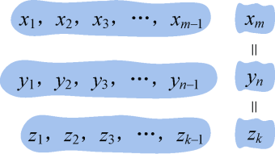
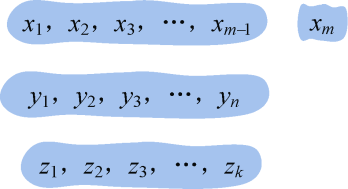
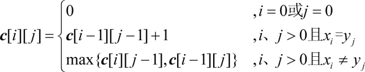

### 4.3.1　问题分析

给定两个序列X={x1，x2，x3，…，xm}和Y={y1，y2，y3，…，yn}，找出X和Y的一个最长的公共子序列。

例如：X=（A，B，C，B，A，D，B），Y=（B，C，B，A，A，C），那么最长公共子序列是B，C，B，A。

如何找到最长公共子序列呢？

如果使用暴力搜索方法，需要穷举X的所有子序列，检查每个子序列是否也是Y的子序列，记录找到的最长公共子序列。X的子序列有2m个，因此暴力求解的方法时间复杂度为指数阶，这是我们避之不及的爆炸性时间复杂度。

那么能不能用动态规划算法呢？

下面分析该问题是否具有最优子结构性质。

（1）分析最优解的结构特征

假设已经知道Zk={z1，z2，z3，…，zk}是Xm={x1，x2，x3，…，xm}和Yn={y1，y2，y3，…，yn}的最长公共子序列。这个假设很重要，我们都是这样假设已经知道了最优解。

那么可以分3种情况讨论。

+ xm= yn= zk：那么Z<em>k</em>−1={z1，z2，z3，…，zk−1}是Xm−1和Yn−1的最长公共子序列，如图4-4所示。

<b class="my_markdown">图4-4　最长公共子序列</b>

**反证法证明**  **：** 如果Zk−1={z1，z2，z3，…，zk−1}不是Xm−1和Yn−1的最长公共子序列，那么它们一定存在一个最长公共子序列。设M为Xm−1和Yn−1的最长公共子序列，M的长度大于Zk−1的长度，即|M|>|Zk−1|。如果在Xm−1和Yn−1的后面添加一个相同的字符xm= yn，则zk=xm=yn，|M+{zk}|>|Zk−1+{zk}|=|Zk|，那么Zk不是Xm和Yn的最长公共子序列，这与假设Zk是Xm和Yn的最长公共子序列矛盾，问题得证。

+ xm≠yn，xm≠ zk：我们可以把xm去掉，那么Zk是Xm−1和Yn的最长公共子序列，如图4-5所示。

<b class="my_markdown">图4-5　最长公共子序列</b>

**反证法证明：** 如果Zk不是Xm−1和Yn的最长公共子序列，那么它们一定存在一个最长公共子序列。设M为Xm−1和Yn的最长公共子序列，M的长度大于Zk的长度，即|M|>|Zk|。如果我们在Xm−1的后面添加一个字符xm，那么M也是Xm和Yn的最长公共子序列，因为|M|>|Zk|，那么Zk不是Xm和Yn的最长公共子序列，这与假设Zk是Xm和Yn的最长公共子序列矛盾，问题得证。

+ xm≠yn，yn≠ zk：我们可以把yn去掉，那么Zk是Xm和Yn−1的最长公共子序列，如图4-6所示。

<b class="my_markdown">图4-6　最长公共子序列</b>

**反证法证明：** 如果Zk不是Xm和Yn−1的最长公共子序列，那么它们一定存在一个最长公共子序列。设M为Xm和Yn−1的最长公共子序列，M的长度大于Zk的长度，即|M|>|Zk|。如果我们在Yn−1的后面添加一个字符yn，那么M也是Xm和Yn的最长公共子序列，因为|M|>|Zk|，那么Zk不是Xm和Yn的最长公共子序列，这与假设Zk是Xm和Yn的最长公共子序列矛盾，问题得证。

（2）建立最优值的递归式。

设**c**[i][j]表示Xi和Yj的最长公共子序列长度。

+ xm= yn= zk：那么**c**[i][j]= **c**[i−1][j−1]+1；
+ xm≠yn：那么我们只需要求解Xi和Yj−1的最长公共子序列和Xi−1和Yj的最长公共子序列，比较它们的长度哪一个更大，就取哪一个值。即**c**[i][j]= max{**c**[i][j−1], **c**[i−1][j]}。
+ 最长公共子序列长度递归式：

（3）底向上计算最优值，并记录最优值和最优策略

i=1时：{x1}和{y1，y2，y3，…，yn}中的字符一一比较，按递归式求解并记录最长公共子序列长度。

i=2时：{x2}和{y1，y2，y3，…，yn}中的字符一一比较，按递归式求解并记录最长公共子序列长度。

……

i=m时：{xm}和{y1，y2，y3，…，yn}中的字符一一比较，按递归式求解并记录最长公共子序列长度。

（4）构造最优解

上面的求解过程只是得到了最长公共子序列长度，并不知道最长公共子序列是什么，那怎么办呢？

例如，现在已经求出**c**[m][n]=5，表示Xm和Yn的最长公共子序列长度是5，那么这个5是怎么得到的呢？我们可以反向追踪5是从哪里来的。根据递推式，有如下情况。

xi= yj时：**c**[i][j]= **c**[i−1][j−1]+1；

xi≠yj时：**c**[i][j]= max{**c**[i][j−1], **c**[i−1][j]}；

那么**c**[i][j]的来源一共有3个：**c**[i][j]= **c**[i−1][j−1]+1，**c**[i][j]= **c**[i][j−1]，**c**[i][j]= **c**[i−1][j]。在第3步自底向上计算最优值时，用一个辅助数组**b** [i][j]记录这3个来源：

**c**[i][j]= **c**[i−1][j−1]+1，**b**[i][j]=1；

**c**[i][j]= c[i][j−1]，**b**[i][j]=2；

**c**[i][j]= c[i−1][j]，**b**[i][j]=3。

这样就可以根据**b**[m][n]反向追踪最长公共子序列，当**b**[i][j]=1时，输出xi；当**b** [i][j]=2时，追踪**c**[i][j−1]；当**b**[i][j]=3时，追踪**c**[i−1][j]，直到i=0或j=0停止。

