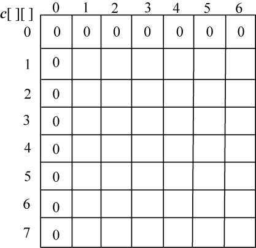
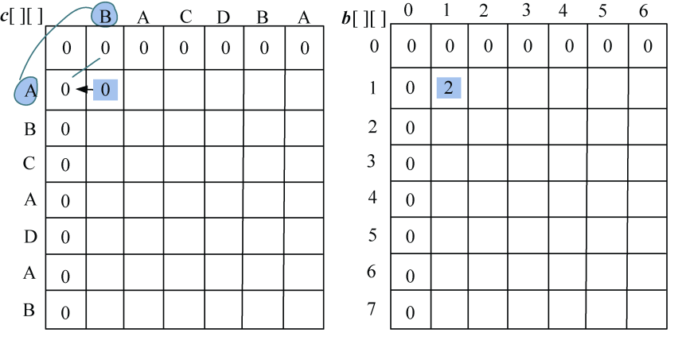
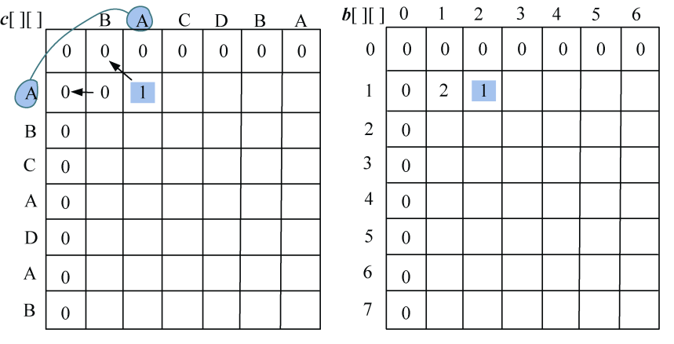
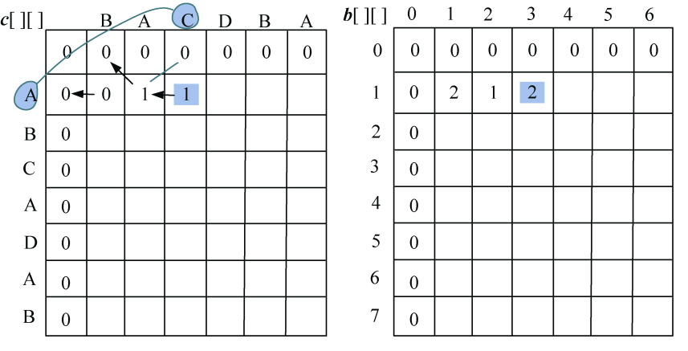
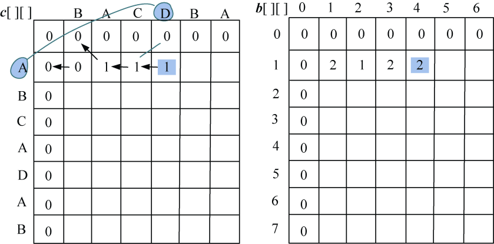
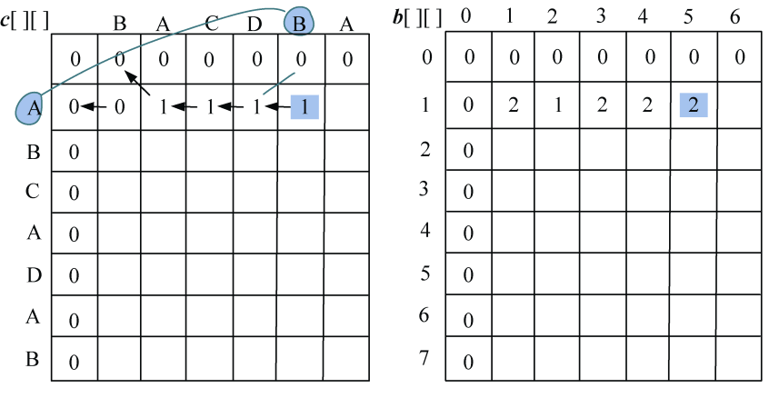
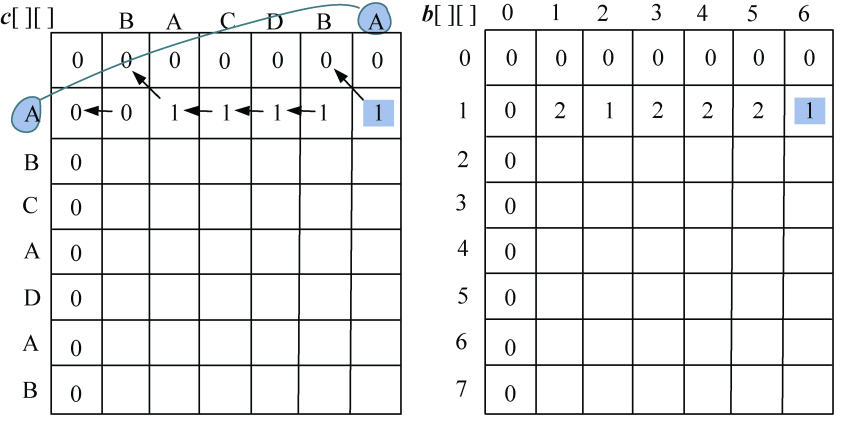
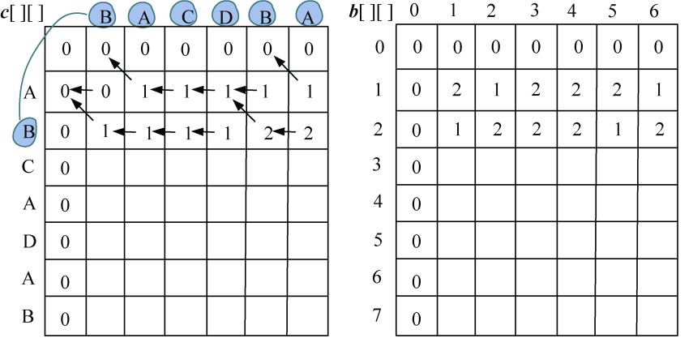
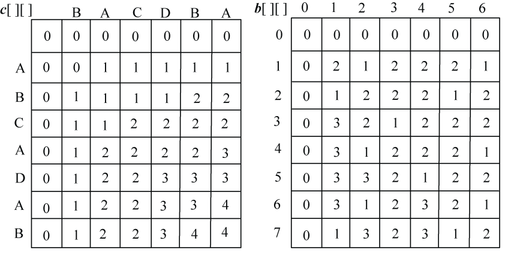
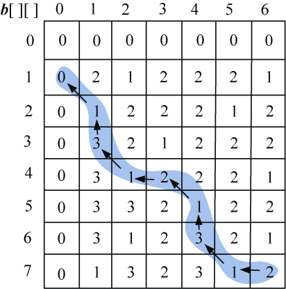

### 4.3.3　完美图解

以字符串s1=“ABCADAB”，s2=“BACDBA”为例。

（1）初始化

len1=7，len2=6，初始化**c**[][]第一行、第一列元素为0，如图4-7所示。

<b class="my_markdown">图4-7　**c**[][]初始化</b>

（2）i=1：s1[0]与s2[j−1]比较，j=1，2，3，…，len2。即“A”与“BACDBA”分别比较一次。

如果字符相等，**c**[i][j]取左上角数值加1，记录最优值来源**b**[i][j]=1。

如果字符不等，取左侧和上面数值中的最大值。如果左侧和上面数值相等，默认取左侧数值。如果**c**[i][j]的值来源于左侧**b**[i][j]=2，来源于上面**b**[i][j]=3。

+ j=1：A≠B，左侧=上面，取左侧数值，**c**[1][1]= 0，最优策略来源**b**[1][1]=2，如图4-8所示。

<b class="my_markdown">图4-8　最长公共子序列求解过程</b>

+ j=2：A=A，则取左上角数值加1，**c**[1][2]= **c**[0][1]+1=2，最优策略来源**b**[1][2] =1，如图4-9所示。

<b class="my_markdown">图4-9　最长公共子序列求解过程</b>

+ j=3：A≠C，左侧上面，取左侧数值，**c**[1][3]= 1，最优策略来源**b**[1][3] =2，如图4-10所示。

<b class="my_markdown">图4-10　最长公共子序列求解过程</b>

+ j= 4：A≠D，左侧上面，取左侧数值，**c**[1][4]= 1，最优策略来源**b**[1][4] =2，如图4-11所示。

<b class="my_markdown">图4-11　最长公共子序列求解过程</b>

+ j=5：A≠B，左侧上面，取左侧数值，**c**[1][5]=1，最优策略来源**b**[1][5]=2，如图4-12所示。

<b class="my_markdown">图4-12　最长公共子序列求解过程</b>

+ j=6：A=A，则取左上角数值加1，**c**[1][6]=1，最优策略来源**b**[1][6]=1，如图4-13所示。

<b class="my_markdown">图4-13　最长公共子序列求解过程</b>

（3）i=2：s1[1]与s2[j−1]比较，j=1，2，3，…，len2。即“B”与“BACDBA”分别比较一次。

如果字符相等，**c**[i][j]取左上角数值加1，记录最优值来源**b**[i][j]=1。

如果字符不等，取左侧和上面数值中的最大值。如果左侧和上面数值相等，默认取左侧数值。如果**c**[i][j]的值来源于左侧**b**[i][j]=2，来源于上面**b**[i][j]=3，如图4-14所示。

<b class="my_markdown">图4-14　最长公共子序列求解过程</b>

（4）继续处理i=2，3，…，len1：s1[i−1]与s2[j−1]比较，j=1，2，3，…，len2。处理结果如图4-15所示。

<b class="my_markdown">图4-15　最长公共子序列求解结果</b>

**c**[][]右下角的值即为最长公共子序列的长度。**c**[7][6]=4，即字符串s1=“ABCADAB”，s2=“BACDBA”的最长公共子序列的长度为4。

那么最长公共子序列包含哪些字符呢？

（5）构造最优解

首先读取**b**[7][6]=2，说明来源为2，向左找**b**[7][5]；

**b**[7][5]=1，向左上角找**b**[6][4]，返回时输出s[6]=“B”；

**b**[6][4]=3，向上找**b**[5][4]；

**b**[5][4]=1，向左上角找**b**[4][3]，返回时输出s[4]=“D”；

**b**[4][3]=2，向左找**b**[4][2]；

**b**[4][2]=1，向左上角找**b**[3][1]，返回时输出s[3]=“C”；

**b**[3][1]=3，向上找**b**[2][1]；

**b**[2][1]=1，向左上角找，返回时输出s[1]=“B”；

**b**[1][0]中列为0，算法停止，返回，输出最长公共子序列为BCDB，如图4-16所示。

<b class="my_markdown">图4-16　最长公共子序列构造最优解</b>

