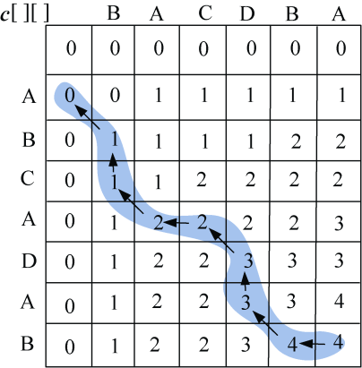

### 4.3.6　算法解析及优化拓展

#### 1．算法复杂度分析

（1）时间复杂度：由于每个数组单元的计算耗费Ο(1)时间，如果两个字符串的长度分别是m、n，那么算法时间复杂度为Ο(m*n)。

（2）空间复杂度：空间复杂度主要为两个二维数组**c**[][]，**b**[][]，占用的空间为O(m*n)。

#### 2．算法优化拓展

因为**c**[i][j]有3种来源：**c**[i−1][j−1]+1、**c**[i][j−1]、**c**[i−1][j]。我们可以利用**c**数组本身来判断来源于哪个值，从而不用**b**[][]，这样可以节省O(m*n)个空间。但因为**c**数组还是O(m*n)个空间，所有空间复杂度数量级仍然是O(m*n)，只是从常数因子上的改进。仍然是倒推的办法，如图4-17所示，读者可以想一想怎么做？

<b class="my_markdown">图4-17　最长公共子序列构造最优解（不用辅助数组）</b>

