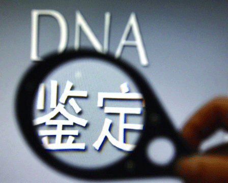

### 4.4　DNA基因鉴定——编辑距离

我们经常会听说DNA亲子鉴定是怎么回事呢？人类的DNA由4个基本字母{A，C，G，T}构成，包含了多达30亿个字符。如果两个人的DNA序列相差0.1%，仍然意味着有300万个位置不同，所以我们通常看到的DNA亲子鉴定报告上结论有：相似度99.99%，不排除亲子关系。

怎么判断两个基因的相似度呢？生物学上给出了一种编辑距离的概念。

例如两个字符串FAMILY和FRAME，有两种对齐方式：

F　 -　 A　M　I　L　Y　　　　　　 -　 F　 A　M　I　L　Y

F　 R　A　M　E　　　　　　　　　 F　 R　 A　M　E

第1种对齐需要付出的代价：4，插入R，将I替换为E，删除L、Y。

第2种对齐需要付出的代价：5，插入R，将F替换为R，将I替换为E，删除L、Y。

编辑距离是指将一个字符串变换为另一个字符串所需要的最小编辑操作。

怎么找到两个字符串x[1，…，m]和y[1，…，n]的编辑距离呢？

<b class="my_markdown">图4-18　DNA基因鉴定</b>

