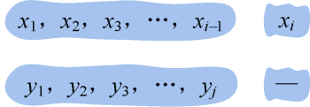
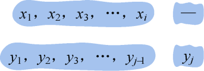
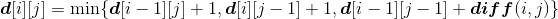

### 4.4.1　问题分析

编辑距离是指将一个字符串变换为另一个字符串所需要的最小编辑操作。

给定两个序列X={x1，x2，x3，…，xm}和Y={y1，y2，y3，…，yn}，找出X和Y的编辑距离。

例如：X=（A，B，C，D，A，B），Y=（B，D，C，A，B）。如果用穷举法，会有很多种对齐方式，暴力穷举的方法是不可取的。那么怎么找到编辑距离呢？

首先考虑能不能把原问题变成规模更小的子问题，如果可以，那就会容易得多。

要求两个字符串X={x1，x2，x3，…，xm}和Y={y1，y2，y3，…，yn}的编辑距离，那么可以求其前缀Xi={x1，x2，x3，…，xi}和Yj={y1，y2，y3，…，yj}的编辑距离，当i=m，j=n时就得到了所有字符的编辑距离。

那么能不能用动态规划算法呢？

下面我们分析该问题是否具有最优子结构性质。

（1）分析最优解的结构特征

假设已经知道**d**[i][j]是Xi={x1，x2，x3，…，xi}和Yj={y1，y2，y3，…，yj}的编辑距离最优解。这个假设很重要，我们都是这样假设已经知道了最优解。

那么两个序列无论怎么对齐，其右侧只可能有如下3种对齐方式：

+ 如图4-19所示。需要删除xi，付出代价1，那么我们只需要求解子问题{x1，x2，x3，…，xi−1}和{y1，y2，y3，…，yj}的编辑距离再加1即可，即**d**[i][j]=**d**[i−1][j]+1。**d**[i−1][j]是Xi−1和Yj的最优解。

<b class="my_markdown">图4-19　编辑距离对齐方式</b>

**反证法证明：** 设**d**[i−1][j]不是Xi−1和Yj的最优解，那么它们一定存在一个最优解**d’**，**d’**<**d**[i−1][j]。如果在Xi−1的后面添加一个字符xi，**d’**+1也是Xi和Yj的最优解，因为**d’**+1<**d**[i−1][j]+1=**d**[i][j]，所以**d**[i][j]不是Xi和Yj的最优解，这与假设**d**[i][j]是Xi和Yj的最优解矛盾，问题得证。

+ 如图4-20所示。需要插入yj，付出代价1，那么我们只需要求解子问题{x1，x2，x3，…，xi}和{y1，y2，y3，…，yj−1}的编辑距离再加1即可，即**d**[i][j]=**d**[i][j−1]+1。**d**[i][j−1]是Xi和Yj−1的最优解。

<b class="my_markdown">图4-20　编辑距离对齐方式</b>

同理可证。

+ 如图4-21所示。如果xi=yj，付出代价0，如果xi≠yj，需要替换，付出代价1，我们用函数**diff**(i，j)来表达，xi=yj时，**diff**(i，j)=0；xi≠yj时，**diff**(i，j)=1。那么我们只需要求解子问题{x1，x2，x3，…，xi−1}和{y1，y2，y3，…，yj−1}的编辑距离再加**diff**(i，j)即可，即**d**[i][j]=**d**[i−1][j−1]+ **diff**(i，j)。**d**[i−1][j−1]是Xi−1和Yj−1的最优解。

<b class="my_markdown">图4-21　编辑距离对齐方式</b>

同理可证。

（2）建立最优值递归式

设**d**[i][j]表示Xi和Yj的编辑距离，则**d**[i][j]取以上三者对齐方式的最小值。

编辑距离递归式：

（3）自底向上计算最优值，并记录最优值和最优策略

i=1时：{x1}和{y1，y2，y3，…，yn}中的字符一一比较，按递归式求解并记录编辑距离。

i=2时：{x2}和{y1，y2，y3，…，yn}中的字符一一比较，按递归式求解并记录编辑距离。

……

i=m时：{xm}和{y1，y2，y3，…，yn}中的字符一一比较，按递归式求解并记录编辑距离。

（4）构造最优解

如果仅仅需要知道编辑距离是多少，上面的求解过程得到的编辑距离就是最优值。如果还想知道插入、删除、替换了哪些字母，就需要从**d**[i][j]表格中倒推，输出这些结果。

