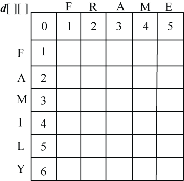
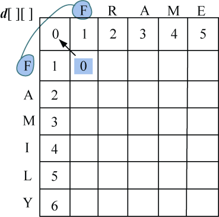
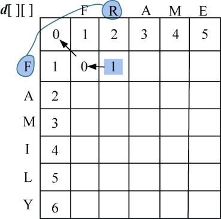
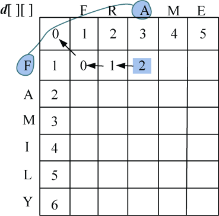
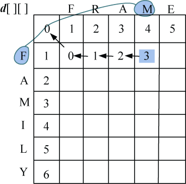
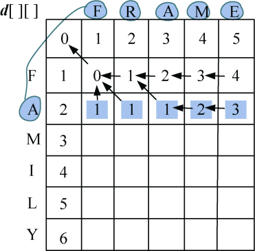
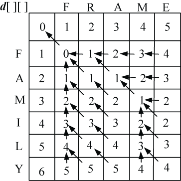
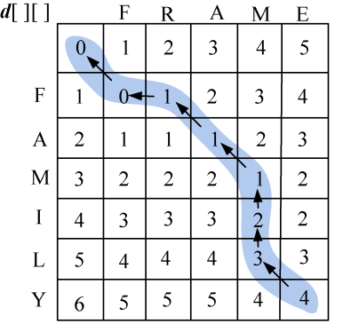

### 4.4.3　完美图解

以字符串s1=” FAMILY”，s2=” FRAME”为例。

（1）初始化

len1=6，len2=5，初始化**d**[][]第一行为0，1，2，…，5，第一列元素为0，1，2，…，6，如图4-22所示。

<b class="my_markdown">图4-22　编辑距离求解初始化</b>

（2）i=1：s1[0]与s2[j−1]比较，j=1，2，3，…，len2。即“F”与“FRAME”分别比较一次。

如果字符相等，**diff**[i][j]=0，否则**diff**[i][j] = 1。按照递归公式：

即取上面+1，左侧+1，左上角数值加**diff**[i][j]3个数当中的最小值，相等时取后者。

+ j=1：F=F，**diff**[1][1]=0，左上角数值加**diff**[1][1]=0，左侧+1=上面+1=2，3个数当中的最小值，**d**[1][1] =0，如图4-23所示。

<b class="my_markdown">图4-23　编辑距离求解过程</b>

+ j=2：F≠R，**diff**[1][2]=1，左上角数值加**diff**[1][2]=2，左侧+1=1，上面+1=3，取3个数当中的最小值，**d**[1][2] =1，如图4-24所示。

<b class="my_markdown">图4-24　编辑距离求解过程</b>

+ j=3：F≠A，**diff**[1][3]=1，左上角数值加**diff**[1][3]=3，左侧+1=2，上面+1=4，取3个数当中的最小值，**d**[1][3] =2，如图4-25所示。

<b class="my_markdown">图4-25　编辑距离求解过程</b>

+ j=4：F≠M：**diff**[1][4]=1，左上角数值加**diff**[1][4]=4，左侧+1=3，上面+1=5，取3个数当中的最小值，**d**[1][4] =3，如图4-26所示。

<b class="my_markdown">图4-26　编辑距离求解过程</b>

+ j=5：F≠E，**diff**[1][5]=1，左上角数值加**diff**[1][5]=5，左侧+1=4，上面+1=6，取3个数当中的最小值，**d**[1][5] =4，如图4-27所示。

<b class="my_markdown">图4-27　编辑距离求解过程</b>

（3）i=2：s1[1]与s2[j−1]比较，j=1，2，3，…，len2。即“A”与“FRAME”分别比较一次。

如果字符相等，**diff**[i][j]=0，否则**diff**[i][j] = 1。按照递归公式：

即取上面+1，左侧+1，左上角数值加**diff**[i][j]3个数当中的最小值，相等时取后者。

填写完毕，如图4-28所示。

<b class="my_markdown">图4-28　编辑距离求解过程</b>

（4）继续处理i=2，3，…，len1：s1[i−1]与s2[j−1]比较，j=1，2，3，…，len2，处理结果如图4-29所示。

<b class="my_markdown">图4-29　编辑距离求解结果</b>

（5）构造最优解

从右下角开始，逆向查找**d**[i][j]的来源： **上面** （即**d**[i][j]=**d**[i−1][j]+1）表示需要删除， **左侧** （即**d**[i][j]=**d**[i][j−1]+1）表示需要插入， **左上角** （即**d**[i][j]=**d**[i−1][j−1]+**diff**[i][j]）要判断是否字符相等，如果不相等则需要替换，如果字符相等什么也不做，如图4-30所示。为什么是这样呢？不清楚的读者可以回看4.4.1节。

<b class="my_markdown">图4-30　编辑距离最优解构造过程</b>

+ 首先读取右下角**d**[6][5]=4，s1[5]≠s2[4]，**d**[6][5]来源于3个数当中的最小值：上面+1=4，左侧+1=5，左上角数值+**diff**[i][j]=4，相等时取后者。来源于左上角，需要替换操作。返回时输出s1[5]替换为s2[4]，即“Y” **替换** 为“E”。
+ 向左上角找**d**[5][4]=3，s1[4]≠s2[3]。**d**[5][4]来源于3个数当中的最小值：上面+1=3，左侧+1=5，左上角数值+**diff**[i][j]=4。来源于上面，需要删除操作。返回时输出删除s1[4]，即 **删除** “L”。
+ 向上面找**d**[4][4]=2，s1[3]≠s2[3]。**d**[4][4]来源于3个数当中的最小值：上面+1=2，左侧+1=4，左上角数值+**diff**[i][j]=3。来源于上面，需要删除操作。返回时输出删除s1[3]，即 **删除** “I”。
+ 向上面找**d**[3][4]=1，s1[2]=s2[3]，不需操作。**d**[3][4]来源于上面+1=3，左侧+1=3，左上角数值+**diff**[i][j]=13个数当中的最小值。来源于左上角，因为字符相等什么也不做。返回时不输出。
+ 向左上角找**d**[2][3]=1，s1[1]=s2[2]，不需操作。**d**[2][3]来源于3个数当中的最小值：上面+1=3，左侧+1=2，左上角数值+**diff**[i][j]=1。来源于左上角，因为字符相等什么也不做。返回时不输出。
+ 向左上角找**d**[1][2]=1，s1[0]≠s2[1]。**d**[1][2]来源于3个数当中的最小值：上面+1=3，左侧+1=1，左上角数值+**diff**[i][j]=2。来源于左则，需要插入操作。返回时输出在第1个字符之后插入s2[1]，即 **插入** “R”。
+ 向左则找**d**[1][1]=0，s1[0]=s2[0]。**d**[1][1]来源于3个数当中的最小值：上面+1=2，左侧+1=2，左上角数值+**diff**[i][j]=0。来源于左上角，因为字符相等什么也不做。返回时不输出。
+ 行或列为0时，算法停止。

