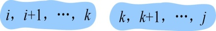
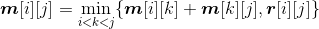
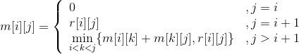

### 4.5.1　问题分析

长江游艇俱乐部在长江上设置了n个游艇出租站，游客可以在这些出租站租用游艇，并在下游的任何一个游艇出租站归还游艇。游艇出租站i到游艇出租站j之间的租金为**r**（i，j）。现在要求出从游艇出租站1到游艇出租站n所需的最少的租金。

当要租用游艇从一个站到另外一个站时，中间可能经过很多站点，不同的停靠站策略就有不同的租金。那么我们可以考虑该问题，从第1站到第n站的最优解是否一定包含前n−1的最优解，即是否具有最优子结构和重叠性。如果是，就可以利用动态规划进行求解。

如果我们穷举所有的停靠策略，例如一共有10个站点，当求子问题4个站点的停靠策略时，子问题有（1，2，3，4），（2，3，4，5），（3，4，5，6），（4，5，6，7），（5，6，7，8），（6，7，8，9），（7，8，9，10）。如果再求其子问题3个站点的停靠策略，（1，2，3，4）产生两个子问题：（1，2，3），（2，3，4）。（2，3，4，5）产生两个子问题：（2，3，4），（3，4，5）。如果再继续求解子问题，会发现有大量的子问题重叠，其算法时间复杂度为2n，暴力穷举的办法是很不可取的。

下面分析第i个站点到第j个站点（i，i+1，…，j）的最优解（最少租金）问题，考查是否具有最优子结构性质。

（1）分析最优解的结构特征

+ 假设我们已经知道了在第k个站点停靠会得到最优解，那么原问题就变成了两个子问题：（i，i+1，…，k）、（k，k+1，…，j）。如图4-32所示。

<b class="my_markdown">图4-32　分解为两个子问题</b>

+ 那么原问题的最优解是否包含子问题的最优解呢？

假设第i个站点到第j个站点（i，i+1，…，j）的最优解是c，子问题（i，i+1，…，k）的最优解是a，子问题（k，k+1，…，j）的最优解是b，那么c=a+b，无论两个子问题的停靠策略如何都不影响它们的结果，因此我们只需要证明如果c是最优的，则a和b一定是最优的（即原问题的最优解包含子问题的最优解）。

**反证法** ：如果a不是最优的，子问题（i，i+1，…，k）存在一个最优解a'，a'<a，那么a'+b <c，所以c不是最优的，这与假设c是最优的矛盾，因此如果c是最优的，则a一定是最优的。同理可证b也是最优的。因此如果c是最优的，则a和b一定是最优的。

因此，该问题具有最优子结构性质。

（2）建立最优值的递归式

+ 用**m**[i][j]表示第i个站点到第j个站点（i，i+1，…，j）的最优值（最少租金），那么两个子问题：（i，i+1，…，k）、（k，k+1，…，j）对应的最优值分别是**m**[i][k]、**m**[k][j]。
+ 游艇租金最优值递归式：

当j=i时，只有1个站点，**m**[i][j]=0。

当j=i+1时，只有2个站点，**m**[i][j]= **r**[i][j]。

当j>i+1时，有3个以上站点，。

整理如下。

（3）自底向上计算最优值，并记录

先求两个站点之间的最优值，再求3个站点之间的最优值，直到n个站点之间的最优值。

（4）构造最优解

上面得到的最优值只是第1个站点到第n个站点之间的最少租金，并不知道停靠了哪些站点，我们需要从记录表中还原，逆向构造出最优解。

