### 4.5.3　完美图解

长江游艇俱乐部在长江上设置了6个游艇出租站，如图4-33所示。游客可以在这些出租站租用游艇，并在下游的任何一个游艇出租站归还游艇。游艇出租站i到游艇出租站j之间的租金为**r**（i，j），如图4-34所示。

<b class="my_markdown">图4-33　游艇租赁地图</b>

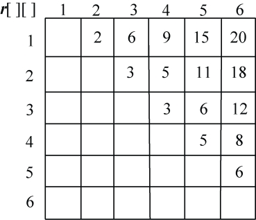

<b class="my_markdown">图4-34　各站点之间的游艇租金</b>

（1）初始化

节点数n=6，**m**[i][j]=**r**[i][j]，**s**[i][j]=0，其中，i=1，2，…，n，j=i+1，i+2，…，n。如图4-35所示。

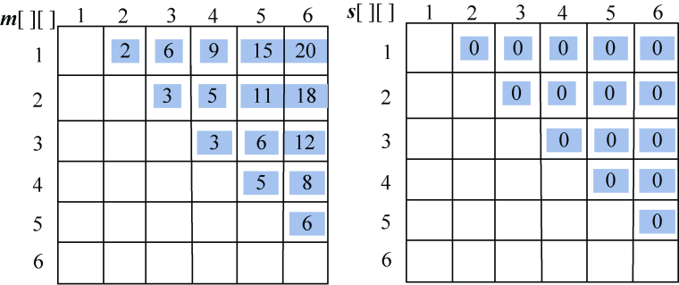

<b class="my_markdown">图4-35　游艇租赁问题初始化</b>

（2）计算3个站点i，i+1，j（j=i+2）的最优值，并将其存入**m**[i][j]，同时将最优策略记入**s**[i][j]，i=1，2，3，4。

+ i = 1，j=3：**m**[1][2]+ **m**[2][3]=5 < **m**[1][3]=6，更新**m**[1][3]=5，**s**[1][3]=2。
+ i = 2，j=4：**m**[2][3]+ **m**[3][4]=6 > **m**[2][4]=5，不做改变。
+ i = 3，j=5：**m**[3][4]+ **m**[4][5] =7> **m**[3][5]=6，不做改变。
+ i = 4，j=6：**m**[4][5]+ **m**[5][6]=9 > **m**[4][6]=8，不做改变。

如图4-36所示。

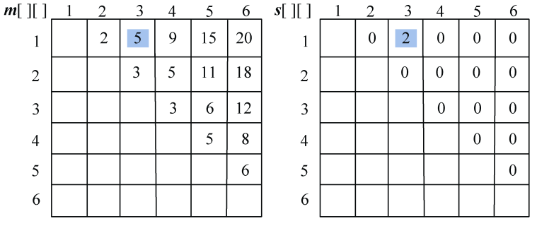

<b class="my_markdown">图4-36　游艇租赁问题求解过程</b>

（3）计算4个站点i，i+1，i+2，j（j=i+3）的最优值，并将其存入**m**[i][j]，同时将最优策略记入**s**[i][j]，i=1，2，3。

+ i = 1，j=4：

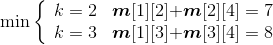；原值**m**[1][4]=9，更新**m**[1][4]=7，**s**[1][4]=2。

+ i =2，j=5：

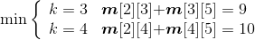；原值**m**[2][5]=11，更新**m**[2][5]=9，**s**[2][5]=3。

+ i =3，j=6：

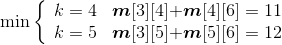；原值**m**[3][6]=12，更新**m**[3][6]=11，**s**[3][6]=4。

如图4-37所示。

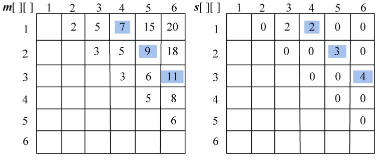

<b class="my_markdown">图4-37　游艇租赁问题求解过程</b>

（4）计算5个站点i，i+1，i+2，i+3，j（j=i+4）的最优值，并将其存入**m**[i][j]，同时将最优策略记入**s**[i][j]，i=1、2。

+ i = 1，j=5：

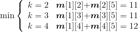；原值**m**[1][5]=15，更新**m**[1][5]=11，**s**[1][5]=2。

+ i = 2，j=6：

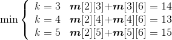；原值**m**[2][6]=18，更新**m**[1][5]=13，**s**[2][6]=4。

如图4-38所示。

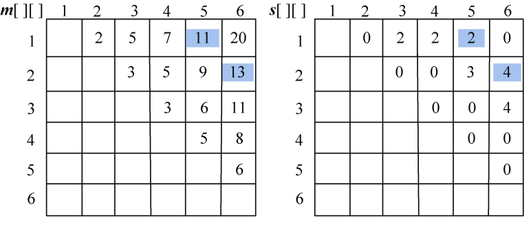

<b class="my_markdown">图4-38　游艇租赁问题求解过程</b>

（5）计算6个站点i，i+1，i+2，i+3，i+4，j（j=i+4）的最优值，并将其存入**m**[i][j]，同时将最优策略记入**s**[i][j]，i=1。

+ i = 1，j=6：

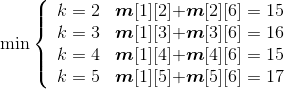；原值**m**[1][6]=20，更新**m**[1][6]=15，**s**[1][6]=2。

如图4-39所示。

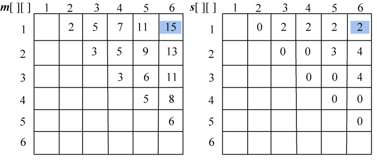

<b class="my_markdown">图4-39　游艇租赁问题求解过程</b>

（6）构造最优解

根据存储表格**s**[][]中的数据来构造最优解，即停靠的站点。

首先输出出发站点1；读取**s**[1][6]=2，表示在2号站点停靠，即分解为两个子问题：（1，2）和（2，3，4，5，6）。

先看第一个子问题（1，2）：读取**s**[1][2]=0，表示没有停靠任何站点，直接到达2，输出2。

再看第二个子问题（2，3，4，5，6）：读取**s**[2][6]=4，表示在4号站点停靠，即分解为两个子问题：（2，3，4）和（4，5，6）。

先看子问题（2，3，4）：读取**s**[2][4]=0，表示没有停靠任何站点，直接到达4，输出4。

再看子问题（4，5，6）：读取**s**[4][6]=0，表示没有停靠任何站点，直接到达6，输出6。

最终答案是：1——2——4——6。

