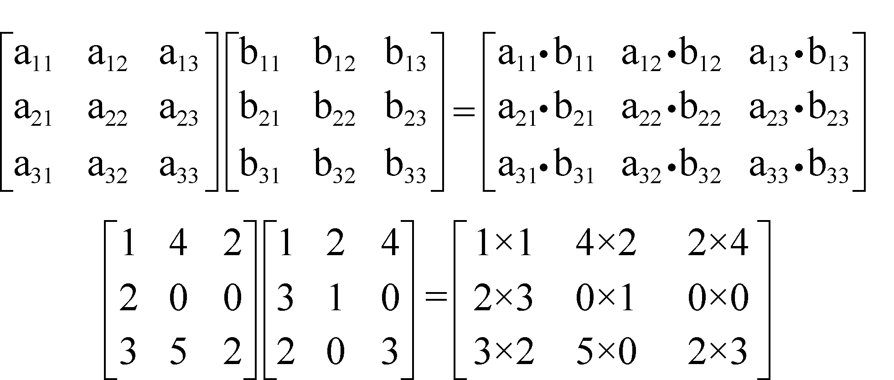

### 4.6　快速计算——矩阵连乘

给定n个矩阵{**A**1，**A** 2，**A**3，…，**A** n}，其中，**A** i 和**A** i+1（i=1，2，…，n−1）是可乘的。矩阵乘法如图4-40所示。用加括号的方法表示矩阵连乘的次序，不同的计算次序计算量（乘法次数）是不同的，找出一种加括号的方法，使得矩阵连乘的计算量最小。

<b class="my_markdown">图4-40　矩阵乘法</b>

例如：

**A**1是**M**5×10的矩阵；

**A**2是**M**10×100的矩阵；

**A**3是**M**100×2的矩阵。

那么有两种加括号的方法：

（1）（**A**1 **A**2）**A**3；

（2）**A**1（**A**2 **A**3）。

第1种加括号方法运算量：5×10×100+5×100×2=6000。

第2种加括号方法运算量：10×100×2+5×10×2=2100。

可以看出，不同的加括号办法，矩阵乘法的运算次数可能有巨大的差别！

