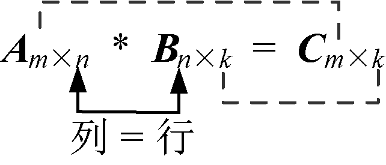
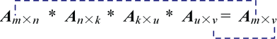
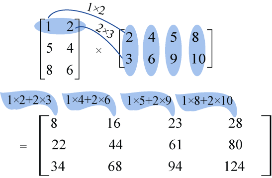
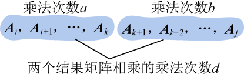
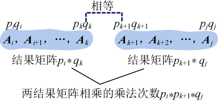
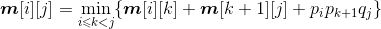
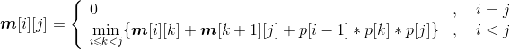

### 4.6.1　问题分析

矩阵连乘问题就是对于给定n个连乘的矩阵，找出一种加括号的方法，使得矩阵连乘的计算量（乘法次数）最小。

看到这个问题，我们需要了解以下内容。

（1）什么是矩阵可乘？

如果两个矩阵， **第1个矩阵的列等于第2个矩阵的行时，那么这两个矩阵是可乘的。** 如图4-41所示。

<b class="my_markdown">图4-41　两个矩阵相乘</b>

（2）矩阵相乘后的结果是什么？

从图4-41可以看出，两个矩阵相乘的结果矩阵，其行、列分别等于第1个矩阵的行、第2个矩阵的列。如果有很多矩阵相乘呢？如图4-42所示。

<b class="my_markdown">图4-42　多个矩阵相乘</b>

**多个矩阵相乘的结果矩阵，其行、列分别等于第1个矩阵的行、最后1个矩阵的列。** 而且无论矩阵的计算次序如何都不影响它们的结果矩阵。

（3）两个矩阵相乘需要多少次乘法？

例如两个矩阵**A**3×2、**B**2×4相乘，结果为**C**3×4要怎么计算呢？

**A**矩阵第1行第1个数 * **B**矩阵第1列第1个数：1×2；

**A**矩阵第1行第2个数 * **B**矩阵第1列第2个数：2×3；

**两者相加存放在C矩阵第1行第1列：1** × **2+2** × **3。**

**A**矩阵第1行第1个数 * **B**矩阵第2列第1个数：1×4；

**A**矩阵第1行第2个数 * **B**矩阵第2列第2个数：2×6；

**两者相加存放在C矩阵第1行第2列：1** × **4+2** × **6。**

**A**矩阵第1行第1个数 * **B**矩阵第3列第1个数：1×5；

**A**矩阵第1行第2个数 * **B**矩阵第3列第2个数：2×9；

**两者相加存放在C矩阵第1行第3列：1** × **5+2** × **9。**

**A**矩阵第1行第1个数 * **B**矩阵第4列第1个数：1×8；

**A**矩阵第1行第2个数 * **B**矩阵第4列第2个数：2×10；

**两者相加存放在C矩阵第1行第4列：1** × **8+2** × **10。**

其他行以此类推。

计算结果如图4-43所示。

<b class="my_markdown">图4-43　矩阵相乘运算</b>

可以看出，结果矩阵中每个数都执行了两次乘法运算，有3×4=12个数，一共需要执行2×3×4=24次，两个矩阵**A**3×2、**A**2×4相乘执行乘法运算的次数为3×2×4。因此，**A** m×n、**A** n×k相乘执行乘法运算的次数为m*n*k **。**

如果穷举所有的加括号方法，那么加括号的所有方案是一个卡特兰数序列，其算法时间复杂度为2n，是指数阶。因此穷举的办法是很糟的，那么能不能用动态规划呢？

下面分析矩阵连乘问题**A** i **A** i+1…**A** j是否具有最优子结构性质。

（1）分析最优解的结构特征

+ 假设我们已经知道了在第k个位置加括号会得到最优解，那么原问题就变成了两个子问题：（**A** i **A** i+1…**A** k），（**A** k+1**A** k+2…**A** j），如图4-44所示。

<b class="my_markdown">图4-44　分解为两个子问题</b>

原问题的最优解是否包含子问题的最优解呢？

+ 假设**A** i **A** i+1…**A** j的乘法次数是c，（**A** i **A** i+1…**A** k）的乘法次数是a，（**A** k+1**A** k+2…**A** j）的乘法次数是b，（**A** i **A** i+1…**A** k）和（**A** k+1**A** k+2…**A** j）的结果矩阵相乘的乘法次数是d，那么c=a+b+d，无论两个子问题（**A** i **A** i+1…**A** k）、（**A** k+1**A** k+2…**A** j）的计算次序如何，都不影响它们结果矩阵，两个结果矩阵相乘的乘法次数d不变。因此我们只需要证明如果c是最优的，则a和b一定是最优的（即原问题的最优解包含子问题的最优解）。

**反证法：** 如果a不是最优的，（**A** i **A** i+1…**A** k）存在一个最优解a'，a'<a，那么，a'+b+d<c，所以c不是最优的，这与假设c是最优的矛盾，因此如果c是最优的，则a一定是最优的。同理可证b也是最优的。因此如果c是最优的，则a和b一定是最优的。

因此，矩阵连乘问题具有最优子结构性质。

（2）建立最优值递归式

+ 用**m**[i][j]表示**A** i **A** i+1…**A** j矩阵连乘的最优值，那么两个子问题（**A** i **A** i+1…**A** k）、（**A** k+1**A** k+2…**A** j）对应的最优值分别是**m**[i][k]、**m**[k+1][j]。剩下的只需要考查（**A** i **A** i+1…**A** k）和（**A** k+1**A** k+2…**A** j）的结果矩阵相乘的乘法次数了。
+ 设矩阵**A** m的行数为pm，列数为qm，m=i，i+1, …，j，且矩阵是可乘的，即相邻矩阵前一个矩阵的列等于下一个矩阵的行（qm= pm+1）。（**A** i **A** i+1…**A** k）的结果是一个pi×qk矩阵，（**A** k+1**A** k+2…**A** j）的结果是一个pk+1*qj矩阵，qk= pk+1，两个结果矩阵相乘的乘法次数是pi*pk+1*qj。如图4-45所示。

<b class="my_markdown">图4-45　结果矩阵乘法次数</b>

+ 矩阵连乘最优值递归式：

当i=j时，只有一个矩阵，**m**[i][j]=0；

当i>j时，

如果用一维数组p[]来记录矩阵的行和列，第i个矩阵的行数存储在数组的第i−1位置，列数存储在数组的第i位置，那么pi*pk+1*qj对应的数组元素相乘为p[i−1]*p[k]* p[j]，原递归式变为：

（3）自底向上计算并记录最优值

先求两个矩阵相乘的最优值，再求3个矩阵相乘的最优值，直到n个矩阵连乘的最优值。

（4）构造最优解

上面得到的最优值只是矩阵连乘的最小的乘法次数，并不知道加括号的次序，需要从记录表中还原加括号次序，构造出最优解，例如**A**1（**A**2**A**3）。

这个问题是一个动态规划求矩阵连乘最小计算量的问题，将问题分为小规模的问题，自底向上，将规模放大，直到得到所求规模的问题的解。

