### 4.6.3　完美图解

现在我们假设有5个矩阵，如表4-1所示。

<b class="my_markdown">表4-1　矩阵的规模</b>

| 矩阵 | A1 | A2 | A3 | A4 | A5 |
| :-----  | :-----  | :-----  | :-----  | :-----  | :-----  | :-----  | :-----  |
| 规模 | 3×5 | 5×10 | 10×8 | 8×2 | 2×4 |

（1）初始化

采用一维数组p[]记录矩阵的行和列，实际上只需要记录每个矩阵的行，再加上最后一个矩阵的列即可，如图4-46所示。**m**[i][i]=0，**s**[i][i]=0，其中i= 1，2，3，4，5。

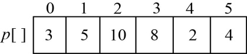

<b class="my_markdown">图4-46　记录行列的数组p[]</b>

最优值数组**m**[i][i]=0，最优决策数组**s**[i][i]=0，其中i= 1，2，3，4，5。如图4-47所示。

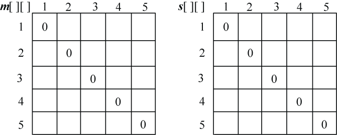

<b class="my_markdown">图4-47　**m**[][]和**s**[][]初始化</b>

（2）计算两个矩阵相乘的最优值

规模r=2。根据递归式：

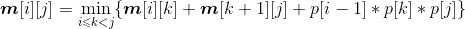
+ **A**1***A**2：k=1，**m**[1][2]=min{ **m**[1][1]+ **m**[2][2]+p0p1p2}=150；**s**[1][2]=1。
+ **A**2***A**3：k=2，**m**[2][3]=min{ **m**[2][2]+ **m**[3][3]+p1p2p3}=400；**s**[2][3]=2。
+ **A**3***A**4：k=3，**m**[3][4]=min{ **m**[3][3]+ **m**[4][4]+p2p3p4}=160；**s**[3][4]=3。
+ **A**4***A**5：k=4，**m**[4][5]=min{ **m**[4][4]+ **m**[5][5]+p3p4p5}=64； **s**[4][5]=4。

计算完毕，如图4-48所示。

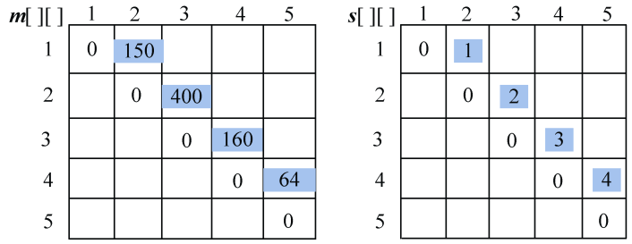

<b class="my_markdown">图4-48　**m**[][]和**s**[][]计算过程</b>

（3）计算3个矩阵相乘的最优值

规模r=3。根据递归式：

+ **A**1***A**2***A**3：

；

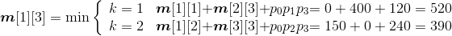
**s**[1][3]=2。

+ **A**2***A**3***A**4：

；

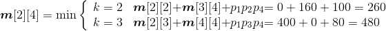
**s**[2][4]=2。

+ **A**3***A**4***A**5：

；

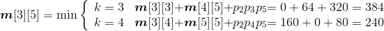
**s**[3][5]=4。

计算完毕，如图4-49所示。

<b class="my_markdown">图4-49　**m**[][]和**s**[][]计算过程</b>

（4）计算4个矩阵相乘的最优值

规模r=4。根据递归式：

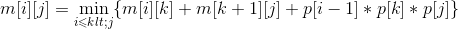
+ **A**1***A**2***A**3***A**4：

；

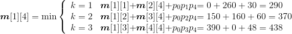
**s**[1][4]=1。

+ **A**2***A**3***A**4***A**5：

；

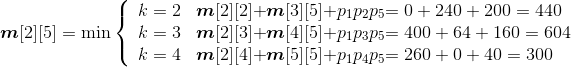
**s**[2][5]=4。

计算完毕，如图4-50所示。

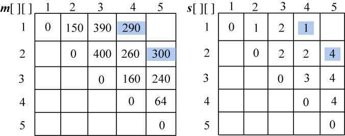

<b class="my_markdown">图4-50　**m**[][]和**s**[][]计算过程</b>

（5）计算5个矩阵相乘的最优值

规模r=5。根据递归式：

+ **A**1***A**2***A**3***A**4***A**5：

；

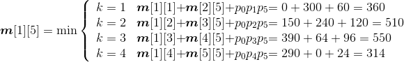
**s**[1][5]=4。

计算完毕，如图4-51所示。

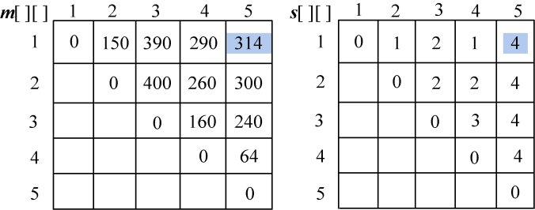

<b class="my_markdown">图4-51**m**[][]和**s**[][]计算过程</b>

（6）构造最优解

根据最优决策数组**s**[][]中的数据来构造最优解，即加括号的位置。

首先读取**s**[1][5]=4，表示在k=4的位置把矩阵分为两个子问题：（**A**1**A**2**A**3**A**4）、**A**5。

再看第一个子问题（**A**1**A**2**A**3**A**4），读取**s**[1][4]=1，表示在k=1的位置把矩阵分为两个子问题：**A**1、（**A**2**A**3**A**4）。

子问题**A**1不用再分解，输出；子问题（**A**2**A**3**A**4），读取**s**[2][4]=2，表示在k=2的位置把矩阵分为两个子问题：**A**2、（**A**3**A**4）。

子问题**A**2不用再分解，输出；子问题(**A**3**A**4)，读取**s**[3][4]=3，表示在k=3的位置把矩阵分为两个子问题：**A**3、**A**4。这两个子问题都不用再分解，输出。

子问题**A**5不用再分解，输出。

最优解构造过程如图4-52所示。

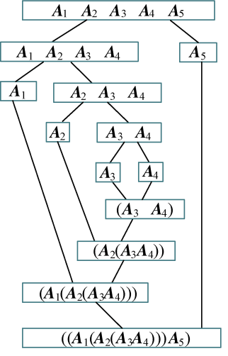

<b class="my_markdown">图4-52　最优解构造过程</b>

最优解为：（（**A**1（**A**2（**A**3**A**4）））**A**5）。

最优值为：314。

