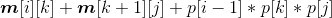

### 4.6.4　伪代码详解

按照算法思想和设计，以下程序将矩阵的行和列存储在一维数组p[]，**m**[][]数组用于存储分成的各个子问题的最优值，**s**[][]数组用于存储各个子问题的决策点，然后在一个for循环里，将问题分为规模为r的子问题，求每个规模子问题的最优解，那么得到的**m**[1][n]就是最小的计算量。

（1）矩阵连乘求解函数

首先将数组**m**[][]，**s**[][]初始化为0，然后自底向上处理不同规模的子问题，r为问题的规模，r= 2；r <= n；r++，当r= 2时，表示矩阵连乘的规模为2，即两个矩阵连乘。求解两个矩阵连乘的最优值和最优策略，根据递归式：


对每一个k值，求解，找到最小值用**m**[i][j]记录，并用**s**[i][j]记录取得最小值的k值。

```c
void matrixchain()
{
     int i,j,r,k;
     memset(m,0,sizeof(m));   // m[][]初始化所有元素为0，实际只需要对角线为0即可
     memset(s,0,sizeof(s));   // s[][]初始化所有元素为0，实际只需要对角线为0即可
     for(r = 2; r <= n; r++)  //r为问题的规模，处理不同规模的子问题
     {
          for(i = 1; i <= n-r+1; i++)
          {
               j = i + r - 1;
               m[i][j] = m[i+1][j] + p[i-1] * p[i] * p[j];//决策为k=i的乘法次数
               s[i][j] = i;             //子问题的最优策略是i;
              for(k = i+1 ; k < j; k++) //对从i+1到j的所有决策，求最优值
               {
                    int t = m[i][k] + m[k+1][j] + p[i-1] * p[k] * p[j];
                    if(t < m[i][j])
                    {
                           m[i][j] = t;
                           s[i][j] = k;
                    }
               }
          }
     }
}
```

（2）最优解输出函数

根据存储表格**s**[][]中的数据来构造最优解，即加括号的位置。首先打印一个左括号，然后递归求解子问题print（i， **s**[i][j]），print（**s**[i][j]+1，j），再打印右括号，当i=j即只剩下一个矩阵时输出该矩阵即可。

```c
void print(int i,int j)
{
     if( i == j )
     {
         cout <<"A[" << i << "]";
         return ;
     }
     cout << "(";
     print(i,s[i][j]);
     print(s[i][j]+1,j);
     cout << ")";
}
```

