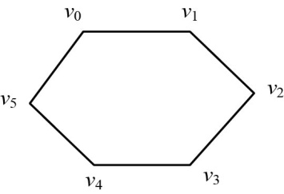
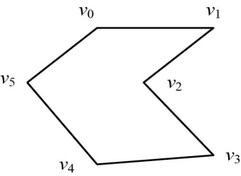
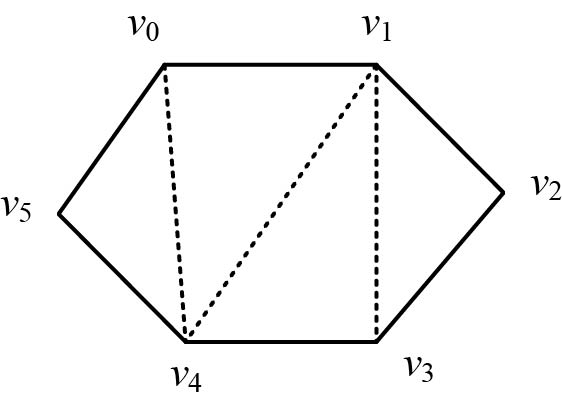
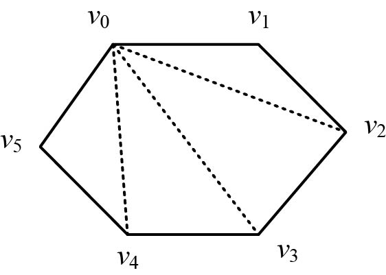
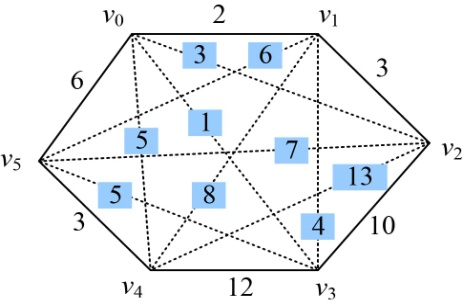
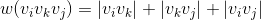
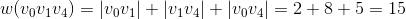
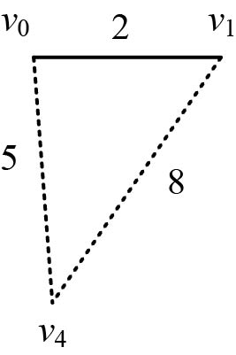
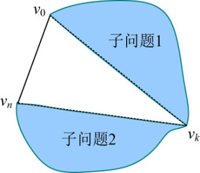
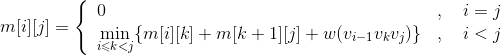

### 4.7.1　问题分析

我们可以把披萨饼看作一个凸多边形，凸多边形是指多边形的任意两点的连线均落在多边形的内部或边界上。

（1）什么是凸多边形？

图4-54所示是一个凸多边形，图4-55所示不是凸多边形，因为v1v3的连线落在了多边形的外部。

<b class="my_markdown">图4-54　凸多边形</b>

<b class="my_markdown">图4-55　非凸多边形</b>

凸多边形不相邻的两个顶点的连线称为凸多边形的弦。

（2）什么是凸多边形三角剖分？

凸多边形的三角剖分是指将一个凸多边形 **分割成互不相交的三角形的弦的集合** 。图4-56所示的一个三角剖分是{ v0v4，v1v3，v1v4}，另一个三角剖分是{ v0v2，v0v3，v0v4}，一个凸多边形的三角剖分有很多种。

<b class="my_markdown">图4-56　凸多边形三角剖分</b>

如果我们给定凸多边形及定义在边、弦上的权值，即任意两点之间定义一个数值作为权值。如图4-57所示。

<b class="my_markdown">图4-57　带权值的凸多边形</b>

三角形上权值之和是指三角形的3条边上权值之和：

如图4-58所示，。

<b class="my_markdown">图4-58　三角形权值之和</b>

（3）什么是凸多边形最优三角剖分？

一个凸多边形的三角剖分有很多种，最优三角剖分就是划分的各三角形上权函数之和最小的三角剖分。

再回到切披萨的问题上来，我们可以把披萨看作一个凸多边形，任何两个顶点的连线对应的权值代表上面的蔬菜和肉片数，我们希望沿着两个不相邻的顶点切成小三角形，尽可能少地切碎披萨上面的蔬菜和肉片。那么，该问题可以归结为凸多边形的最优三角剖分问题。

假设把披萨看作一个凸多边形，标注各顶点为{v0，v1，…，vn}。那么怎么得到它的最优三角剖分呢？

首先分析该问题是否具有最优子结构性质。

（1）分析最优解的结构特征

+ 假设已经知道了在第k个顶点切开会得到最优解，那么原问题就变成了两个子问题和一个三角形，子问题分别是{v0，v1，…，vk}和{vk，vk+1，…，vn}，三角形为v0vkvn，如图4-59所示。

<b class="my_markdown">图4-59　凸多边形三角剖分子问题</b>

那么原问题的最优解是否包含子问题的最优解呢？

+ 假设{v0，v1，…，vn}三角剖分的权值之和是c，{v0，v1，…，vk}三角剖分的权值之和是a，{vk，vk+1，…，vn}三角剖分的权函数之和是b，三角形v0vkvn的权值之和是w（v0vkvn），那么c=a+b+ w（v0vkvn）。因此我们只需要证明如果c是最优的，则a和b一定是最优的（即原问题的最优解包含子问题的最优解）。

**反证法：** 如果a不是最优的，{v0，v1，…，vk}三角剖分一定存在一个最优解a'，a'<a，那么a'+b+w（v0vkvn）<c，所以c不是最优的，这与假设c是最优的矛盾，因此如果c是最优的，则a一定是最优的。同理可证b也是最优的。因此如果c是最优的，则a和b一定是最优的。

因此，凸多边形的最优三角剖分问题具有最优子结构性质。

（2）建立最优值的递归式

+ 用**m**[i][j]表示凸多边形{vi−1，vi，…，vj}三角剖分的最优值，那么两个子问题{vi−1，vi，…，vk}、{vk，vk+1，…，vj}对应的最优值分别是**m**[i][k]、**m**[k+1][j]，如图4-60所示，剩下的就是三角形vi−1vkvj的权值之和是w(vi−1vkvj)。

<b class="my_markdown">图4-60　凸多边形三角剖分最优值</b>

当i=j时，{vi−1，vi，…，vj}就变成了{vi−1，vi }，是一条线段，不能形成一个三角形剖分，我们可以将其看作退化的多边形，其权值设置为0。

+ 凸多边形三角剖分最优解递归式：

当i=j时，只是一个线段，**m**[i][j]=0。

当i>j时，，

。

（3）自底向上计算并记录最优值

先求只有3个顶点凸多边形三角剖分的最优值，再求4个顶点凸多边形三角剖分的最优值，直到n个顶点凸多边形三角剖分的最优值。

（4）构造最优解

上面得到的最优值只是凸多边形三角剖分的三角形权值之和最小值，并不知道是怎样剖分的。我们需要从记录表中还原剖分次序，找到最优剖分的弦，由这些弦构造出最优解。

如图4-61所示，如果vk 能够得到凸多边形{vi−1，vi，…，vj}的最优三角剖分，那么我们就找到两条弦vi−1vk和vkvj，把这两条弦放在最优解集合里面，继续求解两个子问题最优三角剖分的弦。

<b class="my_markdown">图4-61　凸多边形三角剖分构造最优解</b>

凸多边形最优三角剖分的问题，首先判断该问题是否具有最优子结构性质，有了这个性质就可以使用动态规划，然后分析问题找最优解的递归式，根据递归式自底向上求解，最后根据最优决策表格，构造出最优解。

