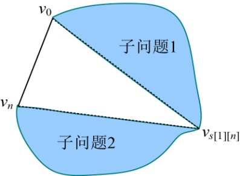

### 4.7.2　算法设计

凸多边形最优三角剖分满足动态规划的最优子结构性质，可以从自底向上逐渐推出整体的最优。

（1）确定合适的数据结构

采用二维数组**g**[][]记录各个顶点之间的连接权值，二维数组**m**[][]存放各个子问题的最优值，二维数组**s**[][]存放各个子问题的最优决策。

（2）初始化

输入顶点数n，然后依次输入各个顶点之间的连接权值存储在二维数组**g**[][]中，令n=n−1（顶点标号从v0开始），**m**[i][i]=0，**s**[i][i]=0，其中i= 1，2，3，…，n。

（3）循环阶段

+ 按照递归关系式计算3个顶点{vi−1，vi，vi+1}的最优三角剖分，j=i+1，将最优值存入**m**[i][j]，同时将最优策略记入**s**[i][ j]，i= 1，2，3，…，n−1。
+ 按照递归关系式计算4个顶点{vi−1，vi，vi+1，vi+2}的最优三角剖分，j=i+2，将最优值存入**m**[i][ j]，同时将最优策略记入**s**[i][ j]，i= 1，2，3，…，n−2。
+ 以此类推，直到求出所有顶点 {v0，v1，…，vn} 的最优三角剖分，并将最优值存入**m**[1][n]，将最优策略记入**s**[1][n]。

（4）构造最优解

根据最优决策信息数组**s**[][]递归构造最优解，即输出凸多边形最优剖分的所有弦。**s**[1][n] 表示凸多边形{v0，v1，…，vn} 的最优三角剖分位置，如图4-62所示。

+ 如果子问题1为空，即没有一个顶点，说明v0v**s**[1][<em>n</em>]是一条边，不是弦，不需输出，否则，输出该弦v0v**s**[1][<em>n</em>]。
+ 如果子问题2为空，即没有一个顶点，说明v**s**[1][<em>n</em>] vn是一条边，不是弦，不需输出，否则，输出该弦v**s**[1][<em>n</em>] vn。
+ 递归构造两个子问题{v0，v1，…，v**s**[1][<em>n</em>]}和{v**s**[1][<em>n</em>]，v1，…，vn }，一直递归到子问题为空停止。

<b class="my_markdown">图4-62　凸多边形三角剖分构造最优解</b>

