### 4.7.3　完美图解

以图4-63的凸多边形为例。

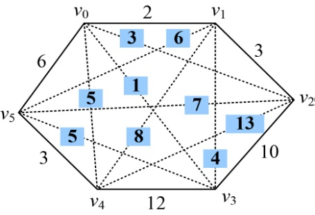

<b class="my_markdown">图4-63　凸多边形</b>

（1）初始化

顶点数n=6，令n=n−1=5（顶点标号从v0开始），然后依次输入各个顶点之间的连接权值存储在邻接矩阵 **g** [i][j]中，其中i，j=0，1，2，3，4，5，如图4-64所示。**m**[i][i]=0，**s**[i][i]=0，其中i=1，2，3，4，5，如图4-65所示。

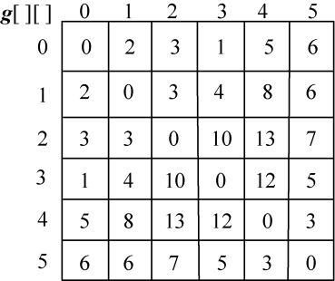

<b class="my_markdown">图4-64　凸多边形邻接矩阵</b>

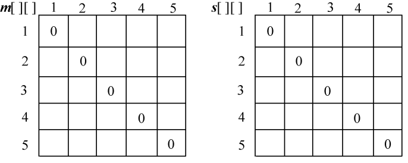

<b class="my_markdown">图4-65　最优值和最优策略</b>

（2）计算3个顶点{vi−1，vi，vi+1}的最优三角剖分，将最优值存入**m**[i][j]，同时将最优策略记入**s**[i][j]，i=1，2，3，4。

根据递归式：

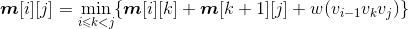
+ i=1，j=2：{v0，v1，v2}
+ k=1：**m**[1][2]=min{**m**[1][1]+**m**[2][2]+w(v0v1v2)}=8；**s**[1][2]=1。
+ i=2，j=3：{v1，v2，v3}
+ k=2：**m**[2][3]=min{**m**[2][2]+**m**[3][3]+w (v1v2v3)}=17；**s**[2][3]=2。
+ i=3，j=4：{v2，v3，v4}
+ k=3：**m**[3][4]=min{**m**[3][3]+**m**[4][4]+w (v2v3v4)}=35；**s**[3][4]=3。
+ i=4，j=5：{v3，v4，v5}
+ k=4：**m**[4][5]=min{**m**[4][4]+**m**[5][5]+w (v3v4v5)}=20；**s**[4][5]=4。

计算完毕，如图4-66所示。

<b class="my_markdown">图4-66　最优值和最优策略</b>

（3）计算4个顶点{vi−1，vi，vi+1，vi+2}的最优三角剖分，将最优值存入**m**[i][j]，同时将最优策略记入**s**[i][j]，i=1，2，3。

根据递归式：

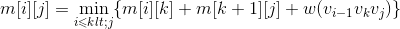
+ i=1，j=3：{v0，v1，v2，v3}

；

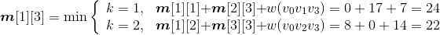
**s**[1][3]=2。

+ i=2，j=4：{v1，v2，v3，v4}

；

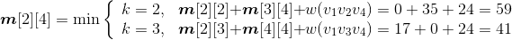
**s**[2][4]=3。

+ i=3，j=5：{v2，v3，v4，v5}

；

**s**[3][5]=3。

计算完毕，如图4-67所示：

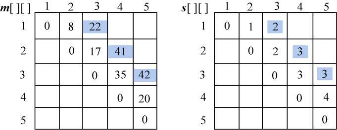

<b class="my_markdown">图4-67　最优值和最优策略</b>

（4）计算5个顶点{vi-1，vi，vi+1，vi+2，vi+3}的最优三角剖分，将最优值存入**m**[i][j]，同时将最优策略记入**s**[i][j]，i=1，2。

根据递归式：

+ i=1，j=4：{v0，v1，v2，v3，v4}

；

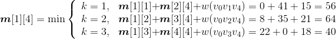
**s**[1][4]=3。

+ i=2，j=5：{v1，v2，v3，v4，v5}

；

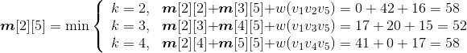
**s**[2][5]=3。

计算完毕，如图4-68所示。

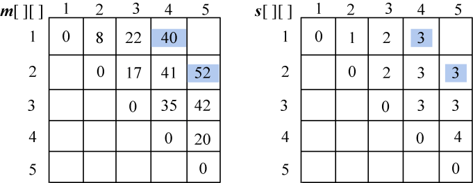

<b class="my_markdown">图4-68　最优值和最优策略</b>

（5）计算6个顶点{vi−1，vi，vi+1，vi+2，vi+3，vi+4}的最优三角剖分，j=i+4，将最优值存入**m**[i][j]，同时将最优策略记入**s**[i][j]，i=1。

根据递归式：

+ i=1，j=5：{v0，v1，v2，v3，v4，v5}

；

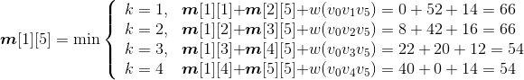
**s**[1][5]=3。

计算完毕，如图4-69所示。

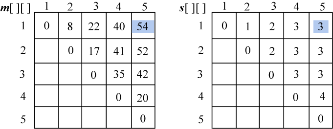

<b class="my_markdown">图4-69　最优值和最优策略</b>

（6）构造最优解

根据最优决策信息数组**s**[][]递归构造最优解，即输出凸多边形最优剖分的所有弦。**s**[1][5] 表示凸多边形{v0，v1，…，v5} 的最优三角剖分位置，从图4-69最优决策数组可以看出，**s**[1][5]=3，如图4-70所示。

+ 因为v0～v3中有结点，所以子问题1不为空，输出该弦v0v3。
+ 因为v3～v5中有结点，所以子问题2不为空，输出该弦v3v5。
+ 递归构造子问题1：{v0，v1，v2，v3}，读取**s**[1][3]=2，如图4-71所示。

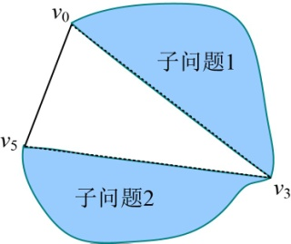

<b class="my_markdown">图4-70　构造最优解过程（原问题）</b>

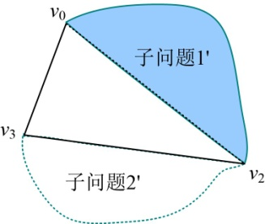

<b class="my_markdown">图4-71　构造最优解过程（子问题1）</b>

因为v0～v2中有结点，所以子问题1'不为空，输出该弦v0v2。

递归构造子问题1'：{v0，v1，v2 }，读取s[1][2]=1，如图4-72所示。

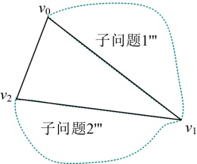

<b class="my_markdown">图4-72　构造最优解过程（子问题1'）</b>

因为v0～v1中没有结点，子问题1'''为空，v0v1是一条边，不是弦，不输出。

因为v1～v2中没有结点，子问题2'''为空，v1v2是一条边，不是弦，不输出。

递归构造子问题2'：{ v2，v3 }。

因为v2～v3中没有结点，子问题2'为空，v2v3是一条边，不是弦，不输出。

+ 递归构造子问题2：{v3，v4，v5}，读取**s**[4][5]=4，如图4-73所示。

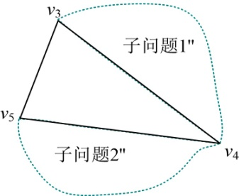

<b class="my_markdown">图4-73　构造最优解过程（子问题2）</b>

因为v3～v4中没有结点，子问题1''为空，v3v4是一条边，不是弦，不输出。

因为v4～v5中没有结点，子问题2''为空，v4v5是一条边，不是弦，不输出。

因此，该凸多边形三角剖分最优解为：v0v3，v3v5，v0v2。

