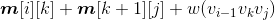

### 4.7.4　伪代码详解

（1）凸多边形三角剖分求解函数

首先将数组**m**[][]、**s**[][]初始化为0，然后自底向上处理不同规模的子问题，d为i到j的规模，d=2；d<=n；d++，当d=2时，实际上是3个点，因为**m**[i][j]表示的是{v<sub class="my_markdown">i</sub><sub>−1</sub>，v<sub class="my_markdown">i</sub>，v<sub class="my_markdown">j</sub>}。求解3个顶点凸多边形三角剖分的最优值和最优策略，根据递归式：


对每一个k值，求解，找到最小值后用**m**[i][j]记录，并用**s**[i][j]记录取得最小值的k值。

```c
void Convexpolygontriangulation()
{
    for(int i = 1 ;i <= n ; i++) // 初始化
    {
         m[i][i] = 0 ;
         s[i][i] = 0 ;
    }
    for(int d = 2 ;d <= n ; d++)  //d为i到j的规模，d=2时，实际上是三个点
                                  //因为我们的m[i][j]表示的是{vi-1，vi，vj}
      for(int i = 1 ;i <= n - d + 1 ; i++) //控制i值
      {
           int j = i + d - 1 ;             // j值
           m[i][j] = m[i+1][j] + g[i-1][i] + g[i][j] + g[i-1][j] ;
           s[i][j] = i ;
           for(int k = i + 1 ;k < j ; k++) // 枚举划分点
           {
                double temp = m[i][k] + m[k+1][j] + g[i-1][k] + g[k][j] + g[i-1][j] ;
                if(m[i][j] > temp)
                {
                     m[i][j] = temp ;      // 更新最优值
                     s[i][j] = k ;         // 记录划分点
                }
           }
      }
}

```

（2）最优解输出函数

我们首先从**s**[][]数组中读取**s**[i][j]，然后判断子问题1是否为空。若**s**[i][j]>i，表示i到**s**[i][j]之间存在顶点，子问题1不为空，那么v<sub class="my_markdown">i</sub><sub>−1</sub>v<sub class="my_markdown">**s**</sub><sub>[i][j]</sub>是一条弦，输出{v<sub class="my_markdown">i</sub><sub>−1</sub>v<sub class="my_markdown">**s**</sub><sub>[i][j]</sub>}；判断子问题2是否为空，若j>**s**[i][j]+1，表示**s**[i][j]+1到j之间存在顶点，子问题2不为空，那么v<sub class="my_markdown">**s**</sub><sub>[i][j]+1</sub> v<sub class="my_markdown">j</sub>是一条弦，输出{v<sub class="my_markdown">**s**</sub><sub>[i][j]+1</sub>v<sub class="my_markdown">j</sub>}。递归求解子问题1和子问题2，直到i=j时停止。

```c
void print(int i , int j)                  // 输出所有的弦
{
     if(i == j)  return ;
     if(s[i][j]>i)
        cout<<"{v"<<i-1<<"v"<<s[i][j]<<"}"<<endl;
     if(j>s[i][j]+1)
        cout<<"{v"<<s[i][j]<<"v"<<j<<"}"<<endl;
     print(i ,s[i][j]);
     print(s[i][j]+1 ,j);
}
```

