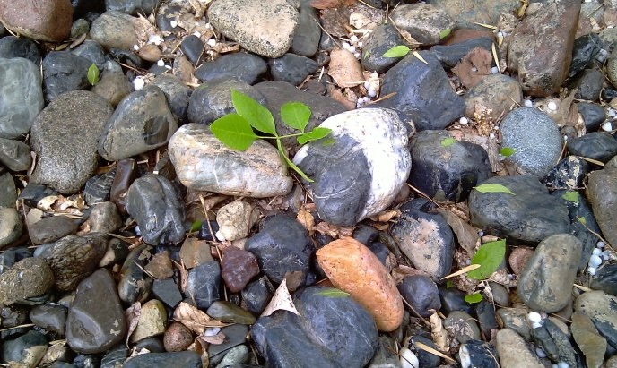

### 4.8　小石子游戏——石子合并

一群小孩子在玩小石子游戏，游戏有两种玩法。

（1）路边玩法

有n堆石子堆放在路边，现要将石子有序地合并成一堆，规定每次只能移动相邻的两堆石子合并，合并花费为新合成的一堆石子的数量。求将这N堆石子合并成一堆的总花费（最小或最大）。

（2）操场玩法

一个圆形操场周围摆放着n堆石子，现要将石子有序地合并成一堆，规定每次只能移动相邻的两堆石子合并，合并花费为新合成的一堆石子的数量。求将这N堆石子合并成一堆的总花费（最小或最大）。

<b class="my_markdown">图4-74　小石子游戏</b>

