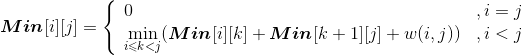
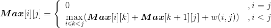
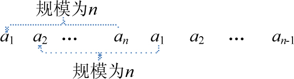

### 4.8.1　问题分析

本题初看可以使用贪心法来解决，但是因为有必须相邻两堆才能合并这个条件在，用贪心法就无法保证每次都能取到所有堆中石子数最少（最多）的两堆。

下面以操场玩法为例：假设有n=6堆石子，每堆的石子个数分别为3、4、6、5、4、2。

如果使用贪心法求最小花费，应该是如下的合并步骤：

第1次合并 3 4 6 5 4 2　　 　2，3合并花费是5

第2次合并 5 4 6 5 4　　　　5，4合并花费是9

第3次合并 9 6 5 4　 　 　 　5，4合并花费是9

第4次合并 9 6 9 　　 　　　 9，6合并花费是15

第5次合并 15 9　 　　 　 　15，9合并花费是24

总得分＝5＋9＋9＋15＋24＝62

但是如果采用如下合并方法，却可以得到比上面花费更少的方法：

第1次合并 3 4 6 5 4 2　　　 3，4合并花费是7

第2次合并 7 6 5 4 2　　　 　7，6合并花费是13

第3次合并 13 5 4 2　　　　 4，2合并花费是6

第4次合并 13 5 6　　　　 　5，6合并花费是11

第5次合并 13 11　　　　　 13，11合并花费是24

总花费＝7＋13＋6＋11＋24＝61

显然利用贪心法来求解错误的，贪心算法在子过程中得出的解只是局部最优，而不能保证全局的值最优，因此本题不可以使用贪心法求解。

如果使用暴力穷举的办法，会有大量的子问题重复，这种做法是不可取的，那么是否可以使用动态规划呢？我们要分析该问题是否具有最优子结构性质，它是使用动态规划的必要条件。

#### 1．路边玩法

如果n−1次合并的全局最优解包含了每一次合并的子问题的最优解，那么经这样的n−1次合并后的花费总和必然是最优的，因此我们就可以通过动态规划算法来求出最优解。

首先分析该问题是否具有最优子结构性质。

（1）分析最优解的结构特征

+ 假设已经知道了在第k堆石子分开可以得到最优解，那么原问题就变成了两个子问题，子问题分别是{ai，a2，…，ak}和{ ak+1，…，aj}，如图4-75所示。

<b class="my_markdown">图4-75　原问题分解为子问题</b>

那么原问题的最优解是否包含子问题的最优解呢？

+ 假设已经知道了n堆石子合并起来的花费是c，子问题1{ ai，a2，…，ak }石子合并起来的花费是a，子问题2{ ak+1，…，aj}石子合并起来的花费是b，{ ai，a2，…，aj }石子数量之和是w（i，j），那么c=a+b+ w（i，j）。因此我们只需要证明如果c是最优的，则a和b一定是最优的（即原问题的最优解包含子问题的最优解）。

**反证法：** 如果a不是最优的，子问题1{ ai，a2，…，ak }一定存在一个最优解a'，a'<a，那么a'+b+ w（i，j）<c，这与我们的假设c是最优的矛盾，因此如果c是最优的，则a一定是最优的。同理可证b也是最优的。因此如果c是最优的，则a和b一定是最优的。

因此，路边玩法小石子合并游戏问题具有最优子结构性质。

（2）建立最优值递归式

设**Min**[i][j]代表从第i堆石子到第j堆石子合并的最小花费，**Min**[i][k]代表从第i堆石子到第k堆石子合并的最小花费，**Min**[k+1][j]代表从第k+1堆石子到第j堆石子合并的最小花费，w（i，j）代表从i堆到j堆的石子数量之和。列出递归式：

**Max**[i][j] 代表从第 i 堆石子到第 j 堆石子合并的最大花费，**Max**[i][k] 代表从第 i 堆石子到第 k堆石子合并的最大花费，**Max**[k+1][j] 代表从第 k+1堆石子到第 j 堆石子合并的最大花费，w（i，j）代表从i堆到j堆的石子数量之和。列出递归式：

#### 2．操场玩法

如果把路边玩法看作直线型石子合并问题，那么操场玩法就属于圆型石子合并问题。圆型石子合并经常转化为直线型来求。也就是说，把圆形结构看成是长度为原规模两倍的直线结构来处理。如果操场玩法原问题规模为n，所以相当于有一排石子a1，a2，…，an，a1，a2，…，an−1，该问题规模为2n−1，如图4-76所示。然后就可以用线性的石子合并问题的方法求解，求最大值的方法和求最小值的方法是一样的。最后，从 **规模是** n **的最优值** 找出 **最小值或最大值** 即可。

<b class="my_markdown">图4-76　转化为规模为2n−1的直线型</b>

