### 4.8.3　完美图解

如图4-77所示，以6堆石子的路边玩法为例。

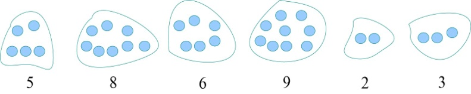

<b class="my_markdown">图4-77　6堆石子</b>

（1）初始化

输入石子的堆数n，然后依次输入各堆石子的数量存储在a[i]中，如图4-78所示。

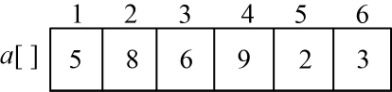

<b class="my_markdown">图4-78　石子数量</b>

**Min**[i][j]和**Max**[i][j]来记录第i堆到第j堆ai，ai+1，…，ai堆石子合并的最小花费和最大花费。令**Min**[i][i]=0，**Max**[i][i]=0，如图4-79所示。

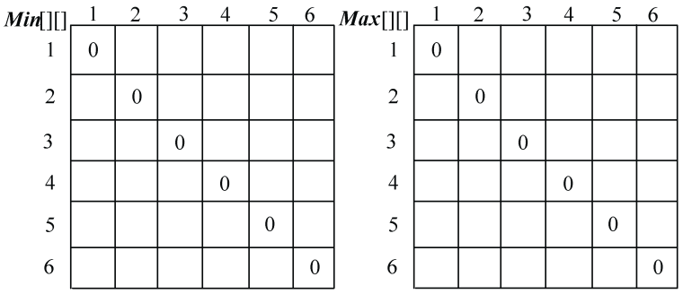

<b class="my_markdown">图4-79　最小花费和最大花费</b>

sum[i]为前i堆石子数量总和，sum[0]=0，计算sum[i]，其中i= 1，2，3，…，n，如图4-80所示。

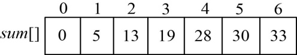

<b class="my_markdown">图4-80　前i堆石子数量总和</b>

原递归公式中的w（i，j）代表从i堆到j堆的石子数量之和，可以用直接查表法sum[j] −sum[i−1]求解，如图4-81所示。这样就不用每次遇到w（i，j）都计算一遍了，这也是动态规划思想的显现！

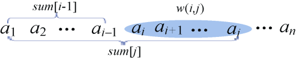

<b class="my_markdown">图4-81　sum[j]−sum[i−1]即为w（i，j）</b>

（2）按照递归式计算两堆石子合并{ai，ai+1}的最小花费和最大花费，i=1，2，3，4，5。如图4-82所示。

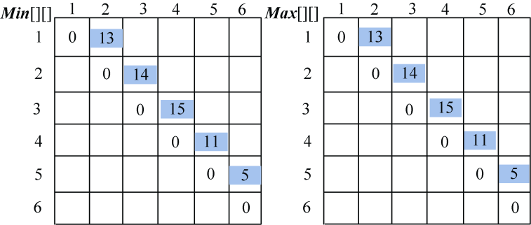

<b class="my_markdown">图4-82　最小花费和最大花费</b>

+ i=1，j=2：{a1，a2}

k=1：**Min**[1][2]=**Min**[1][1]+**Min**[2][2]+sum[2] −sum[0]=13；

**　 　 Max**[1][2]=**Max**[1][1]+**Max**[2][2]+sum[2] −sum[0]=13。

+ i=2，j=3：{a2，a3}

k=2：**Min**[2][3]=**Min**[2][2]+**Min**[3][3]+sum[3] −sum[1]=14；

**　 　 Max**[2][3]=**Max**[2][2]+**Max**[3][3]+sum[3] −sum[1]=14。

+ i=3，j=4：{a3，a4}

k=3：**Min**[3][4]=**Min**[3][3]+**Min**[4][4]+sum[4] −sum[2]=15；

**　 　 Max**[3][4]=**Max**[3][3]+**Max**[4][4]+sum[4] −sum[2]=15。

+ i=4，j=5：{a4，a5}

k=4：**Min**[4][5]=**Min**[4][4]+**Min**[5][5]+sum[5] −sum[3]=11；

**　 　 Max**[4][5]=**Max**[4][4]+**Max**[5][5]+sum[5] −sum[3]=11。

+ i=5，j=6：{a5，a6}

k=5：**Min**[5][6]=**Min**[5][5]+**Min**[6][6]+sum[6] −sum[4]=5；

**　 　 Max**[5][6]=**Max**[5][5]+**Max**[6][6]+sum[6] −sum[4]=5。

（3）按照递归式计算3堆石子合并{ai，ai+1，ai+2}的最小花费和最大花费，i=1，2，3，4，如图4-83所示。

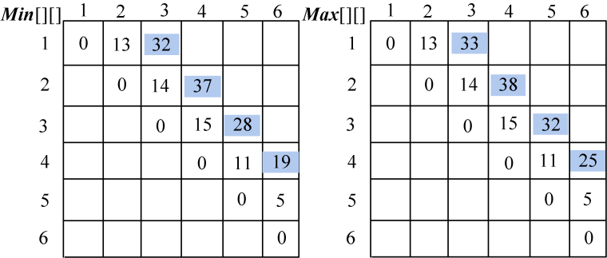

<b class="my_markdown">图4-83　最小花费和最大花费</b>

+ i=1，j=3：{ a1，a2，a3}

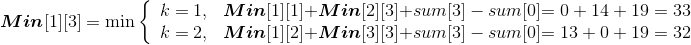
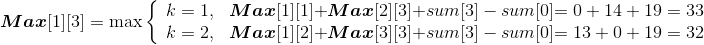
**Min**[1][3]= 32；**Max**[1][3]=33。

+ i=2，j=4：{ a2，a3，a4}

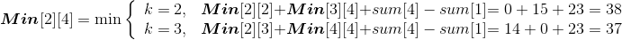
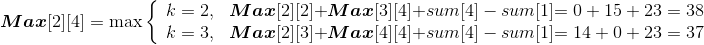
**Min**[2][4]= 37；**Max**[2][4]=38。

+ i=3，j=5：{ a3，a4，a5}

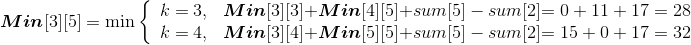
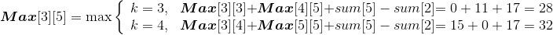
**Min**[3][5]= 28；**Max**[3][5]=32。

+ i=4，j=6：{ a4，a5，a6}

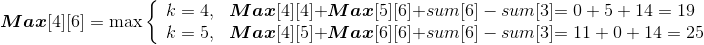
**Min**[4][6]= 19；**Max**[4][6]=25。

（4）按照递归式计算4堆石子合并{ai，ai+1，ai+2，ai+3}的最小花费和最大花费，i=1，2，3，如图4-84所示。

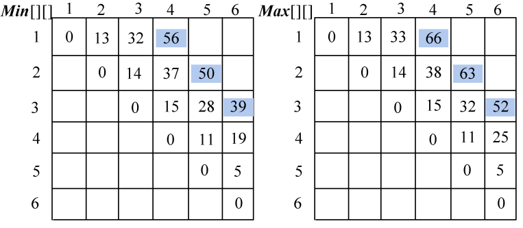

<b class="my_markdown">图4-84　最小花费和最大花费</b>

+ i=1，j=4：{ a1，a2，a3，a4}

**Min**[1][4]= 56；**Max**[1][4]=66。

+ i=2，j=5：{ a2，a3，a4，a5}

**Min**[2][5]=50；**Max**[2][5]=63。

+ i=3，j=6：{ a3，a4，a5，a6}

**Min**[3][6]=39；**Max**[3][6]=52。

（5）按照递归式计算5堆石子合并{ai，ai+1，ai+2，ai+3，ai+4}的最小花费和最大花费，i=1，2，如图4-85所示。

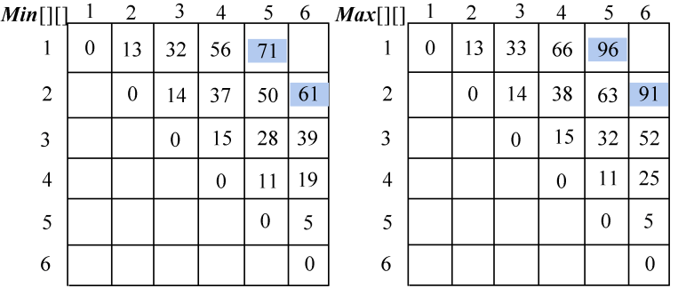

<b class="my_markdown">图4-85　最小花费和最大花费</b>

+ i=1，j=5：{ a1，a2，a3，a4，a5}

**Min**[1][5]=71；**Max**[1][5]=96。

+ i=2，j=6：{ a2，a3，a4，a5，a6}

**Min**[2][6]=61；**Max**[3][6]=9。

（6）按照递归式计算6堆石子合并{a1，a2，a3，a4，a5，a6}的最小花费和最大花费，如图4-86所示。

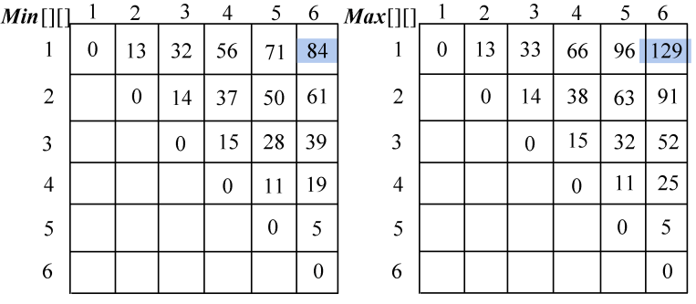

<b class="my_markdown">图4-86　最小花费和最大花费</b>

+ i=1，j=6：{ a1，a2，a3，a4，a5，a6}

**Min**[1][6]=84；**Max**[1][6]=129。

