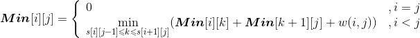
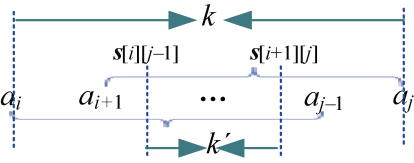
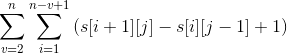
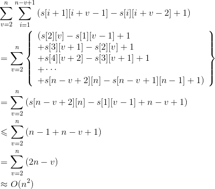

### 4.8.6　算法解析及优化拓展

#### 1．算法复杂度分析

（1）时间复杂度：由程序可以得出语句**Min**[i][j] = min(**Min**[i][j], **Min**[i][k] + **Min**[k+1][j] + tmp)，它是算法的基本语句，在3层for循环中嵌套，最坏情况下该语句的执行次数为O(n<sup class="my_markdown">3</sup>)，故该程序的时间复杂度为O(n<sup class="my_markdown">3</sup>)。

（2）空间复杂度：该程序的辅助变量为**Min**[][]、**Max**[][]，空间复杂度取决于辅助空间，故空间复杂度为O(n<sup class="my_markdown">2</sup>)。

#### 2．算法优化拓展

对于石子合并问题，如果按照普通的区间动态规划进行求解，时间复杂度是O(n<sup class="my_markdown">3</sup>)，但最小值可以用四边形不等式（见附录F）优化。


**s**[i][j]表示取得最优解**Min**[i][j]的最优策略位置。

k的取值范围缩小了很多，原来是区间[i，j)，现在变为区间[**s**[i][j−1]，**s**[i+1][j])。如图4-87所示。


<center class="my_markdown"><b class="my_markdown">图4-87　k的取值范围缩小</b></center>

经过优化，算法时间复杂度可以减少至O(n<sup class="my_markdown">2</sup>)。

注意：最大值有一个性质，即总是在两个端点的最大者中取到。

即**Max**[i][j] = max(**Max**[i][j−1], **Max**[i+1][j]) + **sum**[i][j]

经过优化，算法时间复杂度也可以减少至O(n<sup class="my_markdown">2</sup>)。

优化后算法：

```c
//program 4-6-1
#include <iostream>
#include <string>
using namespace std;
const int INF = 1 << 30;
const int N = 205;
int Min[N][N], Max[N][N],s[N][N];
int sum[N];
int a[N];
int min_Circular,max_Circular;
void get_Min(int n)
{
     for(int v=2; v<=n; v++)               // 枚举合并的堆数规模
     {
          for(int i=1; i<=n-v+1; i++)      //枚举起始点i
          {
               int j = i + v-1;            //枚举终点j
               int tmp = sum[j]-sum[i-1];  //记录i...j之间的石子数之和
               int i1=s[i][j-1]>i?s[i][j-1]:i;
               int j1=s[i+1][j]<j?s[i+1][j]:j;
               Min[i][j]=Min[i][i1]+Min[i1+1][j];
               s[i][j]=i1;
               for(int k=i1+1; k<=j1; k++) //枚举中间分隔点
                    if(Min[i][k]+ Min[k+1][j]<Min[i][j])
                    {
                         Min[i][j]=Min[i][k]+Min[k+1][j];
                         s[i][j]=k;
                    }
               Min[i][j]+=tmp;
          }
     }
}
void get_Max(int n)
{
     for(int v=2; v<=n; v++)             // 枚举合并的堆数规模
     {
          for(int i=1; i<=n-v+1; i++)    //枚举起始点i
          {
               int j = i + v-1;          //枚举终点j
               Max[i][j] = -1;           //初始化为-1
               int tmp = sum[j]-sum[i-1];//记录i...j之间的石子数之和
               if(Max[i+1][j]>Max[i][j-1])
                   Max[i][j]=Max[i+1][j]+tmp;
               else
                   Max[i][j]=Max[i][j-1]+tmp;
          }
     }
}
void straight(int a[],int n)
{
     for(int i=1;i<=n;i++)               // 初始化
          Min[i][i]=0, Max[i][i]=0, s[i][i]=0;
     sum[0]=0;
     for(int i=1;i<=n;i++)
         sum[i]=sum[i-1]+a[i];
     get_Min(n);
     get_Max(n);
}
void Circular(int a[],int n)
{
     for(int i=1;i<=n-1;i++)
          a[n+i]=a[i];
     n=2*n-1;
     straight(a, n);
     n=(n+1)/2;
     min_Circular=Min[1][n];
     max_Circular=Max[1][n];
     for(int i=2;i<=n;i++)
     {
          if(Min[i][n+i-1]<min_Circular)
             min_Circular=Min[i][n+i-1];
          if(Max[i][n+i-1]>max_Circular)
             max_Circular=Max[i][n+i-1];
     }
}
int main()
{
     int n;
     cout << "请输入石子的堆数 n:";
     cin >> n;
     cout << "请依次输入各堆的石子数:";
     for(int i=1;i<=n;i++)
         cin>>a[i];
     straight(a, n);
     cout<<"路边玩法(直线型)最小花费为："<<Min[1][n]<<endl;
     cout<<"路边玩法(直线型)最大花费为："<<Max[1][n]<<endl;
     Circular(a,n);
     cout<<"操场玩法(圆型)最小花费为："<<min_Circular<<endl;
     cout<<"操场玩法(圆型)最大花费为："<<max_Circular<<endl;
     return 0;
}
```

（1）时间复杂度：在get_Min()函数中，虽然有3层for循环语句，但并不是有3层for语句的执行次数就是O(n<sup class="my_markdown">3</sup>)，我们分析其执行次数为：


因为公式中的j=i+v−1，所以：


故get_Min()的时间复杂度为O(n<sup class="my_markdown">2</sup>)。

在get_Max()函数中，有两层for循环语句嵌套，时间复杂度也是O(n<sup class="my_markdown">2</sup>)。

（2）空间复杂度：空间复杂度取决于辅助空间，空间复杂度为O(n<sup class="my_markdown">2</sup>)。

