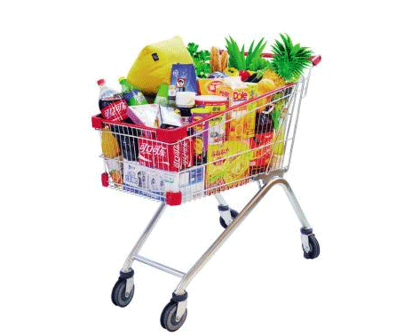

### 4.9　大卖场购物车1——0-1背包问题

央视有一个大型娱乐节目——购物街，舞台上模拟超市大卖场，有很多货物，每个嘉宾分配一个购物车，可以尽情地装满购物车，购物车中装的货物价值最高者取胜。假设有n个物品和1个购物车，每个物品i对应价值为vi，重量wi，购物车的容量为W（你也可以将重量设定为体积）。每个物品只有1件，要么装入，要么不装入，不可拆分。在购物车不超重的情况下，如何选取物品装入购物车，使所装入的物品的总价值最大？最大价值是多少？装入了哪些物品？

<b class="my_markdown">图4-88　大卖场购物车1</b>

