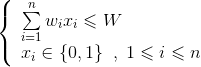
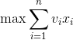
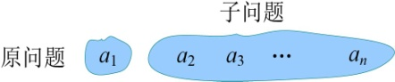
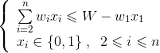
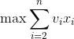
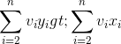

### 4.9.1　问题分析

有n个物品和购物车的容量，每个物品的重量为w[i]，价值为v[i]，购物车的容量为W。选若干个物品放入购物车，使价值最大，可表示如下。

约束条件：

目标函数：

问题归结为求解满足约束条件，使目标函数达到最大值的解向量X={x1，x2，…，xn}。

该问题就是经典的0-1背包问题，我们在第2章贪心算法中已经知道背包问题（可切割）可以用贪心算法求解，而0-1背包问题使用贪心算法有可能得不到最优解（参看2.4.6节）。因为物品的不可切割性，无法保证能够装满背包，所以采用每次装价值/重量比最高的贪心策略是不可行的。

那么是否能够使用动态规划呢？

首先分析该问题是否具有最优子结构性质。

（1）分析最优解的结构特征

+ 假设已经知道了X={x1，x2，…，xn}是原问题{a1，a2，…，an}的最优解，那么原问题去掉第一个物品就变成了子问题{a2，a3，…，an}，如图4-89所示。

<b class="my_markdown">图4-89　原问题和子问题</b>

子问题的约束条件和目标函数如下。

约束条件：

目标函数：

+ 我们只需要证明：X'={x2，…，xn}是子问题{a2，…，an}的最优解，即证明了最优子结构性质。

**反证法：** 假设X'={ x2，…，xn}不是子问题{ a2，…，an}的最优解，{ y2，…，yn}是子问题的最优解，，且满足约束条件，我们将约束条件两边同时加上，则变为，目标函数两边同时加上，则变为，说明{x1，y2，…，yn}比{ x1，x2，…，xn}更优，{ x1，x2，…，xn}不是原问题{a1，a2，…，an}的最优解，与假设X={x1，x2，…，xn}是原问题{a1，a2，…，an}的最优解矛盾。问题得证。

该问题是否具有最优子结构性质。

（2）建立最优值的递归式

可以对每个物品依次检查是否放入或者不放入，对于第i个物品的处理状态：

用**c**[i][j]表示前i件物品放入一个容量为j的购物车可以获得的最大价值。

+ 不放入第i件物品，xi=0，装入购物车的价值不增加。那么问题就转化为“前i−1件物品放入容量为j的背包中”，最大价值为**c**[i−1][j]。
+ 放入第i件物品，xi=1，装入购物车的价值增加vi。

那么问题就转化为“前i−1件物品放入容量为j−w[i]的购物车中”，此时能获得的最大价值就是**c**[i−1][j−w[i]]，再加上放入第i件物品获得的价值v[i]。即**c**[i−1][j−w[i]]+ v[i]。

购物车容量不足，肯定不能放入；购物车容量足，我们要看放入、不放入哪种情况获得的价值更大。

