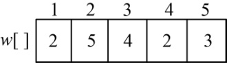
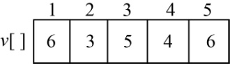
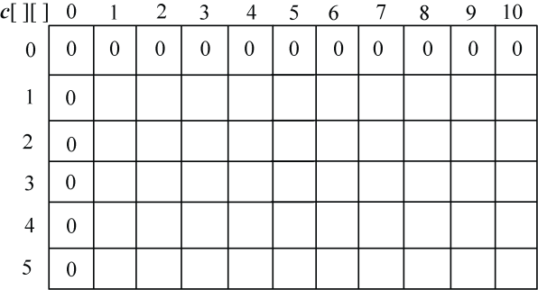
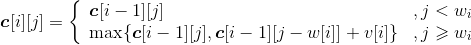
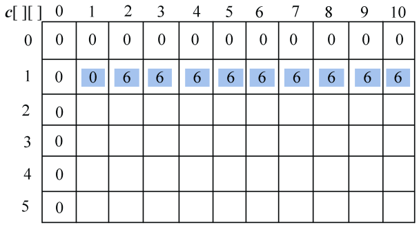
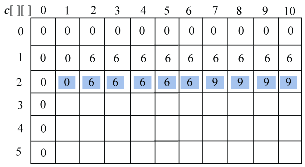
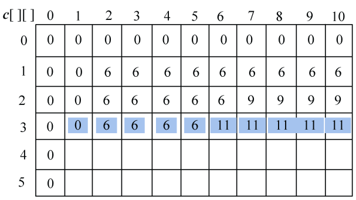
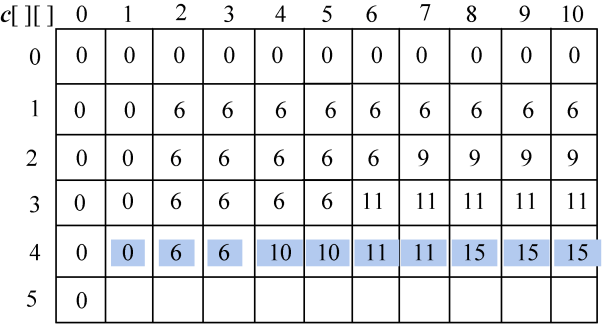
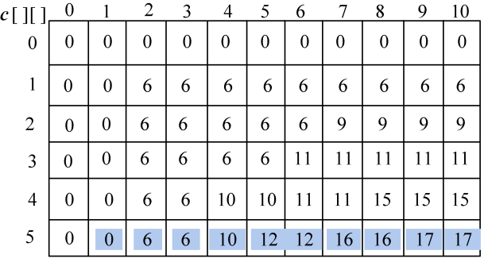
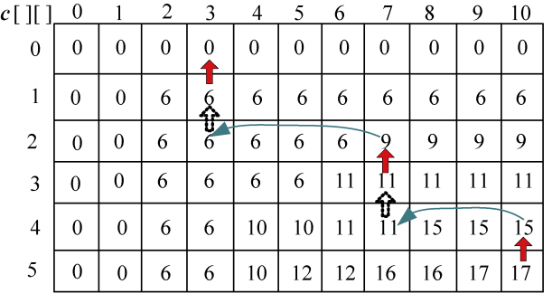

### 4.9.3　完美图解

假设现在有5个物品，每个物品的重量为（2，5，4，2，3），价值为（6，3，5，4，6），如图4-90所示。购物车的容量为10，求在不超过购物车容量的前提下，把哪些物品放入购物车，才能获得最大价值。

<b class="my_markdown">图4-90　物品的重量和价值</b>

（1）初始化

**c**[i][j]表示前i件物品放入一个容量为j的购物车可以获得的最大价值。初始化**c**[][]数组0行0列为0：**c**[0][j]=0，**c**[i][0] =0，其中i=0，1，2，…，n，j=0，1，2，…，W。如图4-91所示。

<b class="my_markdown">图4-91　最大价值数组</b>

按照递归式计算第1个物品（i=1）的处理情况，得到**c**[1][j]，j=1，2，…，W。

w[1]=2，v[1]=6，如图4-92所示。

<b class="my_markdown">图4-92　最大价值数组</b>

+ j=1时，**c**[1][1]=**c**[0][1]=0；
+ j=2时，**c**[1][2]=max{**c**[0][2]，**c**[0][0]+6}=6；
+ j=3时，**c**[1][3]=max{**c**[0][3]，**c**[0][1]+6}=6；
+ j=4时，**c**[1][4]=max{**c**[0][4]，**c**[0][2]+6}=6；
+ j=5时，**c**[1][5]=max{**c**[0][5]，**c**[0][3]+6}=6；
+ j=6时，**c**[1][6]=max{**c**[0][6]，**c**[0][4]+6}=6；
+ j=7时，**c**[1][7]=max{**c**[0][7]，**c**[0][5]+6}=6；
+ j=8时，**c**[1][8]=max{**c**[0][8]，**c**[0][6]+6}=6；
+ j=9时，**c**[1][9]=max{**c**[0][9]，**c**[0][7]+6}=6；
+ j=10时，**c**[1][10]=max{**c**[0][10]，**c**[0][8]+6}=6。

（2）按照递归式计算第1个物品（i=2）的处理情况，得到**c**[2][j]，j=1，2，…，W。

w[2]=5，v[2]=3，如图4-93所示。

<b class="my_markdown">图4-93　最大价值数组</b>

+ j=1时，**c**[2][1]=**c**[1][1]=0；
+ j=2时，**c**[2][2]=**c**[1][2]=6；
+ j=3时，**c**[2][3]=**c**[1][3]=6；
+ j=4时，**c**[2][4]=**c**[1][4]=6；
+ j=5时，**c**[2][5]=max{**c**[1][5]，**c**[1][0]+3}=6；
+ j=6时，**c**[2][6]=max{**c**[1][6]，**c**[1][1]+3}=6；
+ j=7时，**c**[2][7]=max{**c**[1][7]，**c**[1][2]+3}=9；
+ j=8时，**c**[2][8]=max{**c**[1][8]，**c**[1][3]+3}=9；
+ j=9时，**c**[2][9]=max{**c**[1][9]，**c**[1][4]+3}=9；
+ j=10时，**c**[1][10]=max{**c**[1][10]，**c**[1][5]+3}=9。

（3）按照递归式计算第1个物品（i=3）的处理情况，得到**c**[3][j]，j=1，2，…，W。

w[3]=4，v[3]=5，如图4-94所示。

<b class="my_markdown">图4-94　最大价值数组</b>

+ j=1时，**c**[3][1]=**c**[2][1]=0；
+ j=2时，**c**[3][2]=**c**[2][2]=6；
+ j=3时，**c**[3][3]=**c**[2][3]=6；
+ j=4时，**c**[3][4]=max{**c**[2][4]，**c**[2][0]+5}=6；
+ j=5时，**c**[3][5]=max{**c**[2][5]，**c**[2][1]+5}=6；
+ j=6时，**c**[3][6]=max{**c**[2][6]，**c**[2][2]+5}=11；
+ j=7时，**c**[3][7]=max{**c**[2][7]，**c**[2][3]+5}=11；
+ j=8时，**c**[3][8]=max{**c**[2][8]，**c**[2][4]+5}=11；
+ j=9时，**c**[3][9]=max{**c**[2][9]，**c**[2][5]+5}=11；
+ j=10时，**c**[3][10]=max{**c**[2][10]，**c**[2][6]+5}=11。

（4）按照递归式计算第1个物品（i=4）的处理情况，得到**c**[4][j]，j=1，2，…，W。

w[4]=2，v[4]=4，如图4-95所示。

<b class="my_markdown">图4-95　最大价值数组</b>

+ j=1时，**c**[4][1]=c[3][1]=0；
+ j=2时，**c**[4][2]=max{**c**[3][2]，**c**[3][0]+4}=6；
+ j=3时，**c**[4][3]=max{**c**[3][3]，**c**[3][1]+4}=6；
+ j=4时，**c**[4][4]=max{**c**[3][4]，**c**[3][2]+4}=10；
+ j=5时，**c**[4][5]=max{**c**[3][5]，**c**[3][3]+4}=10；
+ j=6时，**c**[4][6]=max{**c**[3][6]，**c**[3][4]+4}=11；
+ j=7时，**c**[4][7]=max{**c**[3][7]，**c**[3][5]+4}=11；
+ j=8时，**c**[4][8]=max{**c**[3][8]，**c**[3][6]+4}=15；
+ j=9时，**c**[4][9]=max{**c**[3][9]，**c**[3][7]+4}=15；
+ j=10时，**c**[4][10]=max{**c**[3][10]，**c**[3][8]+4}=15。

（5）按照递归式计算第1个物品（i=5）的处理情况，得到**c**[5][j]，j=1，2，…，W。

w[5]=3，v[5]=6，如图4-96所示。

<b class="my_markdown">图4-96　最大价值数组</b>

+ j=1时，**c**[5][1]=**c**[4][1]=0；
+ j=2时，**c**[5][2]=**c**[4][2]=6；
+ j=3时，**c**[5][3]=max{**c**[4][3]，**c**[4][0]+6}=6；
+ j=4时，**c**[5][4]=max{**c**[4][4]，**c**[4][1]+6}=10；
+ j=5时，**c**[5][5]=max{**c**[4][5]，**c**[4][2]+6}=12；
+ j=6时，**c**[5][6]=max{**c**[4][6]，**c**[4][3]+6}=12；
+ j=7时，**c**[5][7]=max{**c**[4][7]，**c**[4][4]+6}=16；
+ j=8时，**c**[5][8]=max{**c**[4][8]，**c**[4][5]+6}=16；
+ j=9时，**c**[5][9]=max{**c**[4][9]，**c**[4][6]+6}=17；
+ j=10时，**c**[5][10]=max{**c**[4][10]，**c**[4][7]+6}=17。

（6）构造最优解

首先读取**c**[5][10]>**c**[4][10]，说明第5个物品装入了购物车，即x[5]=1，j=10−w[5]=7；

去找**c**[4][7]=**c**[3][7]，说明第4个物品没装入购物车，即x[4]=0；

去找**c**[3][7]>**c**[2][7]，说明第3个物品装入了购物车，即x[3]=1，j= j−w[3]=3；

去找**c**[2][3]=**c**[1][3]，说明第2个物品没装入购物车，即x[2]=0；

去找**c**[1][3]>**c**[0][3]，说明第1个物品装入了购物车，即x[1]=1，j= j−w[1]=1。

如图4-97所示。

<b class="my_markdown">图4-97　最大价值数组</b>

