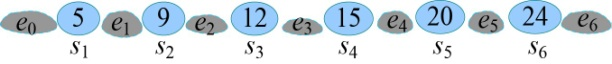

### 4.10　快速定位——最优二叉搜索树

给定n个关键字组成的有序序列S={s1，s2，…，sn}，关键字结点称为实结点。对每个关键字查找的概率是pi，查找不成功的结点称为虚结点，对应{e0，e1，…，en}，每个虚结点的查找概率为qi。e0表示小于s1的值，en大于sn的值。所有结点查找概率之和为1。求最小平均比较次数的二叉搜索树（最优二叉搜索树）。

举例说明：给定一个有序序列S={5，9，12，15，20，24}，这些数的查找概率分别是p1、p2、p3、p4、p5、p6。在实际中，有可能有查找不成功的情况，例如要在序列中查找x=2，那么我们就会定位在5的前面，查找不成功，相当于落在了虚结点e0的位置。要在序列中查找x=18，那么就会定位在15～20，查找不成功，相当于落在了虚结点e4的位置。

<b class="my_markdown">图4-98　查找关键字</b>

<b class="my_markdown">图4-99　快速定位</b>

