### 4.10.1　问题分析

无论是查找成功还是查找不成功，都需要若干次比较才能判断出结果，那么如何查找才能使平均比较次数最小呢？

+ 如果使用顺序查找，能不能使平均查找次数最小呢？
+ 因为序列是有序的，顺序查找有点笨，折半查找怎样呢？
+ 折半查找是在查找概率相等的情况下折半的，查找概率不等的情况又如何呢？
+ 在有序、查找概率不同的情况下，采用二叉搜索树能否使平均比较次数最小呢？
+ 如何构建最优二叉搜索树？

首先我们要了解二叉搜索树。

二叉搜索树（Binary Search Tree，BST），又称为二叉查找树，它是一棵二叉树（每个结点最多有两个孩子），而且左子树结点<根结点，右子树结点>根结点。

最优二叉搜索树（Optimal Binary Search Tree，OBST）是搜索成本最低的二叉搜索树，即平均比较次数最少。

例如，关键字{s1，s2，…，s6}的搜索概率是{p1，p2，…，p6}，查找不成功的结点{e0，e1，…，e6}的搜索概率为{q0，q1，…，q6}，其对应的数值如表4-2所示。

<b class="my_markdown">表4-2　查找概率</b>

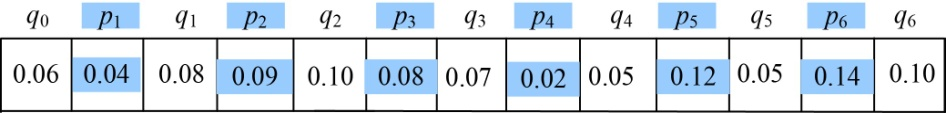
接下来，我们通过构建不同的二叉搜索树来分别看其搜索成本（平均比较次数）。

第1种二叉搜索树如图4-100所示。

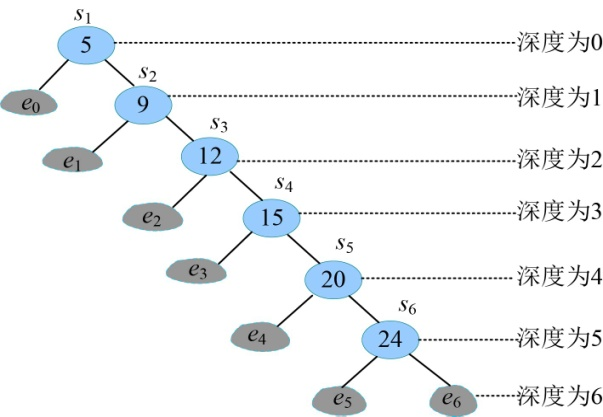

<b class="my_markdown">图4-100　二叉搜索数树1</b>

首先分析关键字结点的搜索成本，搜索每一个关键字需要 **比较的次数是其所在的深度+1** 。例如关键字5，需要比较1次（深度为0），查找成功；关键字12，需要首先和树根5比较，比5大，找其右子树，和右子树的根9比较，比9大，找其右子树，和右子树的根12比较，相等，查找成功，比较了3次（结点12的深度为2）。因此每个关键字结点的搜索成本=（结点的深度+1）*搜索概率=(depth(si)+1)*pi。

我们再看虚结点，即查找不成功的情况的搜索成本，每一个虚结点需要 **比较的次数是其所在的深度** 。虚结点e0需要比较1次（深度为1），即和数据5比较，如果小于5，则落入虚结点e0位置，查找失败。虚结点e1需要比较2次（深度为2），需要首先和树根5比较，比5大，找其右子树，和右子树的根9比较，比9小，找其左子树，则落入虚结点e1位置，查找失败，比较了2次（虚结点e1的深度为2）。因此每个虚结点的搜索成本=结点的深度*搜索概率=(depth(ei))*qi。

二叉搜索树1的搜索成本为：

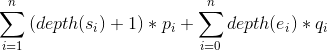
图4-100的搜索成本为：

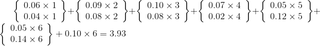
接下来看第2个二叉搜索树，如图4-101所示。

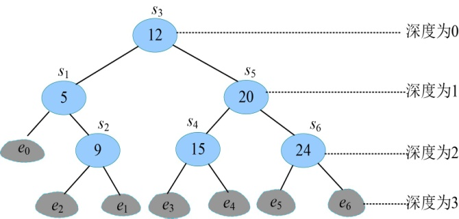

<b class="my_markdown">图4-101　二叉搜索数树2</b>

图4-101的搜索成本为：

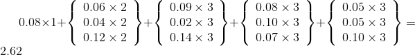
第1个二叉搜索树相当于顺序查找（高度最大），第2个二叉搜索树相当于折半查找（平衡树），我们再看第3个二叉搜索树，如图4-102所示。

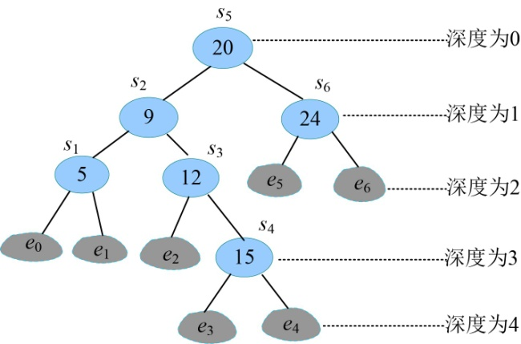

<b class="my_markdown">图4-102　二叉搜索数树3</b>

图4-102的搜索成本为：

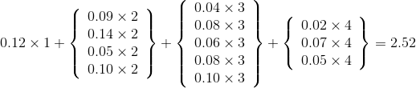
第3个图搜索成本又降到了2.52，有没有可能继续降低呢？

可能很多人会想到，搜索概率大的离根越近，那么总的成本就会更低，这其实就是哈夫曼思想。但是因为二叉搜索树需要满足（左子树<根，右子树>根）的性质，那么每次选取时就不能保证一定搜索概率大的结点。所以哈夫曼思想无法构建最优二叉搜索树。那么怎么找到最优解呢？我们很难确定目前得到的就是最优解，如果采用暴力穷举所有的情况，一共有O(4n/n3/2)棵不同的二叉搜索树，这可是指数级的数量！显然是不可取的。

那么如何才能构建一棵最优二叉搜索树呢？

我们来分析该问题是否具有最优子结构性质：

（1）分析最优解的结构特征

+ 原问题为有序序列{s1，s2，…，sn}，对应虚结点是{e0，e1，…，en}。假设我们已经知道了sk是二叉搜索树T(1，n)的根，那么原问题就变成了两个子问题：{s1，s2，…，sk-1}和{e0，e1，…，ek−1}构成的左子树T(1，k−1)，{sk+1，sk+2，…，sn}和{ek，ek+1，…，en}构成的右子树T(k+1，n)。如图4-103所示。

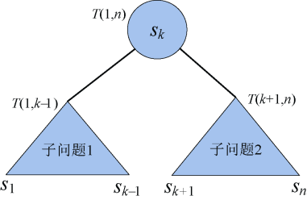

<b class="my_markdown">图4-103　原问题分解为子问题</b>

+ 我们只需要证明：如果T(1，n)是最优二叉搜索树，那么它的左子树T(1，k−1)和右子树T(k+1，n)也是最优二叉搜索树。即证明了最优子结构性质。

**反证法：** 假设T' (1，k−1)是比T(1，k−1)更优的二叉搜索树，则T'(1，k−1)的搜索成本比T(1，k−1)的搜索成本小，因此由T' (1，k−1)、sk、T(k+1，n) 组成的二叉搜索树T' (1，n)的搜索成本比T(1，n)的搜索成本小。T' (1，n)是最优二叉搜索树，与假设T(1，n)是最优二叉搜索树矛盾。问题得证。

（2）建立最优值的递归式

先看看原问题最优解和子问题最优解的关系：用**c**[i][j]表示{si，si+1，…，sj}和{ei−1，ei，…，ej}构成的最优二叉搜索树的搜索成本。

+ 两个子问题（如图4-104所示）的搜索成本分别是**c**[i][k−1]和**c**[k+1][j]。

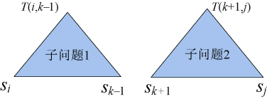

<b class="my_markdown">图4-104　两个子问题</b>

子问题1包含的结点：{si，si+1，…，sk−1}和{e i−1，ei，…，ek−1}。

子问题2包含的结点：{sk+1，sk+2，…，sj}和{ek，ek+1，…，ej}。

+ 把两个子问题和sk一起构建成一棵二叉搜索树，如图4-105所示。

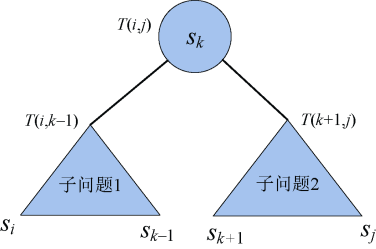

<b class="my_markdown">图4-105　原问题和子问题</b>

在构建的新树中，左子树和右子树中所有的结点深度增加了1，因为实结点搜索成本=（深度+1）*搜索概率p，虚结点搜索成本=深度*搜索概率q。

左子树和右子树中所有的结点深度增加了1，相当于搜索成本 **增加了** 这些结点的搜索概率之和， **加上** sk结点的搜索成本pk，总的增加成本用**w**[i][j]表示。

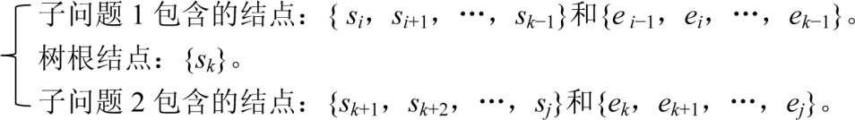
所有结点顺序排列一起：{ei−1，si，ei，…，sk，ek，…，sj，ej}，它们的概率之和为：

**w**[i][j]=qi−1+pi+qi+…+ pk+qk+…+pj+qj

最优二叉搜索树的搜索成本为：

**c**[i][j]= **c**[i][k−1]+**c**[k+1][j]+ **w**[i][j]

因为我们并不确定k的值到底是多少，因此在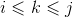的范围内找最小值即可。

（3）因此最优二叉搜索树的最优值递归式：

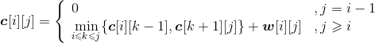
**w**[i][j]也可以使用递推的形式，而没有必要每次都从qi-1加到qj。

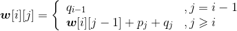
这同样也是动态规划的查表法。

