### 4.10.3　完美图解

假设我们现在有6个关键字{s1，s2，…，s6}的搜索概率是{p1，p2，…，p6}，查找不成功的结点{e0，e1，…，e6}的搜索概率为{q0，q1，…，q6}，其对应的数值如图4-106和图4-107所示。

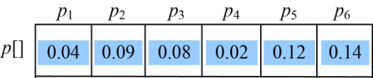

<b class="my_markdown">图4-106　实结点的搜索概率</b>

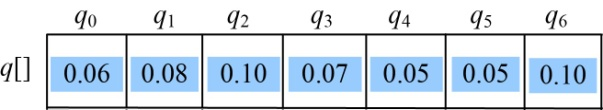

<b class="my_markdown">图4-107　虚结点的搜索概率</b>

采用一维数组p[]、q[]分别记录实结点和虚结点的搜索概率，**c**[i][j]表示最优二叉搜索树T(i，j)的搜索成本，**w**[i][j]表示最优二叉搜索树T(i，j)中的所有实结点和虚结点的搜索概率之和，**s**[i][j]表示最优二叉搜索树T(i，j)的根节点序号，即取得最小值时的k值。

（1）初始化

n=6，令**c**[i][i−1]=0.0，**w**[i][i−1]=q[i−1]，其中i=1，2，3，…，n+1，如图4-108所示。

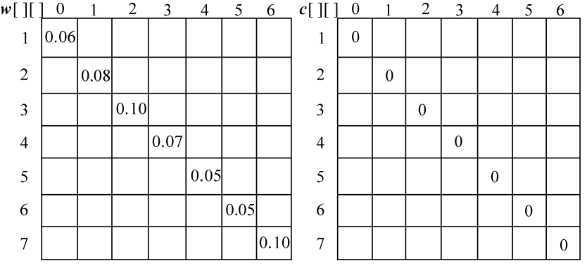

<b class="my_markdown">图4-108　概率之和以及最优二叉树搜索成本</b>

（2）按照递归式计算元素规模是1的{si}（j=i）的最优二叉搜索树搜索成本**c**[i][j]，并记录最优策略，即树根**s**[i][j]，i= 1，2，3，…，n。

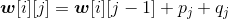
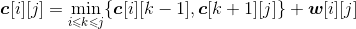
+ i=1，j=1：k=1。

为了形象表达，我们把虚结点和实结点的搜索概率按顺序放在一起，用圆圈和阴影部分表示**w**[][]，如图4-109所示。

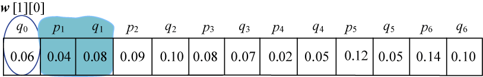

<b class="my_markdown">图4-109　概率之和**w**[1][1]</b>

**w**[1][1]= **w**[1][0]+p1+q1=0.06+0.04+0.08=0.18；

**c**[1][1]= min{**c**[1][0]，**c**[2][1] }+ **w**[1][1] =0.18；

**s**[1][1]=1。

+ i=2，j=2：k=2。如图4-110所示。

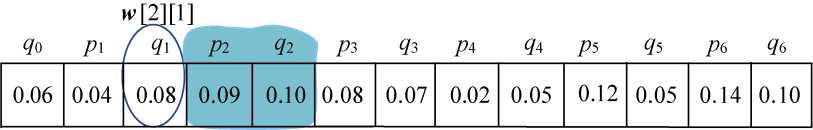

<b class="my_markdown">图4-110　概率之和**w**[2][2]</b>

**w**[2][2]= **w**[2][1]+p2+q2=0.08+0.09+0.10=0.27；

**c**[2][2]= min{**c**[2][1]，**c**[3][2] }+ **w**[2][2] =0.27；

**s**[2][2]=2。

+ i=3，j=3：k=3。如图4-111所示。

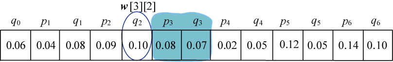

<b class="my_markdown">图4-111　概率之和**w**[3][3]</b>

**w**[3][3]= **w**[3][2]+p3+q3=0.10+0.08+0.07=0.25；

**c**[3][3]= min{**c**[3][2]，**c**[4][3] }+ **w**[3][3] =0.25；

**s**[3][3]=3。

+ i=4，j=4：k=4。如图4-112所示。

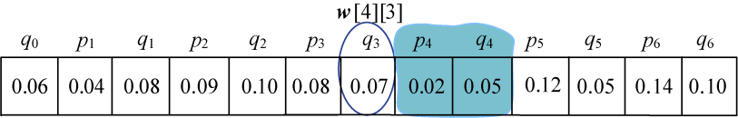

<b class="my_markdown">图4-112　概率之和**w**[4][4]</b>

**w**[4][4]= **w**[4][3]+p4+q4=0.07+0.02+0.05=0.14；

**c**[1][1]= min{**c**[1][0]，**c**[2][1] }+ **w**[1][1] =0.14；

**s**[4][4]=4。

+ i=5，j=5：k=5。如图4-113所示。

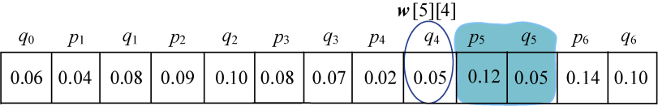

<b class="my_markdown">图4-113　概率之和**w**[5][5]</b>

**w**[5][5]= **w**[5][4]+p5+q5=0.05+0.12+0.05=0.22；

**c**[5][5]= min{**c**[5][4]，**c**[6][5] }+ **w**[5][5] =0.22；

**s**[5][5]=5。

+ i=6，j=6：k=6。如图4-114所示。

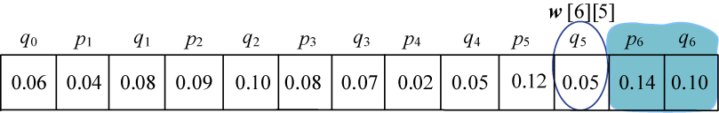

<b class="my_markdown">图4-114　概率之和**w**[6][6]</b>

**w**[6][6]= **w**[6][5]+p6+q6=0.05+0.14+0.10=0.29；

**c**[6][6]= min{**c**[6][5]，**c**[7][6] }+ **w**[6][6] =0.29；

**s**[6][6]=6。

计算完毕，概率之和以及最优二叉树搜索成本如图4-115所示。最优策略如图4-116所示。

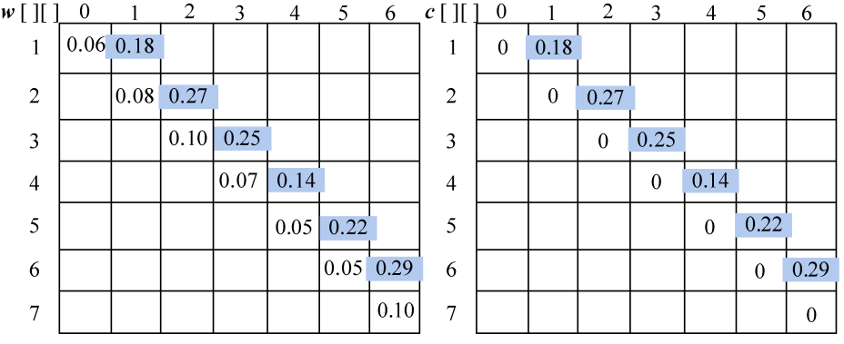

<b class="my_markdown">图4-115　概率之和以及最优二叉树搜索成本</b>

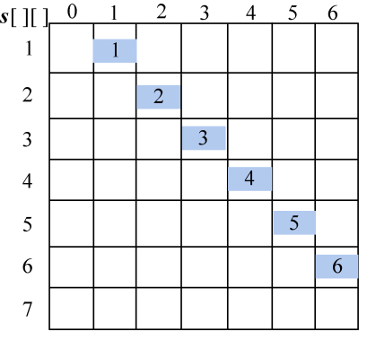

<b class="my_markdown">图4-116　最优二叉树的最优策略</b>

（3）按照递归式计算元素规模是2的{si，si+1}（j=i+1）的最优二叉搜索树搜索成本**c**[i][j]，并记录最优策略，即树根**s**[i][j]，i= 1，2，3，…，n−1。

+ i=1，j=2。如图4-117所示。

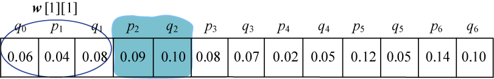

<b class="my_markdown">图4-117　概率之和**w**[1][2]</b>

**w**[1][2]= **w**[1][1]+p2+q2=0.18+0.09+0.10=0.37；

；

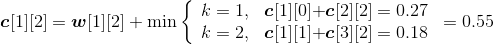
**s**[1][2]=2。

+ i=2，j=3。如图4-118所示。

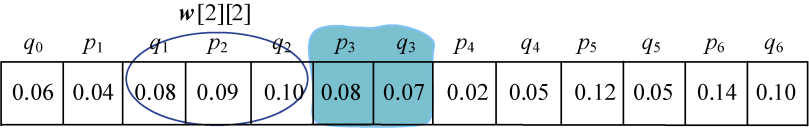

<b class="my_markdown">图4-118　概率之和**w**[2][3]</b>

**w**[2][3]= **w**[2][2]+p3+q3=0.27+0.08+0.07=0.42；

；

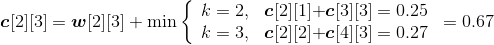
**s**[2][3]=2。

+ i=3，j=4。如图4-119所示。

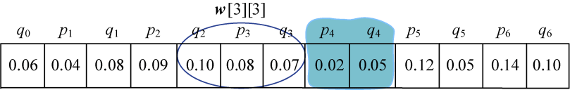

<b class="my_markdown">图4-119　概率之和**w**[3][4]</b>

**w**[3][4]= **w**[3][3]+p4+q4=0.25+0.02+0.05=0.32；

；

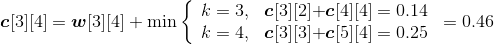
**s**[3][4]=3。

+ i=4，j=5。如图4-120所示。

<b class="my_markdown">图4-120　概率之和**w**[4][5]</b>

**w**[4][5]= **w**[4][4]+p5+q5=0.14+0.12+0.05=0.31；

；

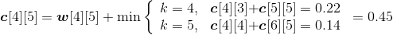
**s**[4][5]=5。

+ i=5，j=6。如图4-121所示。

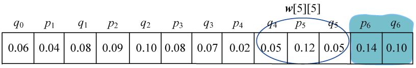

<b class="my_markdown">图4-121　概率之和**w**[5][6]</b>

**w**[5][6]= **w**[5][5]+p6+q6=0.22+0.14+0.10=0.46；

；

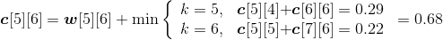
**s**[5][6]=6。

计算完毕。概率之和以及最优二叉树搜索成本如图4-122所示，最优策略如图4-123所示。

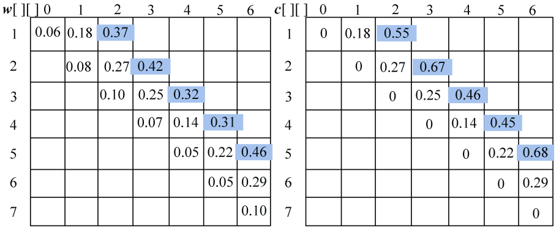

<b class="my_markdown">图4-122　概率之和以及最优二叉树搜索成本</b>

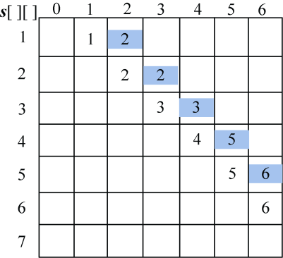

<b class="my_markdown">图4-123　最优策略</b>

（4）按照递归式计算元素规模是3的{si，si+1，si+2}（j=i+2）的最优二叉搜索树搜索成本**c**[i][j]，并记录最优策略，即树根**s**[i][j]，i=1，2，3，4。

+ i=1，j=3。如图4-124所示。

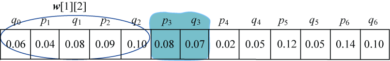

<b class="my_markdown">图4-124　概率之和**w**[1][3]</b>

**w**[1][3]= **w**[1][2]+p3+q3=0.37+0.08+0.07=0.52；

；

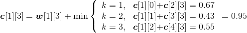
**s**[1][3]=2。

+ i=2，j=4。如图4-125所示。

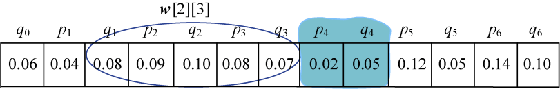

<b class="my_markdown">图4-125　概率之和**w**[2][4]</b>

**w**[2][4]= **w**[2][3]+p4+q4=0.42+0.02+0.05=0.49；

；

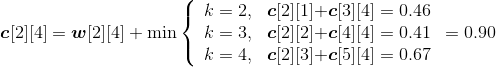
**s**[2][4]=3。

+ i=3，j=5。如图4-126所示。

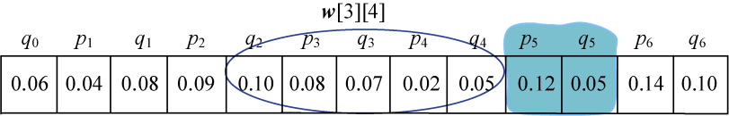

<b class="my_markdown">图4-126　概率之和**w**[3][5]</b>

**w**[3][5]= **w**[3][4]+p5+q5=0.32+0.12+0.05=0.49；

；

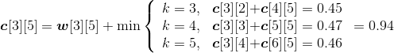
**s**[3][5]=3。

+ i=4，j=6。如图4-127所示。

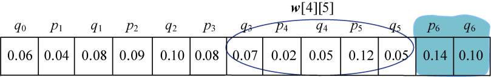

<b class="my_markdown">图4-127　概率之和**w**[4][6]</b>

**w**[4][6]= **w**[4][5]+p6+q6=0.31+0.14+0.10=0.55；

；

**s**[4][6]=5。

计算完毕。概率之和以及最优二叉树搜索成本如图4-128所示，最优策略如图4-129所示。

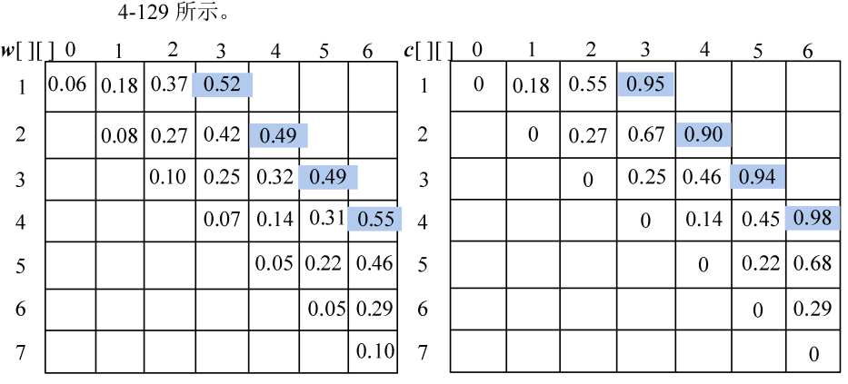

<b class="my_markdown">图4-128　概率之和以及最优二叉树搜索成本</b>

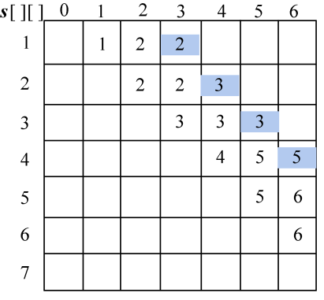

<b class="my_markdown">图4-129　最优策略</b>

（5）按照递归式计算元素规模是4的{si，si+1，si+2，si+3}（j=i+3）的最优二叉搜索树搜索成本**c**[i][j]，并记录最优策略，即树根**s**[i][j]，i=1，2，3。

+ i=1，j=4。如图4-130所示。

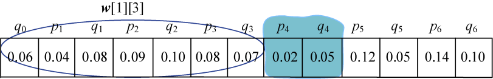

<b class="my_markdown">图4-130　概率之和**w**[1][4]</b>

**w**[1][4]= **w**[1][3]+p4+q4=0.52+0.02+0.05=0.59；

；

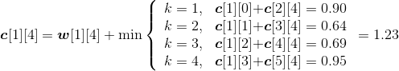
**s**[1][4]=2。

+ i=2，j=5。如图4-131所示。

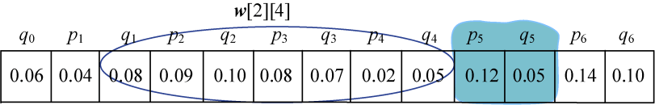

<b class="my_markdown">图4-131　概率之和**w**[2][5]</b>

**w**[2][5]= **w**[2][4]+p5+q5=0.49+0.12+0.05=0.66；

；

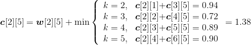
**s**[2][5]=3。

+ i=3，j=6。如图4-132所示。

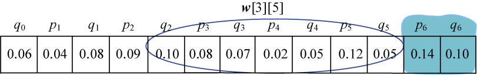

<b class="my_markdown">图4-132　概率之和**w**[3][6]</b>

**w**[3][6]= **w**[3][5]+p6+q6=0.49+0.14+0.10=0.73；

；

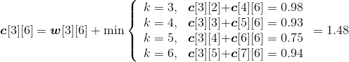
**s**[3][6]=5。

计算完毕。概率之和以及最优二叉树搜索成本如图4-133所示，最优策略如图4-134所示。

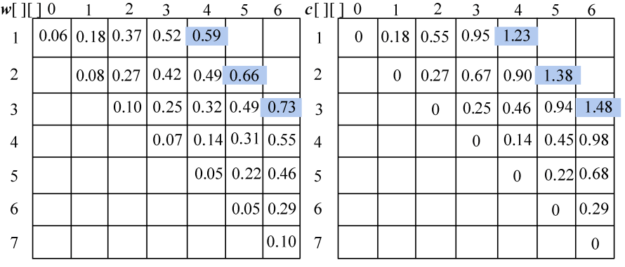

<b class="my_markdown">图4-133　概率之和以及最优二叉树搜索成本</b>

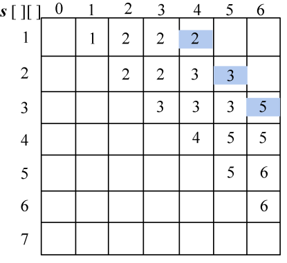

<b class="my_markdown">图4-134　最优策略</b>

（6）按照递归式计算元素规模是5的{si，si+1，si+2，si+3，si+4}（j=i+4）的最优二叉搜索树搜索成本**c**[i][j]，并记录最优策略，即树根**s**[i][j]，i=1，2。

+ i=1，j=5。如图4-135所示。

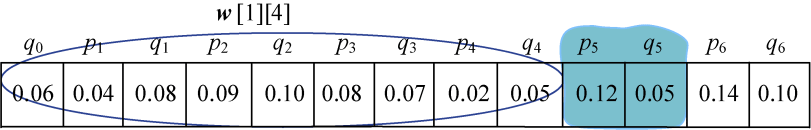

<b class="my_markdown">图4-135　概率之和**w**[1][5]</b>

**w**[1][5]= **w**[1][4]+p5+q5=0.59+0.12+0.05=0.76；

；

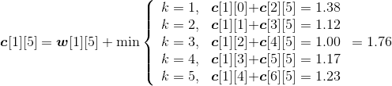
**s**[1][5]=3。

+ i=2，j=6。如图4-136所示。

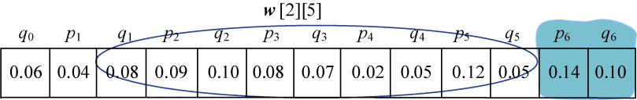

<b class="my_markdown">图4-136　概率之和**w**[2][6]</b>

**w**[2][6]= **w**[2][5]+p6+q6=0.66+0.14+0.10=0.90；

；

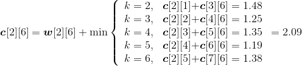
**s**[2][6]=5。

计算完毕。概率之和以及最优二叉树搜索成本如图4-137所示，最优策略如图4-138所示。

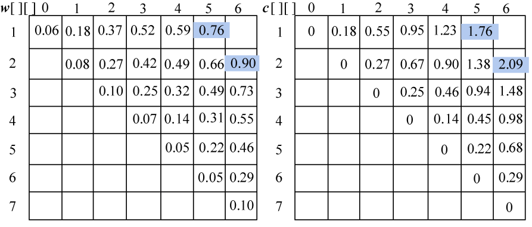

<b class="my_markdown">图4-137　概率之和以及最优二叉树搜索成本</b>

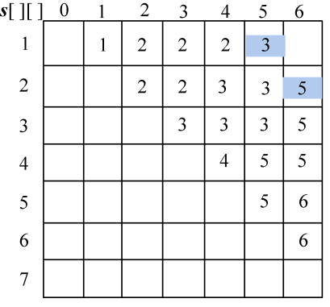

<b class="my_markdown">图4-138　最优策略</b>

（7）按照递归式计算元素规模是6的{si，si+1，si+2，si+3，si+4，si+5}（j=i+5）的最优二叉搜索树搜索成本**c**[i][j]，并记录最优策略，即树根**s**[i][j]，i=1。

+ i=1，j=6。如图4-139所示。

<b class="my_markdown">图4-139　概率之和**w**[1][6]</b>

**w**[1][6]= **w**[1][5]+p6+q6=0.76+0.14+0.10=1.00；

；

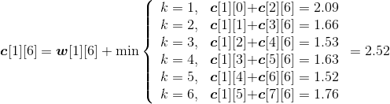
**s**[1][6]=5。

计算完毕。概率之和以及最优二叉树搜索成本如图4-140所示，最优策略如图4-141所示。

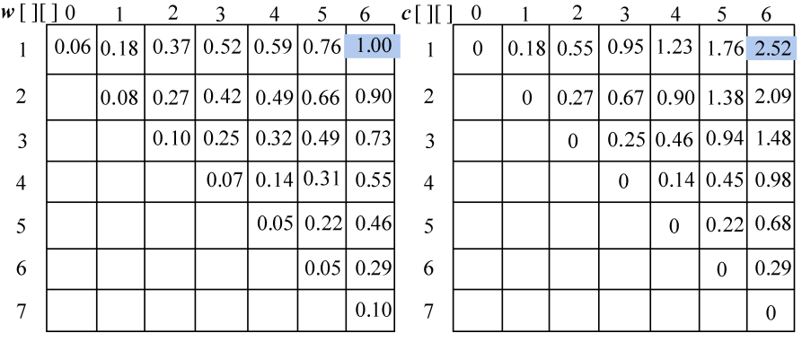

<b class="my_markdown">图4-140　概率之和和最优二叉树搜索成本</b>

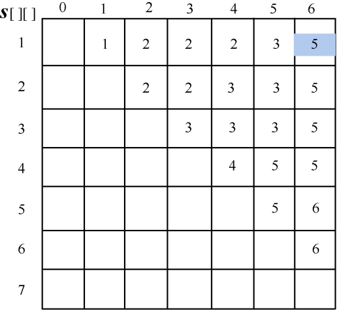

<b class="my_markdown">图4-141　最优决策</b>

（8）构造最优解

+ 首先读取**s**[1][6]=5，k=5，输出s5为最优二叉搜索树的根。

判断如果k−11，读取**s**[1][4]=2，输出s2为s5的左孩子；递归求解左子树T（1，4）；判断如果k<6，读取**s**[6][6]=6，输出s6为s5的右孩子；递归求解右子树T（6，6），如图4-142所示。

<b class="my_markdown">图4-142　最优解构造过程</b>

+ 递归求解左子树T（1，4）。

首先读取**s**[1][4]=2，k=2。

判断如果k−11，读取**s**[1][1]=1，输出s1为s2的左孩子；判断如果k<4，读取**s**[3][4]=3，输出s3为s2的右孩子；递归求解右子树T（3，4），如图4-143所示。

<b class="my_markdown">图4-143　最优解构造过程</b>

+ 递归求解左子树T（1，1）。

首先读取**s**[1][1]=1，k=1。

判断如果k−1<1，输出e0为s1的左孩子；判断如果k1，输出e1为s1的右孩子，如图4-144所示。

<b class="my_markdown">图4-144　最优解构造过程</b>

+ 递归求解右子树T（3，4）。

首先读取**s**[3][4]=3，k=3。

判断如果k−1<3，输出e2为s3的左孩子；判断如果k<4，读取**s**[4][4]=4，输出s4为s3的右孩子；递归求解右子树T（4，4），如图4-145所示。

<b class="my_markdown">图4-145　最优解构造过程</b>

+ 递归求解右子树T（4，4）。

首先读取**s**[4][4]=4，k=4。

判断如果k−1<4，输出e3为s4的左孩子；判断如果k4，输出e4为s4的右孩子，如图4-146所示。

<b class="my_markdown">图4-146　最优解构造过程</b>

+ 递归求解右子树T（6，6）。

首先读取**s**[6][6]=6，k=6。

判断如果k−1<6，输出e5为s6的左孩子；判断如果k6，输出e6为s6的右孩子，如图4-147所示。

<b class="my_markdown">图4-147　最优解构造过程</b>

