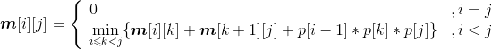

### 4.11　动态规划算法秘籍

本章通过8个实例讲解了动态规划的解题过程。动态规划求解最优化问题时需要考虑两个性质：最优子结构和子问题重叠。只要满足最优子结构性质就可以使用动态规划，如果还具有子问题重叠，则更能彰显动态规划的优势。判断可以使用动态规划后，就可以分析其最优子结构特征，找到原问题和子问题的关系，从而得到最优解递归式。然后按照最优解递归式自底向上求解，采用备忘机制（查表法）有效解决子问题重叠，重复的子问题不需要重复求解，只需查表即可。

动态规划的关键总结如下。

（1）最优子结构判定

+ 作出一个选择。
+ 假定已经知道了哪种选择是最优的。

例如矩阵连乘问题，我们假设已经知道在第k个矩阵加括号是最优的，即(**A** i **A** i+1…**A** k)(**A** k+1**A** k+2…**A** j)。

+ 最优选择后会产生哪些子问题。

例如矩阵连乘问题，我们作出最优选择后产生两个子问题：(**A** i **A** i+1…**A** k)，(**A** k+1**A** k+2…**A** j)。

+ 证明原问题的最优解包含其子问题的最优解。

通常使用“剪切—粘贴”反证法。证明如果原问题的解是最优解，那么子问题的解也是最优解。反证：假定子问题的解不是最优解，那么就可以将它“剪切”掉，把最优解“粘贴”进去，从而得到一个比原问题最优解更优的解，这与前提原问题的解是最优解矛盾。得证。

例如：矩阵连乘问题，c=a+b+d，我们只需要证明如果c是最优的，则a和b一定是最优的（即原问题的最优解包含子问题的最优解）。

**反证法：** 如果a不是最优的，（**A** i **A** i+1…**A** k）存在一个最优解a'，a'<a，那么，a'+b+d<c，这与假设c是最优的矛盾，因此如果c是最优的，则a一定是最优的。同理可证b也是最优的。因此如果c是最优的，则a和b一定是最优的。因此，矩阵连乘问题具有最优子结构性质。

（2）如何得到最优解递归式

+ 分析原问题最优解和子问题最优解的关系。

例如矩阵连乘问题，我们假设已经知道在第k个矩阵加括号是最优的，即（**A** i **A** i+1…**A** k） （**A** k+1**A** k+2…**A** j）。作出最优选择后产生两个子问题：（**A** i **A** i+1…**A** k），（**A** k+1**A** k+2…**A** j）。如果我们用**m**[i][j]表示**A** i **A** i+1…**A** j矩阵连乘的最优解，那么两个子问题（**A** i **A** i+1…**A** k）、（**A** k+1**A** k+2…**A** j）对应的最优解分别是**m**[i][k]、**m**[k+1][j]。剩下的只需要考查（**A** i **A** i+1…**A** k）和（**A** k+1**A** k+2…**A** j）的结果矩阵相乘的乘法次数了，两个结果矩阵相乘的乘法次数是pi*pk+1*qj。

因此，原问题最优解和子问题最优解的关系为**m**[i][j]=**m**[i][k]+**m**[k+1][j]+ pi*pk+1*qj。

+ 考查有多少种选择。

实质上，我们并不知道哪种选择是最优的，因此就需要考查有多少种选择，然后从这些选择中找到最优解。

例如矩阵连乘问题，加括号的位置k（**A** i **A** i+1…**A** k）（**A** k+1**A** k+2…**A** j），k的取值范围是{i，i+1，…，j−1}，即ik<j，那么我们考查每一种选择，找到最优值。

+ 得到最优解递归式。

例如矩阵连乘问题，**m**[i][j]表示**A** i **A** i+1…**A** j矩阵连乘的最优解，根据最优解和子问题最优解的关系，并考查所有的选择，找到最小值即为最优解。

