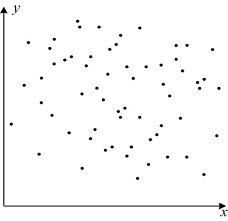
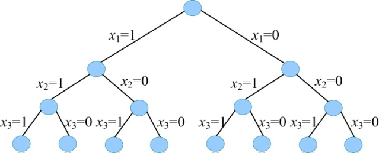
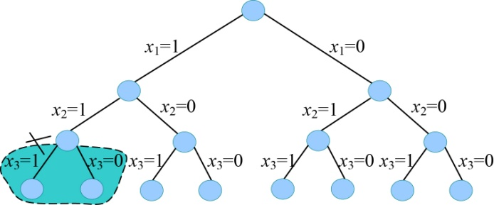

### 5.1.2　算法要素

用回溯法解决实际问题时，首先要确定解的形式，定义问题的解空间。

什么是解空间呢？

（1）解空间

+ 解的组织形式：回溯法解的组织形式可以规范为一个n元组{x1，x2，…，xn}，例如3个物品的0-1背包问题，解的组织形式为{x1，x2，x3}。
+ 显约束：对解分量的取值范围的限定。

例如有3个物品的0-1背包问题，解的组织形式为{x1，x2，x3}。它的解分量xi的取值范围很简单，xi=0或者xi=1。xi=0表示第i个物品不放入背包，xi=1表示第i个物品放入背包，因此xi∈{0，1}。

3个物品的0-1背包问题，其所有可能解有：{0，0，0}，{0，0，1}，{0，1，0}，{0，1，1}，{1，0，0}，{1，0，1}，{1，1，0}，{1，1，1}。

+ 解空间：顾名思义，就是由所有可能解组成的空间。二维解空间如图5-1所示。

假设图5-1中的每一个点都有可能是我们要的解，这些可能解就组成了解空间，而我们需要根据问题的约束条件，在解空间中寻找最优解。

<b class="my_markdown">图5-1　解空间</b>

**解空间越小，搜索效率越高。** 解空间越大，搜索的效率越低。犹如大海捞针，在海里捞针相当困难，如果把解空间缩小到一平方米的海底就容易很多了。

（2）解空间的组织结构

一个问题的解空间通常由很多可能解组成，我们不可能毫无章法，像无头苍蝇一样乱飞乱撞去寻找最优解，盲目搜索的效率太低了。需要按照一定的套路，即一定的组织结构搜索最优解，如果把这种组织结构用树形象地表达出来，就是解空间树。例如3个物品的0-1背包问题，解空间树如图5-2所示。

<b class="my_markdown">图5-2　解空间树</b>

解空间树只是解空间的形象表示，有利于解题时对搜索过程的直观理解，并不是真的要生成一棵树。有了解空间树，不管是写代码还是手工搜索求解，都能看得非常清楚，更能直观看到整个搜索空间的大小。

（3）搜索解空间

**隐约束** 指对能否得到问题的可行解或最优解做出的约束。

如果不满足隐约束，就说明得不到问题的可行解或最优解，那就没必要再沿着该结点的分支进行搜索了，相当于把这个分支剪掉了。因此， **隐约束也称为剪枝函数** ，实质上不是剪掉该分支，而是不再搜索该分支。

例如3个物品的0-1背包问题，如果前2个物品放入（x1=1，x2=1）后，背包超重了，那么就没必要再考虑第3个物品是否放入背包的问题，如图5-3所示。即圈中的分支不再搜索了，相当于剪枝了。

<b class="my_markdown">图5-3　剪枝</b>

**隐约束（剪枝函数）包括约束函数和限界函数。**

对能否得到问题的可行解的约束称为约束函数，对能否得到最优解的约束称为限界函数。有了剪枝函数，我们就可以剪掉得不到可行解或最优解的分支，避免无效搜索，提高搜索的效率。剪枝函数设计得好，搜索效率就高。

**解空间的大小和剪枝函数的好坏都直接影响搜索效率，** 因此这两项是搜索算法的关键。

在搜索解空间时，有几个术语需要说明。

+ 扩展结点：一个正在生成孩子的结点。
+ 活结点：一个自身已生成，但孩子还没有全部生成的结点。
+ 死结点：一个所有孩子都已经生成的结点。
+ 子孙：结点E的子树上所有结点都是E的子孙。
+ 祖宗：从结点E到树根路径上的所有结点都是E的祖宗。

