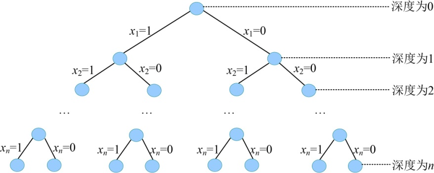
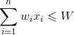

### 5.2.2　算法设计

（1）定义问题的解空间

购物车问题属于典型的0-1背包问题，问题的解是从n个物品中选择一些物品使其在不超过容量的情况下价值最大。每个物品有且只有两种状态，要么装入购物车，要不不装入。那么第i个物品装入购物车，能够达到目标要求，还是不装入购物车能够达到目标要求呢？很显然，目前还不确定。因此，可以用变量xi表示第i种物品是否被装入购物车的行为，如果用“0”表示不被装入背包，用“1”表示装入背包，则xi的取值为0或1。i=1，2，…，n第i个物品装入购物车，xi=1；不装入购物车，xi=0。该问题解的形式是一个n元组，且每个分量的取值为0或1。

由此可得，问题的解空间为{x1，x2，…，xi，…，xn}，其中，显约束xi =0或1，i=1，2，…，n。

（2）确定解空间的组织结构

问题的解空间描述了2n种可能解，也可以说是n个元素组成的集合所有子集个数。例如3个物品的购物车问题，解空间是：{0，0，0}，{0，0，1}，{0，1，0}，{0，1，1}，{1，0，0}，{1，0，1}，{1，1，0}，{1，1，1}。该问题有23个可能解。

可见，问题的解空间树为子集树，解空间树的深度为问题的规模n，如图5-5所示。

<b class="my_markdown">图5-5　解空间树（子集树）</b>

（3）搜索解空间

+ 约束条件

购物车问题的解空间包含2n种可能解，存在某种或某些物品无法装入购物车的情况，因此需要设置约束条件，判断装入购物车的物品总重量是否超出购物车容量，如果超出，为不可行解；否则为可行解。搜索过程不再搜索那些导致不可行解的结点及其孩子结点。

约束条件为：

+ 限界条件

购物车问题的可行解可能不止一个，问题的目标是找一个装入购物车的物品总价值最大的可行解，即最优解。因此，需要设置限界条件来加速找出该最优解的速度。

根据解空间的组织结构，对于任何一个中间结点z（中间状态），从根结点到z结点的分支所代表的状态（是否装入购物车）已经确定，从z到其子孙结点的分支的状态是不确定的。也就是说，如果z在解空间树中所处的层次是t，说明第1种物品到第t−1种物品的状态已经确定了。我们只需要沿着z的分支扩展很容易确定第t种物品的状态。那么前t种物品的状态就确定了。但第t+1种物品到第n种物品的状态还不确定。这样，前t种物品的状态确定后，当前已装入购物车的物品的总价值，用cp表示。已装入物品的价值高不一定就是最优的，因为还有剩余物品未确定。

我们还不确定第t+1种物品到第n种物品的实际状态，因此只能用估计值。假设第t+1种物品到第n种物品都装入购物车，第t+1种物品到第n种物品的总价值用rp来表示，因此cp+rp是所有从根出发经过中间结点z的可行解的价值上界，如图5-6所示。

<b class="my_markdown">图5-6　解空间树（cp+rp）</b>

如果价值上界小于或等于当前搜索到的最优值（最优值用bestp表示，初始值为0），则说明从中间结点z继续向子孙结点搜索不可能得到一个比当前更优的可行解，没有继续搜索的必要，反之，则继续向z的子孙结点搜索。

限界条件为：

cp+rp>bestp

+ 搜索过程

从根结点开始，以深度优先的方式进行搜索。根节点首先成为活结点，也是当前的扩展结点。由于子集树中约定左分支上的值为“1”，因此沿着扩展结点的左分支扩展，则代表装入物品。此时，需要判断是否能够装入该物品，即判断约束条件成立与否，如果成立，即生成左孩子结点，左孩子结点成为活结点，并且成为当前的扩展结点，继续向纵深结点扩展；如果不成立，则剪掉扩展结点的左分支，沿着其右分支扩展，右分支代表物品不装入购物车，肯定有可能导致可行解。但是沿着右分支扩展有没有可能得到最优解呢？这一点需要由限界条件来判断。如果限界条件满足，说明有可能导致最优解，即生成右孩子结点，右孩子结点成为活结点，并成为当前的扩展结点，继续向纵深结点扩展；如果不满足限界条件，则剪掉扩展结点的右分支，向最近的祖宗活结点回溯。搜索过程直到所有活结点变成死结点结束。

