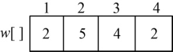
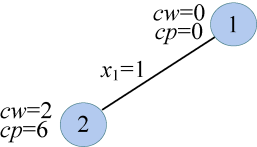
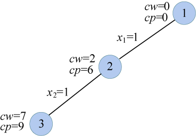
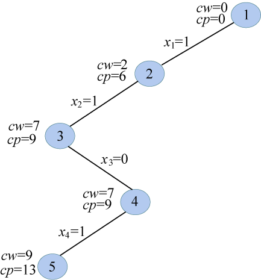
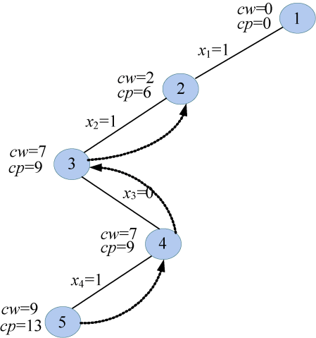
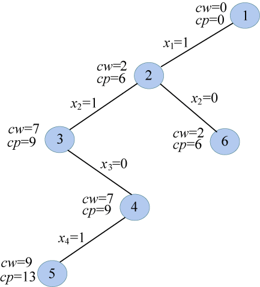
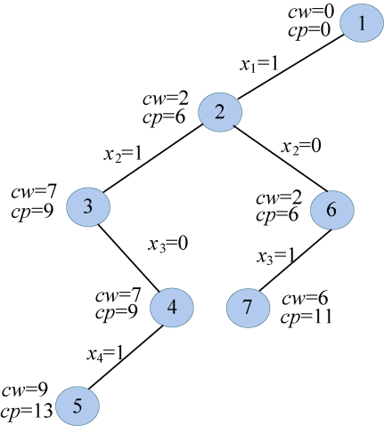
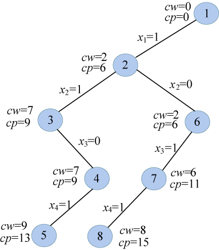
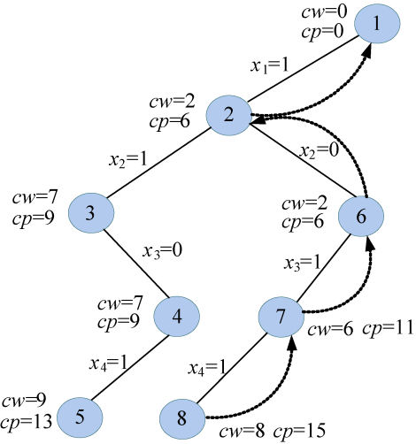

### 5.2.3　完美图解

假设现在有4个物品和一个购物车，每个物品的重量w为（2，5，4，2），价值v为（6，3，5，4），购物车的容量W为10，如图5-7所示。求在不超过购物车容量的前提下，把哪些物品放入购物车，才能获得最大价值。

<b class="my_markdown">图5-7　物品的重量和价值</b>

（1）初始化

sumw和sumv分别用来统计所有物品的总重量和总价值。sumw=13，sumv=18，sumw>W，因此不能全部装完，需要搜索求解。初始化当前放入购物车的物品重量cw=0；当前放入购物车的物品价值cp=0；当前最优值bestp=0。

（2）开始搜索第一层（t=1）

扩展1号结点，首先判断cw+w[1]=2<W，满足约束条件，扩展左分支，令x[1]=1，cw=cw+w[1]=2，cp=cp+v[1]=6，生成2号结点，如图5-8所示。

<b class="my_markdown">图5-8　搜索过程</b>

（3）扩展2号结点（t=2）

首先判断cw+w[2]=7<W，满足约束条件，扩展左分支，令x[2]=1，cw=cw+w[2]=7，cp=cp+v[2]=9，生成3号结点，如图5-9所示。

<b class="my_markdown">图5-9　搜索过程</b>

（4）扩展3号结点（t=3）

首先判断cw+w[3]=11>W，超过了购物车容量，第3个物品不能放入。那么判断bound(t+1)是否大于bestp。bound(4)中剩余物品只有第4个，rp=4，cp+rp=13，bestp=0，因此满足限界条件，扩展右子树。令x[3]=0，生成4号结点，如图5-10所示。

<b class="my_markdown">图5-10　搜索过程</b>

（5）扩展4号结点（t=4）

首先判断cw+w[4]=9<W，满足约束条件，扩展左分支，令x[4]=1，cw=cw+w[4]=9，cp=cp+v[4]=13，生成5号结点，如图5-11所示。

<b class="my_markdown">图5-11　搜索过程</b>

（6）扩展5号结点（t=5）

t>n，找到一个当前最优解，用bestx[]保存当前最优解{1，1，0，1}，保存当前最优值bestp=cp=13，5号结点成为死结点。

（7）回溯到4号结点（t=4），一直向上回溯到2号结点

向上回溯到4号结点，回溯时cw=cw−w[4]=7，cp=cp− v[4]=9。怎么加上的，怎么减回去。4号结点右子树还未生成，考查bound(t+1)是否大于bestp，bound(5)中没有剩余物品，rp=0，cp+rp=9，bestp=13，因此不满足限界条件，不再扩展4号结点右子树。4号结点成为死结点。向上回溯，回溯到3号结点，3号结点的左右孩子均已考查过，是死结点，继续向上回溯到2号结点。回溯时cw=cw−w[2]=2，cp=cp−v[2]=6。怎么加上的，怎么减回去，如图5-12所示。

<b class="my_markdown">图5-12　搜索过程</b>

（8）扩展2号结点（t=2）

2号结点右子树还未生成，考查bound(t+1)是否大于bestp，bound(3)中剩余物品为第3、4个，rp=9，cp+rp=15，bestp=13，因此满足限界条件，扩展右子树。令x[2]=0，生成6号结点，如图5-13所示。

<b class="my_markdown">图5-13　搜索过程</b>

（9）扩展6号结点（t=3）

首先判断cw+w[3]=6<W，满足约束条件，扩展左分支，令x[3]=1，cw=cw+w[3]=6，cp=cp+v[3]=11，生成7号结点，如图5-14所示。

<b class="my_markdown">图5-14　搜索过程</b>

（10）扩展7号结点（t=4）

首先判断cw+w[4]=8<W，满足约束条件，扩展左分支，令x[4]=1，cw=cw+w[4]=8，cp=cp+v[4]=15，生成8号结点，如图5-15所示。

<b class="my_markdown">图5-15　搜索过程</b>

（11）扩展8号结点（t=5）

t>n，找到一个当前最优解，用bestx[]保存当前最优解{1，0，1，1}，保存当前最优值bestp=cp=15，8号结点成为死结点。向上回溯到7号结点，回溯时cw=cw−w[4]=6，cp=cp−v[4]=11。怎么加上的，怎么减回去，如图5-16所示。

<b class="my_markdown">图5-16　搜索过程</b>

（12）扩展7号结点（t=4）

7号结点的右子树还未生成，考查bound(t+1)是否大于bestp，bound(5)中没有剩余物品，rp=0，cp+rp=11，bestp=15，因此不满足限界条件，不再扩展7号结点的右子树。7号结点成为死结点。向上回溯，回溯到6号结点，回溯时cw=cw−w[3]=2，cp=cp−v[3]=6，怎么加上的，怎么减回去。

（13）扩展6号结点（t=3）

6号结点的右子树还未生成，考查bound(t+1)是否大于bestp，bound(4)中剩余物品是第4个，rp=4，cp+rp=10，bestp=15，因此不满足限界条件，不再扩展6号结点的右子树。6号结点成为死结点。向上回溯，回溯到2号结点，2号结点的左右孩子均已考查过，是死结点，继续向上回溯到1号结点。回溯时cw=cw−w[1]=0，cp=cp−v[1]=0。怎么加上的，怎么减回去。

（14）扩展1号结点（t=1）

1号结点的右子树还未生成，考查bound(t+1)是否大于bestp，bound(2)中剩余物品是第2、3、4个，rp=12，cp+rp=12，bestp=15，因此不满足限界条件，不再扩展1号结点的右子树，1号结点成为死结点。所有的结点都是死结点，算法结束。

