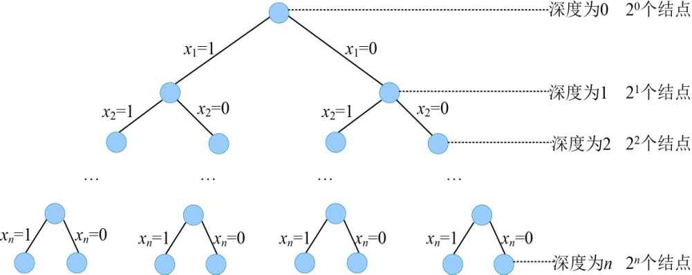

### 5.2.6　算法解析

（1）时间复杂度

回溯法的运行时间取决于它在搜索过程中生成的结点数。而限界函数可以大大减少所生成的的结点个数，避免无效搜索，加快搜索速度。

左孩子需要判断约束函数，右孩子需要判断限界函数，那么最坏有多少个左孩子和右孩子呢？我们看规模为n的子集树，最坏情况下的状态如图5-17所示。

<b class="my_markdown">图5-17　解空间树</b>

总的结点个数有20 +21+…+2<em>n</em> =2<em>n</em>+1−1，减去树根结点再除2就得到了左右孩子结点的个数，左右孩子结点的个数=（2<em>n</em>+1−1−1）/2=2<em>n</em>−1。

约束函数时间复杂度为O(1)，限界函数时间复杂度为O(n)。最坏情况下有O(2n)个左孩子结点调用约束函数，有O(2n)个右孩子结点需要调用限界函数，故回溯法解决购物车问题的时间复杂度为O(1*2n+n*2n)=O(n*2n)。

（2）空间复杂度

回溯法的另一个重要特性就是在搜索执行的同时产生解空间。在所搜过程中的任何时刻，仅保留从开始结点到当前扩展结点的路径，从开始结点起最长的路径为n。程序中我们使用bestp[]数组记录该最长路径作为最优解，所以该算法的空间复杂度为O(n)。

