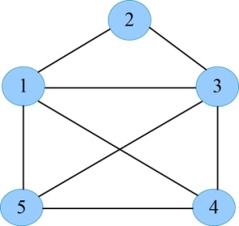
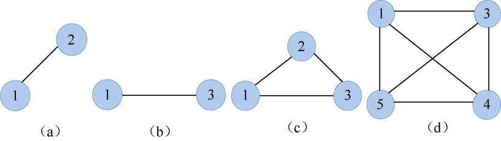

### 5.3.1　问题分析

以部落中的5个居民为例，我们把每个居民编号作为一个结点，凡是关系友好的两个居民，就用线连起来，是仇敌的不连线，如图5-19所示。国王护卫队问题就转化为从图中找出最多的结点，这些结点相互均有连线（任何两个人都不是仇敌）。

<b class="my_markdown">图5-19　部落居民关系图**G**</b>

国王护卫队问题属于典型的最大团问题。什么是最大团呢？首先来看什么是团。

**完全子图：** 给定无向图**G**=（V，E），其中V是结点集，E是边集。**G** '=（V'，E'）如果结点集V'⊆V，E'⊆E，且**G** '中任意两个结点有边相连，则称**G** '是**G**的完全子图。其实很简单，**G** '是**G**的子图，正好**G** '又是一个完全图，所以称为完全子图。

例如下面几个图都是图5-19的完全子图，如图5-20所示。

<b class="my_markdown">图5-20　**G**的完全子图</b>

（1） **团：** **G**的完全子图**G** '是**G**的团，当且仅当**G** '不包含在**G**的更大的完全子图中，也就是说**G** '是**G**的极大完全子图。图5-20中（c）、（d）是**G**的团，而（a）、（b）不是**G**的团，因为它们包含在**G**的更大的完全子图（c）中。

（2） **最大团：** **G**的最大团是指**G**的所有团中，含结点数最多的团。图5-20中的（d）是**G**的最大团。

根据问题描述可知，我们将国王护卫队问题转化为从无向图**G**=（V，E），顶点集是由n个结点组成的集合{1，2，3，…，n}，选择一部分结点集V'，即n个结点集合{1，2，3，…，n}的一个子集，这个子集中的任意两个结点在无向图**G**中都有边相连，且包含结点个数是n个结点集合{1，2，3，…，n}所有同类子集中包含结点个数最多的。显然，问题的解空间是一棵子集树，解决方法与解决购物车问题类似。

