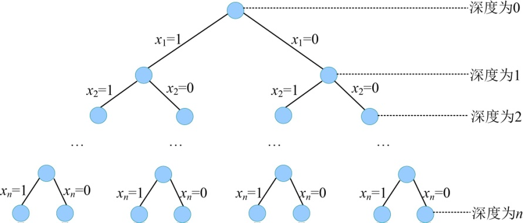
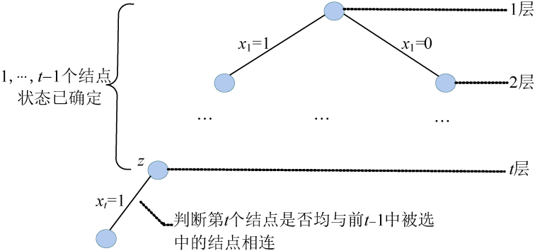
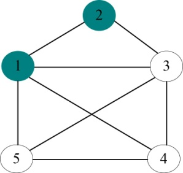
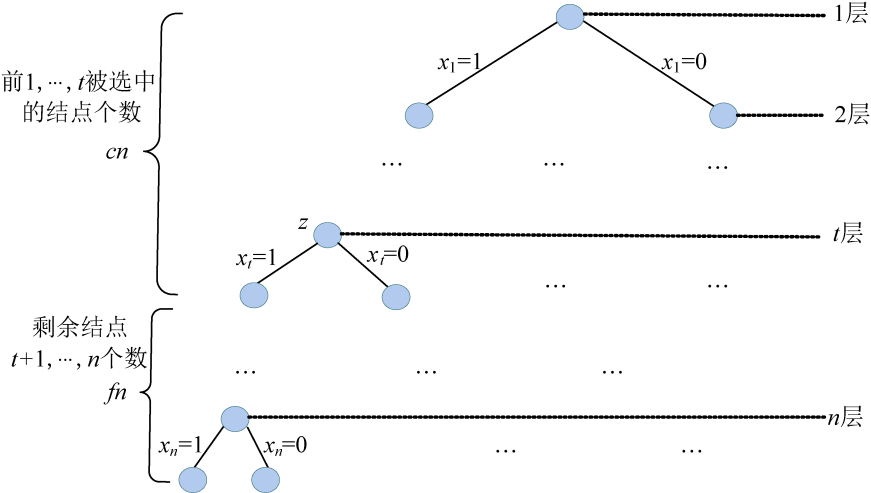

### 5.3.2　算法设计

（1）定义问题的解空间

问题解的形式为n元组，每一个分量的取值为0或1，即问题的解是一个n元0-1向量。由此可得，问题的解空间为{x1，x2，…，xi，…，xn}，其中显约束xi =0或1，（i=1，2，3，…，n）。

xi =1表示图**G**中第i个结点在最大团里，xi =0表示图**G**中第i个结点不在最大团里。

（2）解空间的组织结构

解空间是一棵子集树，树的深度为n，如图5-21所示。

<b class="my_markdown">图5-21　解空间树（子集树）</b>

（3）搜索解空间

+ 约束条件

最大团问题的解空间包含2n个子集，这些子集存在集合中的某两个结点没边相连的情况。显然，这种情况下的可能解不是问题的可行解，故需要设置约束条件来判断是否有情况可能导致问题的可行解。

假设当前扩展节点处于解空间树的第t层，那么从第一个结点到第t−1个结点的状态（是否在团里）已经确定。接下来沿着扩展结点的左分支进行扩展，此时需要判断是否将第t个结点放入团里。只要第t个结点与前t−1个结点中 **被选中的结点** （在团里的那些结点）均有边相连，则能放入团里，即x[t]=1；否则，就不能放入团中，即x[t]=0，如图5-22所示。

<b class="my_markdown">图5-22　解空间树（约束条件判断）</b>

例如，假设当前扩展结点是第4个，说明前3个结点的状态（是否选中）已经确定。

如果前3个结点中，我们选中了1号结点和2号结点，4号结点不可以加入到团中，因为4号结点和已经选中的2号结点没有边相连，如图5-23所示。

<b class="my_markdown">图5-23　约束条件判断</b>

+ 限界条件

假设当前的扩展结点为z，如果z处于第t层，从第1个结点到第t−1个结点的状态已经确定。接下来要确定第t个结点的状态，无论沿着z的哪一个分支进行扩展，第t个结点的状态就确定了。那么，从第t+1个结点到第n个结点的状态还不确定。这样，可以根据前t个结点的状态确定当前已放入团内的结点个数（用cn表示），假想从第t+1个结点到第n结点全部放入团内，放入的结点个数（用fn表示）fn=n−t，则cn+fn是所有从根出发的路径中经过中间结点z的可行解所包含结点个数的上界，如图5-24所示。

<b class="my_markdown">图5-24　解空间树（限界条件判断）</b>

如果cn+fn小于或等于当前最优解包含的结点个数bestn，则说明不需要再从中间结点z继续向子孙结点搜索。因此，限界条件可描述为：cn+fn>bestn。

+ 搜索过程

国王护卫队问题的搜索和购物车问题的搜索相似，只是进行判断的约束条件和限界条件不同而已。从根结点开始，以深度优先的方式进行。每次搜索到一个结点时，判断约束条件，看是否可以将当前结点加入到护卫队中。如果可以，则沿着当前结点的左分支继续向下搜索；如果不可以加入，判断限界条件，如果满足则沿着当前结点的右分支继续向下搜索。

