### 5.3.3　完美图解

部落酋长为了组织一支保卫部落的卫队，希望从居民中选出最多的居民加入卫队，并保证卫队中任何两个人都不是仇敌。以部落中的5个居民为例，我们给每个居民编号作为一个结点，凡是关系友好的两个居民，就用线连起来，是仇敌的不连线，如图5-25所示。

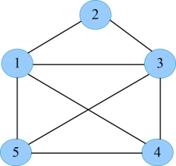

<b class="my_markdown">图5-25　部落护卫队关系图</b>

国王护卫队问题就转化为从图中找出最多的结点，这些结点相互均有连线（任何两个人都不是仇敌）。

（1）初始化

当前已加入卫队的人数cn=0；当前最优值bestn=0。

（2）开始搜索第1层（t=1）

扩展A结点，首先判断是否满足约束条件，因为之前还未选中任何结点，满足约束条件。扩展左分支，令x[1]=1，cn++，cn=1，生成B结点，如图5-26所示。

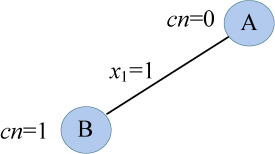

<b class="my_markdown">图5-26　搜索过程</b>

（3）扩展B结点（t=2）

首先判断t号结点是否和前面已选中的结点（1号）有边相连，满足约束条件，扩展左分支，令x[2]=1，cn++，cn=2，生成C结点，如图5-27所示。

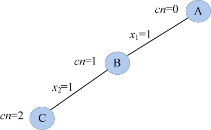

<b class="my_markdown">图5-27　搜索过程</b>

（4）扩展C结点（t=3）

首先判断t号结点是否和前面已选中的结点（1、2号）有边相连，满足约束条件，扩展左分支，令x[3]=1，cn++，cn=3，生成D结点，如图5-28所示。

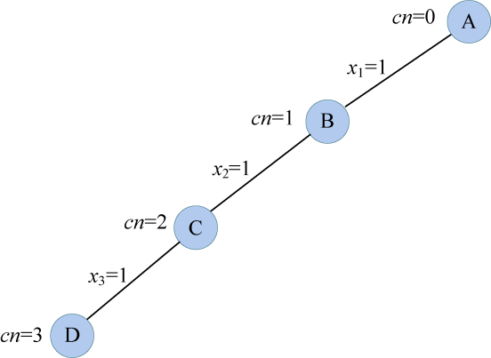

<b class="my_markdown">图5-28　搜索过程</b>

（5）扩展D结点（t=4）

首先判断t号结点是否和前面已选中的结点（1、2、3号）有边相连，4号和2号没有边相连，不满足约束条件，不能扩展左分支。判断限界条件cn+fn>bestn，cn=3，fn=n−t=1，bestn=0，满足限界条件，令x[4]=0，生成E结点，如图5-29所示。

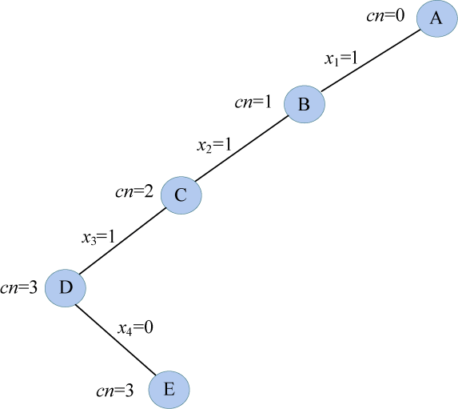

<b class="my_markdown">图5-29　搜索过程</b>

（6）扩展E结点（t=5）

首先判断t号结点是否和前面已选中的结点（1、2、3号）有边相连，5号和2号没有边相连，不满足约束条件，不能扩展左分支。判断限界条件cn+fn>bestn，cn=3，fn=n−t=0，bestn=0，满足限界条件，令x[5]=0，生成F结点，如图5-30所示。

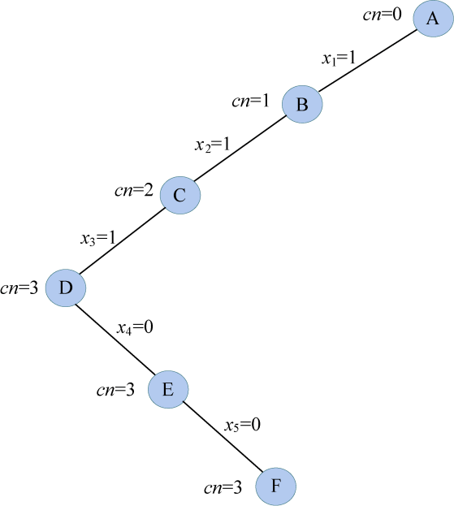

<b class="my_markdown">图5-30　搜索过程</b>

（7）扩展F结点（t=6）

t>n，找到一个当前最优，用bestx[]保存当前最优解{1，1，1，0，0}，保存当前最优值bestn=cn=3，F结点成为死结点。

（8）向上回溯到E结点（t=5）

E结点的左右孩子均已考查，继续向上回溯到D结点，D结点的左右孩子均已考查，继续向上回溯到C结点，回溯时，cn−−，cn=2。因为C结点生成D结点时，执行了cn++，怎么加上的，怎么减回去，如图5-31所示。

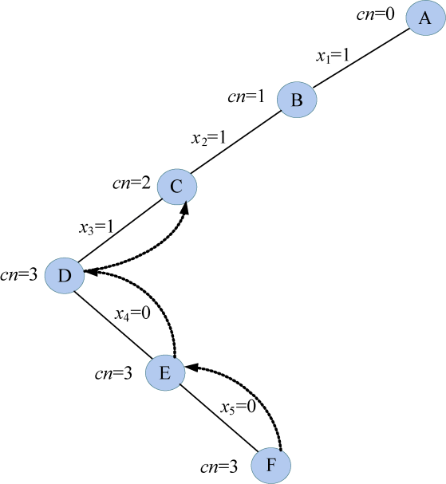

<b class="my_markdown">图5-31　搜索过程</b>

（9）重新扩展C结点（t=3）

C结点右子树还未生成，判断限界条件cn+fn>bestn，cn=2，fn=n−t=2，bestn=3，满足限界条件，扩展右子树。令x[3]=0，生成G结点，如图5-32所示。

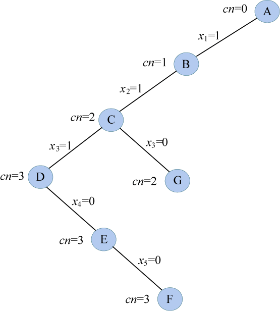

<b class="my_markdown">图5-32　搜索过程</b>

（10）扩展G结点（t=4）

首先判断t号结点是否和前面已选中的结点（1、2号）有边相连，4号和2号没有边相连，不满足约束条件，不能扩展左分支。判断限界条件cn+fn>bestn，cn=2，fn=n−t=1，bestn=3，不满足限界条件，不能扩展右分支，G结点称为死结点。

（11）向上回溯到C结点（t=3）

C结点左右孩子均已考查是死结点，向上回溯到最近的活结点B。C结点向B结点回溯时，cn−−，cn=1。因为B结点生成C结点时，执行了cn++，怎么加上的，怎么减回去，如图5-33所示。

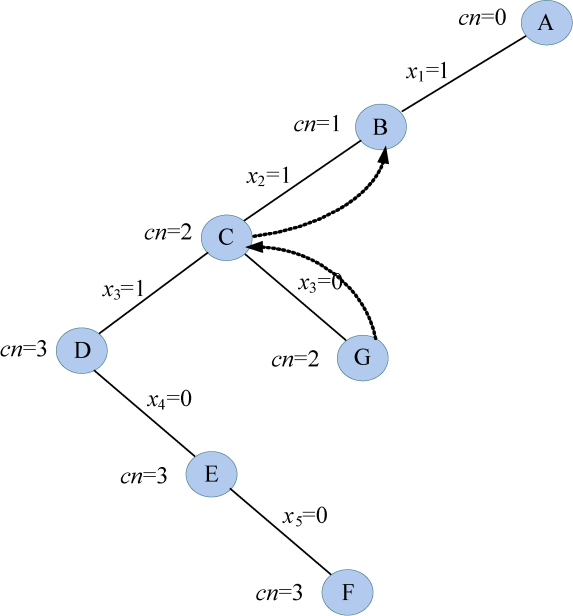

<b class="my_markdown">图5-33　搜索过程</b>

（12）重新扩展B结点（t=2）

B结点左分支已经生成，判断限界条件，cn+fn>bestn，cn=1，fn=n−t=3，bestn=3，满足限界条件，扩展右分支。令x[2]=0，生成H结点，如图5-34所示。

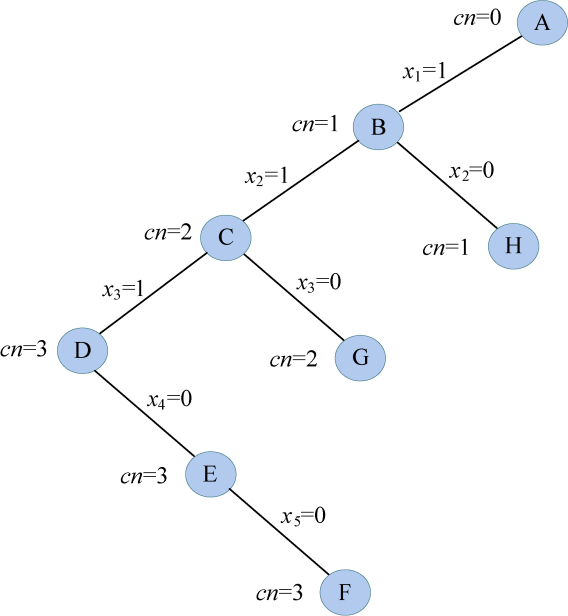

<b class="my_markdown">图5-34　搜索过程</b>

（13）扩展H结点（t=3）

首先判断t号结点是否和前面已选中的结点（1号）有边相连，满足约束条件，扩展左分支，令x[3]=1，cn++，cn=2，生成I结点，如图5-35所示。

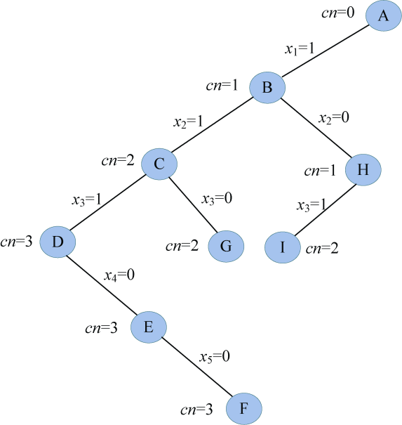

<b class="my_markdown">图5-35　搜索过程</b>

（14）扩展I结点（t=4）

首先判断t号结点是否和前面已选中的结点（1、3号）有边相连，满足约束条件，扩展左分支，令x[4]=1，cn++，cn=3，生成J结点，如图5-36所示。

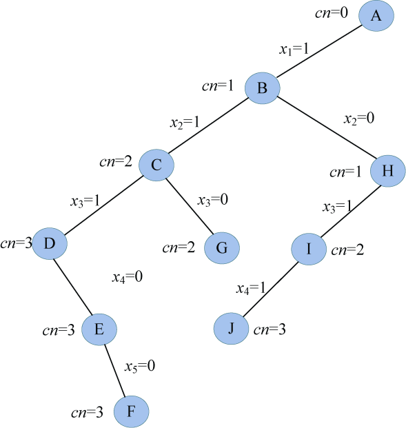

<b class="my_markdown">图5-36　搜索过程</b>

（15）扩展J结点（t=5）

首先判断t号结点是否和前面已选中的结点（1、3、4号）有边相连，满足约束条件，扩展左分支，令x[5]=1，cn++，cn=4，生成K结点，如图5-37所示。

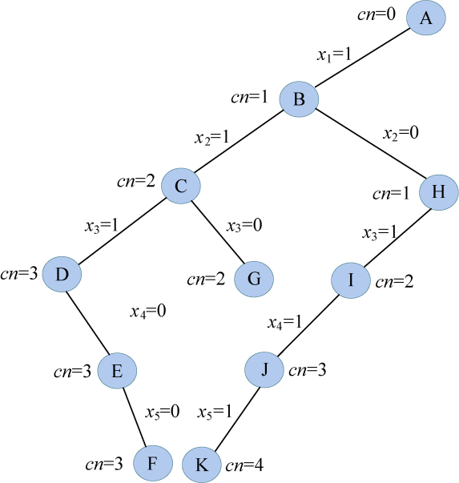

<b class="my_markdown">图5-37　搜索过程</b>

（16）扩展K结点（t=6）

t>n，找到一个当前最优解，用bestx[]保存当前最优解{1，0，1，1，1}，更新当前最优值bestn=cn=4，K结点成为死结点。向上回溯到J结点，回溯时，cn−−，cn=3。

（17）重新扩展J结点（t=5）

J结点的右孩子未生成，判断限界条件cn+fn>bestn，cn=3，fn=n−t=0，bestn=4，不满足限界条件，不能扩展右分支。继续向上回溯到I结点，回溯时，cn−−，cn=2。

（18）重新扩展I结点（t=4）

I结点的右孩子未生成，判断限界条件cn+fn>bestn，cn=2，fn=n−t=1，bestn=4，不满足限界条件，不能扩展右分支。继续向上回溯到H结点，回溯时，cn−−，cn=1。

（19）重新扩展H结点（t=3）

H结点的右孩子未生成，判断限界条件cn+fn>bestn，cn=1，fn=n−t=2，bestn=4，不满足限界条件，不能扩展右分支。

（20）回溯到B结点（t=2）

B结点左右孩子均已考查是死结点，向上回溯到最近的活结点A。回溯时，cn−−，cn=0。A结点（t=1）的右孩子未生成，判断限界条件cn+fn>bestn，cn=0，fn=n−t=4，bestn=4，不满足限界条件，不能扩展右分支。A结点称为死结点，算法结束，如图5-38所示。

<b class="my_markdown">图5-38　搜索过程</b>

